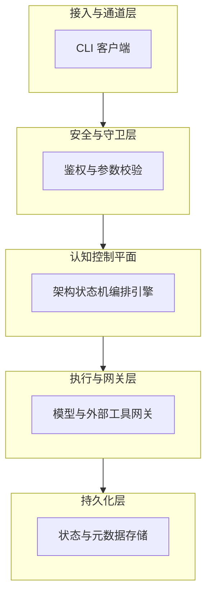

# Architecture Overview Diagram (5-Layer AOD)

```mermaid
flowchart TD
    subgraph L1 ["接入与通道层"]
        CLI["CLI 客户端"]
    end
    subgraph L2 ["安全与守卫层"]
        Guard["鉴权与参数校验"]
    end
    subgraph L3 ["认知控制平面"]
        FSM["架构状态机编排引擎"]
    end
    subgraph L4 ["执行与网关层"]
        Gateway["模型与外部工具网关"]
    end
    subgraph L5 ["持久化层"]
        Storage["状态与元数据存储"]
    end
    L1 --> L2 --> L3 --> L4 --> L5
```
