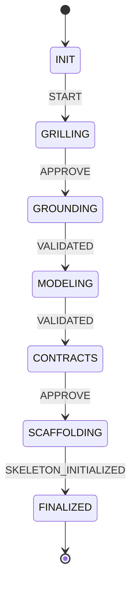

# Domain Logical Model

```mermaid
stateDiagram-v2
    [*] --> INIT
    INIT --> GRILLING: START
    GRILLING --> GROUNDING: APPROVE
    GROUNDING --> MODELING: VALIDATED
    MODELING --> CONTRACTS: VALIDATED
    CONTRACTS --> SCAFFOLDING: APPROVE
    SCAFFOLDING --> FINALIZED: SKELETON_INITIALIZED
    FINALIZED --> [*]
```
