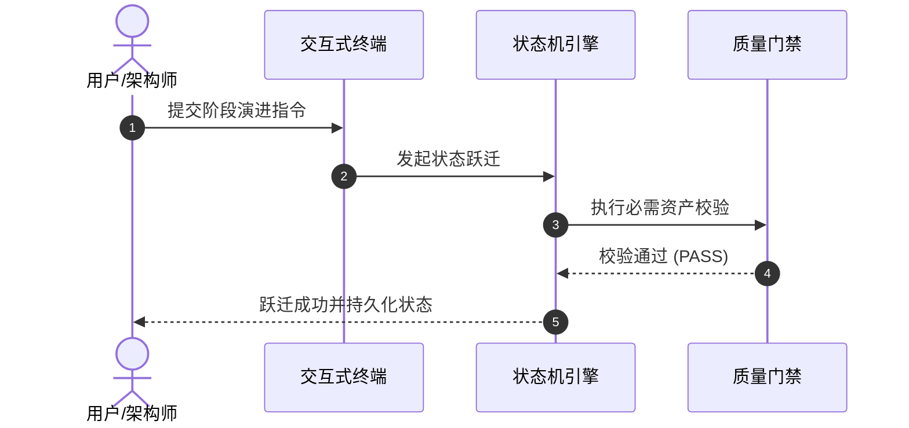

# Sequence and Dataflow

```mermaid
sequenceDiagram
    autonumber
    actor User as 用户/架构师
    participant CLI as 交互式终端
    participant FSM as 状态机引擎
    participant Gate as 质量门禁
    User->>CLI: 提交阶段演进指令
    CLI->>FSM: 发起状态跃迁
    FSM->>Gate: 执行必需资产校验
    Gate-->>FSM: 校验通过 (PASS)
    FSM-->>User: 跃迁成功并持久化状态
```
