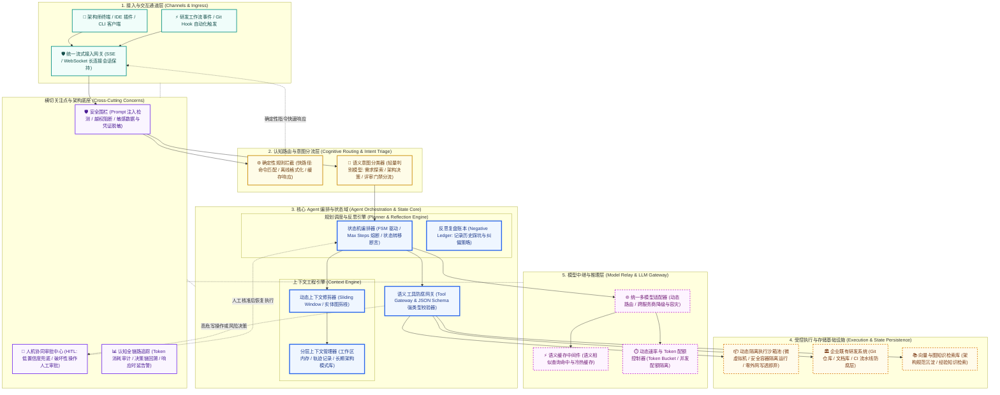

# 架构全景概览图规约 (Architecture Overview Diagram, AOD)

> 架构视角：系统全局认知控制平面与分层逻辑全景 (Global Overview & Cognitive Plane)  
> 核心作用：面向企业干系人、架构师与工程团队的高阶抽象图，展示认知路由、核心编排状态机、执行沙箱、模型网关与横切安全围栏。

---

## 1. AOD 架构全景抽象图 (Mermaid Visual)

---

## 2. 统一架构图例说明 (Architecture Legend)

| 图例标识 | 含义与层级 | 核心工程边界与设计约束 |
| :--- | :--- | :--- |
| **青绿色容器 (Ingress)** | 接入与交互通道层 | 承接人机交互及外部事件，负责协议转换、长连接保持与断线重连保障。 |
| **黄色容器 (Routing)** | 认知路由与意图分流 | 区分快慢思考路径，优先执行高确定性低成本规则，降低无谓模型调用。 |
| **蓝色实线容器 (Core)** | 核心 Agent 编排与状态 | 核心逻辑控制平面，服务设计保持无状态化，状态转移必须受限且可审计。 |
| **橙色虚线容器 (Sandbox)**| 受控执行沙箱与存储 | 任何不受信的代码生成与动态脚本执行严禁宿主机直跑，必须落地隔离容器。 |
| **紫色虚线容器 (AI Relay)**| 模型中继与推理层 | 抽象各主流供应商与私有推理节点，封装语义缓存、重试与配额保护。 |
| **深紫横切底座 (Cross)** | 横切关注点底座 | 贯穿全生命周期的双向安全拦截、敏感凭据脱敏、人工介入与全链路指标追踪。 |

---

## 3. 分层设计原则与信息流转机制

### 3.1 快慢思考双通道架构设计 (Fast-Slow Cognitive Path)
1. **快路径 (System 1 / 确定性规则拦截):**
   - 针对结构化指令（如状态查看、本地离线格式校验、历史文档检索），直接由确定性规则引擎或静态缓存即时响应，时延控制在 50ms 以内，零 Token 消耗。
2. **慢路径 (System 2 / 深度认知推理):**
   - 复杂架构权衡推演、需求澄清追问与系统级代码推导，经过意图分类器精准分流至编排调度器，装配动态修剪后的最小上下文，交由深度推理模型链处理。

### 3.2 横切守护与人机协同逃生通道 (Guardrails & HITL Escape)
- **输入前置围栏:** 在用户指令抵达路由前，进行提示词注入检测（Jailbreak/Prompt Injection）与密钥等敏感数据识别，命中直接阻断。
- **输出执行围栏:** Agent 拟发起的工具操作必须经过语义参数 Schema 校验；凡涉及删除文件、覆写生产分支、采购高额基础设施等操作，强制触发 HITL 流程挂起任务，等待人工授权。
- **全链路回溯:** 每次决策的输入上下文快照、推理思考链、工具入参与真实返回结果统一写入审计日志，支持事后单步复盘。

---

## 4. 合格性 3 分钟压力测试 (The 3-Minute Test 评审自检表)

| 检验问题 | 自检结果与工程支撑说明 | 判定 |
| :--- | :--- | :---: |
| **Q1: 能否在 3 分钟内向非技术干系人讲清系统的输入、大脑与落地执行路径？** | 明确展示“通道接入 -> 意图分流 -> 编排大脑 -> 安全沙箱/企业接口 -> 统一模型网关”主骨架，角色与职责层次分明。 | **PASS** |
| **Q2: 架构图是否剔除了易过时的具体数据库/中间件品牌，保持逻辑能力抽象？** | 采用“受控执行沙箱池”、“分层上下文管理器”、“模型中继适配器”等逻辑概念，不直接绑定具体品牌。 | **PASS** |
| **Q3: 是否存在不受约束直接调用外部工具/模型的死角路径？** | 所有模型调用必须收敛至模型中继层，所有工具调用必须穿透工具网关与安全围栏，零直连裸跑。 | **PASS** |
| **Q4: 当模型陷入死循环或幻觉产生破坏性行为时，架构是否有熔断与兜底？** | 具备状态机 Max Steps 步数硬熔断，且敏感写操作具备 HITL 人工介入逃生通道。 | **PASS** |
