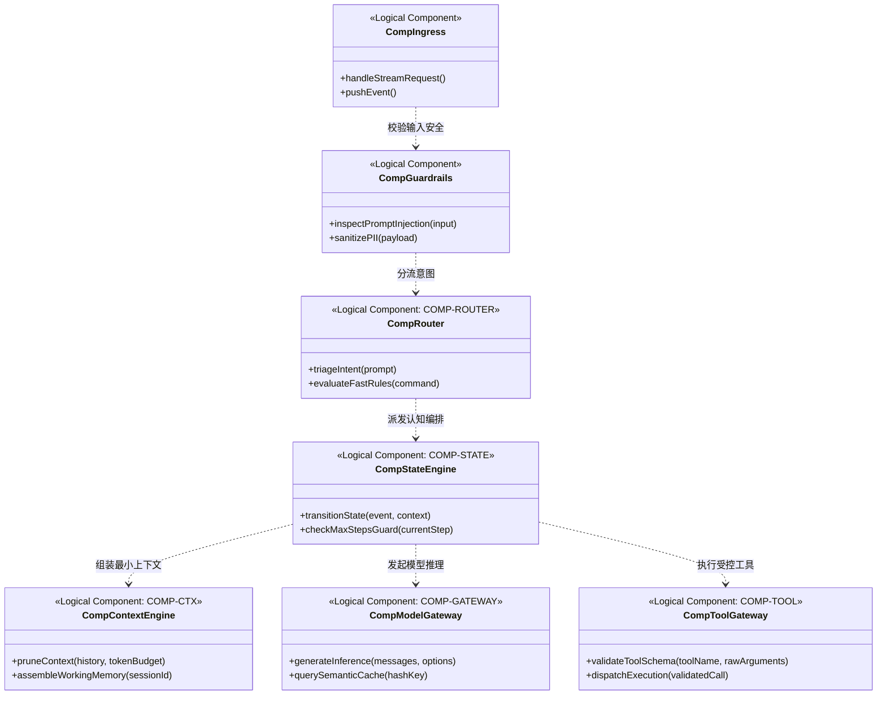

# 组件模型设计规约 (Component Model, CM)

> 架构视角：逻辑组件划分、物理组件演进、接口契约约束与防腐隔离  
> 核心原则：契约优先、逻辑到物理映射、工具入参强类型防护、编排引擎无状态化

---

## 1. 逻辑组件模型 (Logical CM)



---

## 2. 物理组件模型 (Physical CM: 逻辑到物理落地演进)

| 逻辑组件编号 | 逻辑组件名称 | 物理承载构件 / 运行时 | 技术方案与依赖 | 部署拓扑与边界 |
| :--- | :--- | :--- | :--- | :--- |
| **COMP-INGRESS** | 流式会话接入组件 | FastAPI / SSE 接入中间件 | Python 3.12, Uvicorn, ASGI | DMZ 边缘高可用 Pod，支持长连接保活 |
| **COMP-ROUTER** | 认知路由与快慢分流组件 | RegexEngine + FastIntentRouter | 轻量模式匹配 + 专用小参数判别模型 | 编排前置逻辑库，轻量内存驻留 |
| **COMP-CTX** | 动态上下文修剪装配组件 | ContextPruner | Tiktoken 计数器，滑动语义修剪算法 | 内存无状态库，结合外置缓存加载上下文 |
| **COMP-STATE** | 确定性状态机与熔断组件 | FsmOrchestrationEngine | Python 状态机引擎，支持外部状态存储 | 核心服务层，无状态调度，支持跨节点迁移 |
| **COMP-TOOL** | 语义工具代理与强校验组件 | ToolExecutionGateway | Pydantic v2 / JSON Schema 严格验证器 | 隔离调用代理，写操作前置 HITL 挂起 |
| **COMP-GATEWAY** | 统一模型推理网关组件 | LiteLLMAdapter / vLLM Client | 统一适配协议，支持自动重试与熔断 | 独立网关服务，统一管理 API Key 与配额 |
| **COMP-SANDBOX** | 隔离代码与工具沙箱池 | MicroVM / 安全隔离容器池 | Firecracker / gVisor 极速沙箱集群 | 隔离安全区，零外网直通，用完即销毁 |

---

## 3. 核心 Agent 组件详细设计卡片

### 3.1 COMP-CTX: 动态上下文修剪与装配组件
- **组件职责:** 根据目标模型窗口预算（Token Budget），自适应剪裁历史会话轨迹、压实记忆并提取核心要素，防止上下文污染与无谓成本开销。
- **Provided 接口:**
  ```python
  def assemble_context(session_id: str, new_instruction: str, max_tokens: int = 4096) -> Dict[str, Any]:
      """根据 Token 上限装配修剪后的上下文信息包"""
      ...
  ```
- **Required 接口:**
  - `IMemoryStore.load_recent_trajectory(session_id: str, limit: int)`
  - `ITokenizer.count_tokens(text: str) -> int`

### 3.2 COMP-TOOL: 语义工具代理与 Schema 强校验组件
- **组件职责:** 阻断大语言模型产生的格式幻觉与恶劣入参，在将工具调用传递至底层系统或沙箱前，执行严格的 JSON Schema 与 Pydantic 类型断言。
- **Provided 接口契约 (JSON Schema):**
  ```json
  {
    "$schema": "https://json-schema.org/draft/2020-12/schema",
    "title": "ToolExecutionInvocation",
    "type": "object",
    "properties": {
      "tool_name": { "type": "string", "pattern": "^[a-zA-Z0-9_-]+$" },
      "action_type": { "type": "string", "enum": ["READ", "EXECUTE", "WRITE", "DELETE"] },
      "parameters": { "type": "object" },
      "requires_hitl_approval": { "type": "boolean" }
    },
    "required": ["tool_name", "action_type", "parameters", "requires_hitl_approval"],
    "additionalProperties": false
  }
  ```
- **防线策略:** 若模型输出不满足 Schema，立即将错误反馈回模型并扣减剩余重试次数；连续失败 3 次触发任务降级。

### 3.3 COMP-STATE: 确定性状态机与熔断组件
- **组件职责:** 管理会话所处的阶段生命周期，执行状态迁移守卫断言；维护 `current_step` 与 `max_steps`（硬上限 25 步），杜绝 Agent 陷入无限发散循环。
- **无状态化约束 (Statelessness):** 编排调度器本身不维护内存中的运行期 Session 数据，每一次事件循环都从外部状态持久化系统拉取快照，并在迁移成功后刷写落盘。

---

## 4. 组件领域数据排他性所有权归属 (Data Ownership Matrix)

| 数据资产实体 | 独占写入组件 (Exclusive Owner) | 只读共享组件 (Read-Only Consumers) | 存储形态与持久化要求 |
| :--- | :--- | :--- | :--- |
| **会话阶段状态快照 (Session State Snapshot)** | `COMP-STATE` (状态机引擎) | `COMP-INGRESS`, `COMP-ROUTER`, 看板渲染器 | 分布式状态缓存与持久化文件，强一致性写入 |
| **上下文轨迹与修剪记录 (Context Pruned Trajectory)**| `COMP-CTX` (上下文引擎) | `COMP-STATE`, `COMP-GATEWAY` | 内存缓存配合按会话隔离的轨迹日志 |
| **工具调用 Schema 规约库 (Tool Schemas)** | `COMP-TOOL` (工具代理网关) | `COMP-STATE`, `COMP-GATEWAY` | 代码静态注册表，编译期冻结不可热篡改 |
| **推理用量与语义缓存 (Inference & Semantic Cache)** | `COMP-GATEWAY` (模型网关) | 审计分析服务、财务计费组件 | 集中式内存缓存与只追加审计存储表 |
| **沙箱临时输出产物 (Sandbox Transient Artifacts)** | `COMP-SANDBOX` (执行沙箱池) | `COMP-TOOL`, `COMP-STATE` | 隔离临时卷，单任务生命周期结束立即焚毁 |

---

## 5. 架构防腐与质量防线自检表 (四道防线)

| 质量防线 | 检查维度与设计规范 | 本设计落实措施 | 判定 |
| :--- | :--- | :--- | :---: |
| **第一道防线：结构性防腐** | 核心编排引擎严禁与具体底层沙箱或底层工具直连耦合。 | 核心编排通过 `COMP-TOOL` 网关和适配器解耦，隔离层阻断异常蔓延。 | **PASS** |
| **第二道防线：接口契约防护** | 严禁信任模型原始输出，工具入参必须强类型校验。 | 采用严格 `JSON Schema` / `Pydantic` 校验模型输出，非法格式立即拦截。 | **PASS** |
| **第三道防线：异常兜底保护** | 防止推理链震荡、死锁、无限递归与超长步数。 | 引入 `Max Steps = 25` 硬熔断机制与 Negative Ledger 记录失败路径。 | **PASS** |
| **第四道防线：无状态原则** | 编排核心节点具备横向弹性，单节点故障不丢失上下文。 | 编排引擎坚持无状态化设计，运行快照由外置持久化层统一管理。 | **PASS** |
