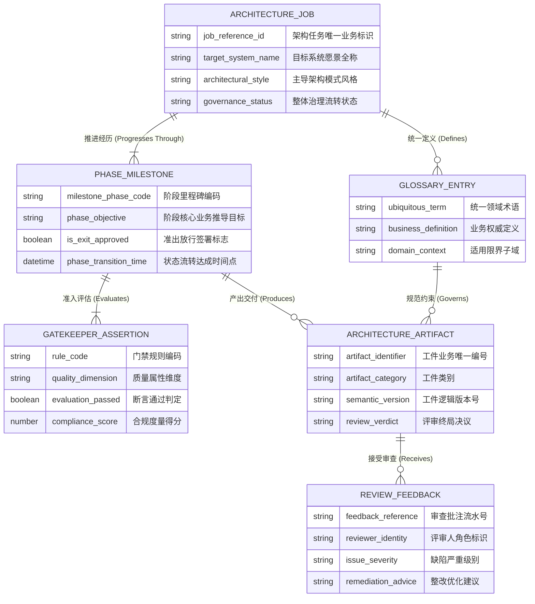

# 概念数据模型规约 (Conceptual Data Model, CDM)

> **架构视角**: 数据视角顶层抽象 (Data Architecture - Conceptual Level)  
> **核心使命**: 遵循“CDM $\to$ LDM $\to$ PDM”演进路径，用业务统一语言厘清架构技能编排与治理套件的核心业务实体、实体关系基数（Cardinality）与组件所有权边界。保持技术中立，严禁引入任何物理数据库实现细节。

---

## 1. 统一语言与领域概念字典 (Ubiquitous Language Dictionary)

| 概念术语 (Term) | 英文标识 (Identifier) | 商业定义与业务语义 | 概念边界与排他性澄清 |
| :--- | :--- | :--- | :--- |
| **架构设计任务** | `ArchitectureJob` | 架构师发起的包含目标愿景、范围边界与质量准则的顶层设计工作单元。 | 区别于单一会话或临时脚本，任务承载完整的工程生命周期。 |
| **阶段里程碑** | `PhaseMilestone` | 架构推导流转中确立的不可逆业务阶段（如需求提炼、结构建模、验证放行）。 | 业务进度管控点，不绑定具体的调度线程或定时器。 |
| **门禁断言** | `GatekeeperAssertion` | 阶段推进前必须满足的不可妥协质量与完整性规则校验判定。 | 形式化质量守卫契约，独立于具体代码单测实现。 |
| **架构工件** | `ArchitectureArtifact` | 阶段推导输出的受版本管理的工程技术交付物（如 AOD、CM、OM、CDM、ADR）。 | 系统向干系人交付的价值凭证，不指代物理磁盘文件句柄。 |
| **审查批注** | `ReviewFeedback` | 技术委员会评审人或自动化门禁引擎在工件审查时留下的整改意见或签署记录。 | 包含明确的处置决议与审计痕迹，具有治理约束力。 |
| **统一词汇条目** | `GlossaryEntry` | 业务与技术团队共同认可并严格遵守的领域核心概念与统一语言定义。 | 跨工件一致性基准，消除跨团队沟通歧义。 |

---

## 2. 概念实体关系拓扑图 (Conceptual ER Diagram)

---

## 3. 核心实体详细规格卡片 (Core Entity Specifications)

### 3.1 实体: 架构设计任务 (ArchitectureJob)
- **归属概念子域**: 架构编排与生命周期治理域 (Orchestration & Governance)
- **核心商业特征**: 架构师发起系统设计的总顶层实体，协调各阶段里程碑演进并追踪总体质量合规状态。
- **关键业务属性**:
  - `job_reference_id`: 架构任务的全局业务唯一编号。
  - `target_system_name`: 待构建或治理的目标系统法定商业名称。
  - `governance_status`: 治理流转生命周期（定义中、结构建模中、评审门禁中、已归档发布）。
- **核心业务不变量 (Business Invariants)**:
  - 任务推进必须遵循单向阶段流转，任何跳阶段行为均被阻断。
  - 只有在所有必需阶段里程碑均获得准出放行后，任务才能转为“已归档发布”。

### 3.2 实体: 架构工件 (ArchitectureArtifact)
- **归属概念子域**: 工业级工件生成与打磨域 (Artifact Polish & Delivery)
- **核心商业特征**: 符合 IBM 架构思想与 C4 规范的顶层工程技术资产。
- **关键业务属性**:
  - `artifact_identifier`: 规范化的工件编号（如 AOD-001, CDM-001, ADR-001）。
  - `artifact_category`: 工件分类（系统上下文、AOD、CM、OM、CDM、ADR、ARC）。
  - `review_verdict`: 评审决议（草稿、审查打回、已签署生效）。
- **核心业务不变量**:
  - 工件生效前必须通过门禁断言判定且合规得分达标（100 分制）。
  - 每次重大结构修订必须演进语义版本号。

### 3.3 实体: 门禁断言 (GatekeeperAssertion)
- **归属概念子域**: 质量守卫与合规仲裁域 (Quality Gatekeeping)
- **核心商业特征**: 守护架构工件技术中立性、统一语言与结构严谨性的不可篡改规则判断。
- **关键业务属性**:
  - `rule_code`: 门禁规则编号（如 GK-CDM-NO-PHYSICAL-DB）。
  - `compliance_score`: 自动化与专家联合评估的数值化质量分。
- **核心业务不变量**:
  - 存在严重级门禁断言未通过时，里程碑的准出放行签署标志恒为 `false`。

---

## 4. 限界上下文与数据所有权矩阵 (Data Ownership Matrix)

| 概念实体 (Entity) | 所属限界上下文 (Bounded Context) | 唯一归属组件 (Owning CM Component) | 数据所有权模式 (Data Ownership) | 跨边界访问与流转契约 |
| :--- | :--- | :--- | :--- | :--- |
| **`ArchitectureJob`** | 编排治理上下文 | `LifecycleOrchestrator` (COMP-01) | **独占写入 (Exclusive Write)** | 驱动阶段状态机推进与通知 |
| **`PhaseMilestone`** | 编排治理上下文 | `LifecycleOrchestrator` (COMP-01) | **独占写入 (Exclusive Write)** | 汇总门禁断言决定流转 |
| **`GatekeeperAssertion`**| 质量门禁上下文 | `GatekeeperGuard` (COMP-02) | **独占写入 (Exclusive Write)** | 导出判定结果供里程碑放行参考 |
| **`ArchitectureArtifact`** | 工件交付上下文 | `ArtifactBuilder` (COMP-03) | **独占写入 (Exclusive Write)** | 向评审引擎与渲染看板暴露视图 |
| **`ReviewFeedback`** | 评审协作上下文 | `ReviewBoardHub` (COMP-04) | **独占写入 (Exclusive Write)** | 反馈修改意见并回传工件构建器 |
| **`GlossaryEntry`** | 领域知识上下文 | `KnowledgeDictionary` (COMP-05) | **独占写入 (Exclusive Write)** | 为所有工件生成提供统一词汇对照表 |

---

## 5. 三步压力测试自检记录 (3-Step Stress Tests)

### 5.1 业务代言人对齐走查测试 (Business Proxy Walkthrough)
- **演练场景**: 首席架构师启动新交易系统设计任务，推导 AOD 与 CDM，在门禁校验中由于实体包含技术字段被拦截，经整改后顺利签署通过。
- **走查路径**:
  1. 架构师初始化 `ArchitectureJob`，关联系统愿景；
  2. 启动建模阶段 `PhaseMilestone`，从 `GlossaryEntry` 提取统一领域术语；
  3. 产出首版 `ArchitectureArtifact` (CDM)；
  4. 触发门禁，`GatekeeperAssertion` 检出违规项并记录未通过；
  5. 评审引擎生成 `ReviewFeedback` 指导整改；
  6. 修订后重新评估，合规评分通过，里程碑 `is_exit_approved` 置为真，驱动进入后续阶段。
- **评审结论**: 业务流转过程与架构师日常治理逻辑完全吻合，概念实体关系严密可信。

### 5.2 生命周期完整性测试 (Lifecycle & State Completeness)
- **被测核心实体**: `ArchitectureJob` 与 `ArchitectureArtifact`。
- **状态全集检查**:
  - `ArchitectureJob`: [Initiated] $\to$ [AnalysisActive] $\to$ [ModelingActive] $\to$ [UnderReview] $\to$ [ApprovedAndFinalized] / [RejectedTerminated]。
  - `ArchitectureArtifact`: [Draft] $\to$ [InReview] $\to$ [Accepted] / [RequiresRevision]。
- **评审结论**: 实体包含所有必要的状态属性与追溯标记，无孤立断流。

### 5.3 驱动组件模型 (CM) 验证测试
- **所有权单一性检查**:
  - 确认仅 `GatekeeperGuard` 可生成和更新 `GatekeeperAssertion` 状态，工件构建器仅有读权限。
  - 确认 `ReviewFeedback` 仅由 `ReviewBoardHub` 维护，杜绝跨边界篡改评审记录。
- **评审结论**: CDM 实体与逻辑组件边界严格映射，各司其职，保证系统的松耦合与内聚性。
