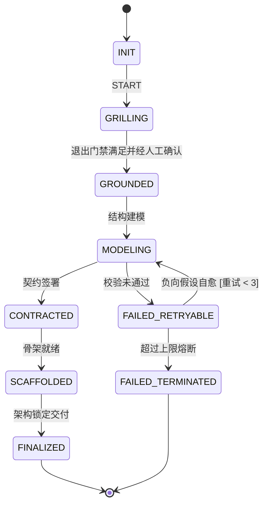

# Domain Logical Model

## 1. 限界上下文与聚合划分
- **ArchitectureLifecycleJob (Aggregate Root)**: 守护任务单向状态机与门禁

## 2. 核心生命周期状态机

```mermaid
stateDiagram-v2
    classDef happyPath fill:#f0fdf4,stroke:#16a34a,stroke-width:2px,color:#14532d;
    classDef retryPath fill:#fffbeb,stroke:#d97706,stroke-width:2px,color:#78350f;
    classDef termPath fill:#fef2f2,stroke:#dc2626,stroke-width:2px,color:#7f1d1d;

    [*] --> INIT
    INIT --> GRILLING: START
    GRILLING --> GROUNDED: 退出门禁满足并经人工确认
    GROUNDED --> MODELING: 结构建模
    MODELING --> CONTRACTED: 契约签署
    CONTRACTED --> SCAFFOLDED: 骨架就绪
    SCAFFOLDED --> FINALIZED: 架构锁定交付
    
    MODELING --> FAILED_RETRYABLE: 校验未通过
    FAILED_RETRYABLE --> MODELING: 负向假设自愈 [重试 < 3]
    FAILED_RETRYABLE --> FAILED_TERMINATED: 超过上限熔断
    
    FINALIZED --> [*]
    FAILED_TERMINATED --> [*]

    class INIT,GRILLING,GROUNDED,MODELING,CONTRACTED,SCAFFOLDED,FINALIZED happyPath;
    class FAILED_RETRYABLE retryPath;
    class FAILED_TERMINATED termPath;
```
