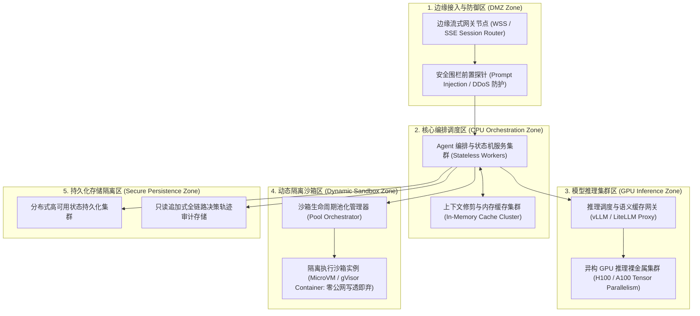

# 运行模型设计规约 (Operational Model, OM)

> 架构视角：物理拓扑分布、异构算力调度、动态隔离沙箱区、长连接雪崩治理与极限容灾推演  
> 核心原则：环境物理隔离、沙箱零信任逃逸阻断、GPU 显存与长连接容量规划、失效可控

---

## 1. 逻辑运行模型 (Logical OM: 节点分类与区域划分)

---

## 2. 物理部署模型与 CM 映射 (Physical OM & Deployment Allocation Matrix)

| 部署单元编号 | 物理部署节点区 | 承载组件映射 (CM 映射) | 基础硬件与容器规格 | 隔离级别与网络区域 |
| :--- | :--- | :--- | :--- | :--- |
| **DEP-01** | 边缘接入区 (DMZ) | `COMP-INGRESS` | 4C 8G 虚拟机，双机热备，公网绑定 | VPC DMZ 子网，TLS 1.3 终结，会话保活心跳 |
| **DEP-02** | CPU 编排核心区 | `COMP-ROUTER`, `COMP-STATE`, `COMP-CTX` | 16C 32G 容器集群 (K8s Pods, 3+ 副本) | 核心应用内网 VPC，无状态水平自动弹性伸缩 |
| **DEP-03** | 安全工具网关区 | `COMP-TOOL` | 8C 16G 专用隔离安全代理 Pod | 专用代理子网，强制入参 JSON Schema 断言 |
| **DEP-04** | GPU 推理服务区 | `COMP-GATEWAY`, Model Adapter | 8x NVIDIA H100 80GB SXM5，RDMA 互联 | AI 专用子网，显存预分配，长上下文 KV Cache 优化 |
| **DEP-05** | 动态沙箱隔离区 | `COMP-SANDBOX` | 32C 64G 裸金属节点宿主 (Firecracker) | 物理硬隔离子网，禁开公网出站，单任务即焚 |
| **DEP-06** | 数据持久化区 | State Persistence, Audit Store | 分布式高可用数据库与冷热分层对象存储 | 多可用区数据子网，落盘强加密，只追加防篡改 |

---

## 3. 标准节点规范卡片集 (Node Specifications)

### NODE-01: 边缘接入节点 (Edge Gateway Node)
- **机型与规格:** 云原生虚拟机 4 vCPU, 8 GB RAM, 10 Gbps 弹性网卡
- **网络与 VPC:** 公网访问入口，绑定弹性公网 IP，位于安全防护边界 DMZ
- **存储配置:** 50 GB 高性能系统盘（无持久化状态写入）
- **高可用模式:** 双节点主动负载均衡（Active-Active），支持跨可用区流量分发

### NODE-02: CPU 编排核心节点 (Orchestrator Worker Node)
- **机型与规格:** 云原生计算型实例 16 vCPU, 32 GB RAM
- **网络与 VPC:** 私有应用子网（Private App Subnet），禁止公网直接路由
- **存储配置:** 100 GB NVMe 缓存盘用于临时文件分析与工程依赖包缓存
- **运行特征:** 完全无状态部署（Stateless），支持基于 CPU 利用率与并发队列的快速横向扩容（HPA）

### NODE-03: GPU 推理裸金属节点 (GPU Inference Node)
- **机型与规格:** 8x NVIDIA H100 Tensor Core GPU (80GB SXM5), 双路 64C CPU, 1TB 内存
- **网络与 VPC:** 私有 AI 专属算力集群，GPU 间 3.2 Tbps InfiniBand / RDMA 互联
- **存储配置:** 2TB 本地 NVMe 高速缓存，支持大模型权重预热与高命中率 KV Cache 驻留
- **高可用与容灾指标:** 目标 **RTO < 30s**（主备推理集群秒级流量切换），**RPO = 0**（推理过程无状态不丢数据）

### NODE-04: 动态代码沙箱物理宿主机 (Sandbox Host Node)
- **机型与规格:** 物理裸金属服务器 32 Core AMD EPYC, 64 GB RAM, 开启 KVM 虚拟化
- **网络与 VPC:** 物理隔离安全区（Isolated Sandbox VLAN），默认配置零默认网关（No Default Gateway），出网流量一律拦截
- **存储配置:** 500 GB 高 IOPS 内存虚拟盘（RAM Disk），单实例隔离执行完成后在 1000ms 内销毁重置

---

## 4. 核心运行机制与容量规划

### 4.1 动态沙箱隔离区 (Sandbox Zone) 与逃逸防御测试 (Escape Containment)
- **隔离级别:** 采用微虚拟机（MicroVM，如 AWS Firecracker）或安全沙箱容器（如 gVisor），提供独立 Linux 内核边界与精简系统调用拦截（seccomp 白名单）。
- **零信任网络控制:**
  - 沙箱环境**禁止分配公网 IP**，禁止出站访问互联网，阻断 Agent 受诱导向外部黑客 C2 节点外发数据的路径。
  - 沙箱仅挂载单次执行所需的只读输入文件卷，产生的文件输出通过受控 RPC 回传，执行完毕后容器镜像在 1000ms 内销毁重置。
- **逃逸防御实战验证:** 在 CI/CD 准入流水线中，注入提权脚本、特权逃逸 Exploit 与恶意端口扫描测试，确保沙箱对宿主系统资源实现隔离防线。

### 4.2 长连接保持、雪崩防范与冷启动时延指标
- **长连接保活:** SSE / WebSocket 会话引入 15 秒心跳探测机制。网络短暂抖动时，客户端携带 `Last-Event-ID` 发起重连，服务端根据增量缓存实现断点流式接续。
- **重连雪崩抑制:** 遇到网关集群滚动升级或突发断网恢复时，客户端启用全抖动指数退避算法（Exponential Backoff with Full Jitter），削平重连毛刺。
- **冷启动指标:**
  - 动态沙箱池常备 10 个热就绪（Warm Standby）实例，使单次代码执行冷启动时间压制在 150ms 以内。
  - 编排调度服务全无状态部署，实现秒级拉起与扩缩容。
- **灾备恢复基线 (Disaster Recovery Baseline):**
  - **RTO (Recovery Time Objective):** 核心编排故障切换 **RTO < 60秒**；推理网关熔断切换 **RTO < 10秒**。
  - **RPO (Recovery Point Objective):** 会话状态持久化强一致落盘，数据丢失指标 **RPO < 1秒**（仅丢失最近一次未持久化的单步交互）。

---

## 5. 四大实战极限故障演练场景 (Chaos Walkthrough / 压力实战测试)

| 演练场景编号 | 极端故障注入条件 (拔电源测试 / 突发故障) | 架构防护机制与自动恢复路径 | 预期降级表现 |
| :--- | :--- | :--- | :--- |
| **SC-OM-01: GPU 显存打满与拔电源测试** | 突发长提示词并发涌入，模型推理节点显存利用率达到 98%，单卡掉电。 | 统一网关感知模型排队时延超标，自动激活断路器，将非关键请求降级到备用轻量模型。 | 复杂分析降级为精炼概要，保障服务不出现宕机。 |
| **SC-OM-02: 恶意代码沙箱逃逸注入** | Agent 执行由不可信输入引导生成的提权越狱脚本，试图探测宿主机宿主进程。 | 受到 MicroVM seccomp 强拦截，系统调用被内核级阻断并打标为高危攻击，沙箱强制熔断销毁。 | 任务终止并告警，宿主机与编排集群不受任何影响。 |
| **SC-OM-03: 长连接风暴与网关抖动** | 边缘网关单节点突发网络异常导致 5000+ 流式会话同时中断。 | 客户端触发指数抖动重连，其余健康网关节点承接流量，通过共享缓存按会话断点继续流式下发。 | 终端用户界面出现轻微加载提示后自动平滑续播。 |
| **SC-OM-04: 编排逻辑发散陷入死循环** | 模型产生虚假依赖判断，持续反复调用相同失败工具达到 20 轮。 | 状态机 `COMP-STATE` 计数器捕获步数达到 `Max Steps = 25` 硬阈值，触发硬熔断。 | 任务终止执行，系统输出排障报告并转交人工审核。 |
