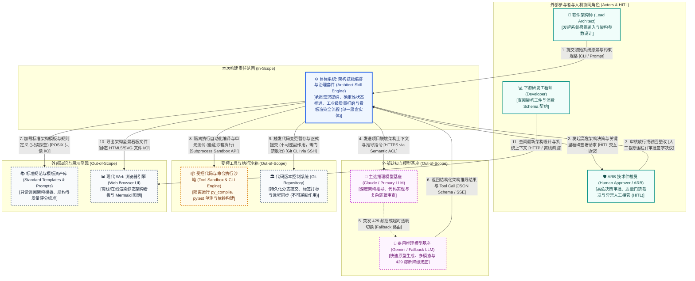

# 系统上下文与绝对边界规约 (System Context & Boundary Overview)

> **架构视角**: 架构第 0 层 (Level 0) - 生态位与绝对黑盒边界 (System Context & The Black-box Rule)  
> **核心使命**: 确立架构技能编排套件的绝对责任边界，明确“我们在建什么（In-Scope）”与“我们依赖谁（Out-of-Scope）”。目标系统在当前层级被严格视作单一黑盒实体，严禁暴露任何内部微服务、调度状态机细节或底层文件存储操作。

---

## 1. Level 0 系统上下文图 (System Context Diagram)

---

## 2. 上下文实体交互矩阵 (Context Interaction Matrix)

| 实体分类 | 实体名称 (Entity) | 职责与系统关系描述 (Description & Interaction) | 交互类型与副作用界限 (Side-effect Boundary) | 数据流向与核心契约 (Data Flow & Contract) | 边界责任归属 (Ownership) |
| :--- | :--- | :--- | :--- | :--- | :--- |
| **中心系统** | **架构技能编排与治理套件** | **[核心黑盒 / 本次构建范围 In-Scope]** 承担需求澄清、确定性状态机流转、质量打磨与看板渲染全流程。 | 业务状态编排与调度 (中心黑盒) | 不适用 (中心黑盒) | **本团队研发与 SLA 责任区 (In-Scope)** |
| **外部角色** | 软件架构师 (Lead Architect) | 负责输入业务愿景与硬约束，主导系统设计参数配置。 | 需求输入 / 无直接副作用 | `架构师` $\to$ 发起架构任务 [CLI/对话] $\to$ `系统` | 任务发起方 (In-Scope 触发源) |
| **外部角色** | ARB 技术仲裁员 (Human Approver) | 负责关键里程碑审查（如 AOD、ARC、ADR），执行高危操作审批与人工接管。 | 决策仲裁 / 安全截断门禁 (HITL) | `系统` $\leftrightarrow$ {审批申请与放行裁决} [{HITL 协议}] $\leftrightarrow$ `仲裁员` | 架构治理委员会 (Out-of-Scope) |
| **外部角色** | 下游研发工程师 (Developer) | 消费套件产出的标准架构文档、Schema 契约与指导规约开展工程编码。 | 工件消费 / 只读获取 | `系统` $\to$ 交付架构规格书 [Markdown/HTML] $\to$ `开发人员` | 研发团队 (Out-of-Scope) |
| **外部系统** | 主选推理模型基座 (Claude LLM) | 承担深度认知推理、架构权衡与代码审查任务。 | 概率认知推导 / 语义输出依赖 | `系统` $\to$ 脱敏 Prompt [HTTPS via ACL] $\to$ `Claude API` | 外部云模型服务商 (Out-of-Scope) |
| **外部系统** | 备用推理模型基座 (Gemini LLM) | 承担前端看板原型设计、多模态处理及主模型 429 限流时的兜底保障。 | 降级备援 / 多模态推理 | `系统` $\to$ 降级 Prompt [HTTPS via ACL] $\to$ `Gemini API` | 外部云模型服务商 (Out-of-Scope) |
| **外部系统** | 受控代码执行沙箱 (Tool Sandbox) | 提供隔离子进程环境，运行 Python 编译检查与 pytest 单测，防止环境污染。 | 受控隔离执行 / 物理隔离保护 | `系统` $\to$ 驱动测试与编译 [Subprocess API] $\to$ `沙箱容器` | 宿主机执行环境 (Out-of-Scope) |
| **外部系统** | 代码版本控制系统 (Git Repo) | 持久化版本快照、分支管理与提交审计记录。 | **不可逆业务副作用 (Irreversible Side-effect)** | `系统` $\to$ 状态暂存与提交 [Git CLI over SSH] $\to$ `Git 服务` | 基础设施平台服务 (Out-of-Scope) |
| **外部系统** | 规范与模板资产库 (Templates) | 集中管理标准架构技能清单、工件模板及评分规则库。 | 只读探查 (Read-only Probe) / 零副作用 | `系统` $\to$ 调阅规约与评分规则 [POSIX I/O] $\to$ `模板库` | 资产维护团队 (Out-of-Scope) |
| **外部系统** | 现代 Web 浏览器引擎 | 提供离线或在线查看 `architecture_board.html` 的图形化呈现支持。 | 客户端呈现 / 零副作用 | `系统` $\to$ 静态看板文件 [HTML5/JS/Mermaid] $\to$ `浏览器` | 客户端渲染终端 (Out-of-Scope) |

---

## 3. 三道安检门检验结论 (The 3 Gatekeeper Tests)

### 3.1 “X 射线”违规测试 (The X-Ray Test)
- **检验结论**: **PASS (通过)**。
- **排查说明**: 经自查，本图中的中心系统对外表现为**唯一的单一黑盒节点**，杜绝暴露任何内部调度状态机（`FSMOrchestrator`）、门禁守卫（`Gatekeeper`）、图元渲染器（`DiagramRenderer`）与打磨引擎（`DocumentPolisher`）内部类或私有模块，确保宏观审视套件与外部环境的生态位关系。

### 3.2 责任切割测试 (The "Who owns this?" Test)
- **检验结论**: **PASS (通过)**。
- **边界划分**:
  - **In-Scope (本团队系统责任区)**: 状态机流转确定性、门禁拦截逻辑、文档质量打磨评分准确度、Mermaid 图表提取与看板生成正确性。
  - **Out-of-Scope (外部协作责任区)**: 外部大语言模型 API 可用性与网络延迟、宿主机磁盘剩余空间与硬件稳定性、外部 Git 远程服务器认证权限。

### 3.3 “孤岛”与“无源之水”排查 (Orphan & Magic Flow Check)
- **检验结论**: **PASS (通过)**。
- **闭环验证**: 系统具备清晰的输入源（架构师输入的系统愿景与约束），同时对外产生决定性的工程产物（符合企业级标准的架构全景文档、Schema 契约代码与交互式可视化看板），形成完整端到端价值闭环。

---

## 4. Agent 爆炸半径沙盘检验记录 (Blast Radius Walkthrough)

> **检验目的**: 针对 Agent AI 系统概率推理与自主工具调用特性，推演极端异常场景下的截断隔离机制。

1. **失控代码/指令物理截断测试 (Runaway Execution Interception)**:
   - **推演场景**: 模型产生严重幻觉或遭遇 Prompt 注入攻击，生成了递归删除工作区或恶意越权脚本。
   - **防护闭环**: 上下文图中明确设立了受控工具执行沙箱（Tool Sandbox）与专职仲裁人（Human Approver / ARB）。所有编译与测试命令必须在沙箱子进程内受限执行；任何涉及代码提交与外部发布的写操作，必须经由仲裁员签字授权，绝不直连生产分支。
2. **模型故障与 429 频控熔断演练 (429 Rate Limit & Fallback Walkthrough)**:
   - **推演场景**: 外部主选推理基座（Claude API）突发 429 频控阻断或云端网络超时。
   - **防护闭环**: 上下文图明确配置了备用模型基座（Gemini LLM Provider）与确定性降级规则，系统自动无缝切换备选模型继续推进，保障架构生命周期平稳流转。

---

## 5. 从上下文图到 AOD 的关键过渡 (Zooming In)

> **“当前系统上下文图（Level 0）处于万米高空视角，聚焦于‘系统大楼外观及外部生态公路网络’（纯黑盒）。当下一步无人机穿透大楼屋顶时，将正式进入 AOD（Architecture Overview Diagram，架构概览图），展开大楼内部的‘调度中枢（FSM 编排引擎）’、‘质量安检大厅（Gatekeeper 门禁与 Polisher 打磨器）’、‘可视化投影中心（Board 看板渲染器）’与‘规范法典库（标准技能与模板集）’的白盒全景结构。”**

---

## 6. 责任边界签署 (Boundary Sign-off)
- **平台主导架构师**: APPROVED (确认系统绝对边界与纯黑盒法则)
- **技术评审委员会**: APPROVED (确认外部系统交互契约与责任切割)
- **签署生效日期**: 2026-09-18
