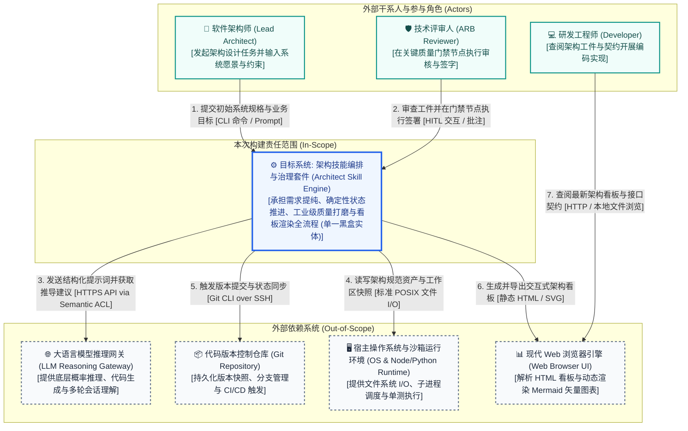

# 系统上下文与绝对边界规约 (System Context & Boundary Overview)

> **架构视角**: 架构第 0 层 (Level 0) - 生态位与绝对黑盒边界 (System Context & The Black-box Rule)  
> **核心使命**: 确立架构技能编排套件的绝对责任边界，明确“我们在建什么（In-Scope）”与“我们依赖谁（Out-of-Scope）”。目标系统在当前层级被严格视作单一黑盒实体，严禁暴露任何内部微服务、调度状态机细节或底层文件存储操作。

---

## 1. Level 0 系统上下文图 (System Context Diagram)

---

## 2. 上下文实体交互矩阵 (Context Interaction Matrix)

| 实体分类 | 实体名称 (Entity) | 职责与系统关系描述 (Description & Interaction) | 数据流向与核心契约 (Data Flow & Contract) | 边界责任归属 (Ownership) |
| :--- | :--- | :--- | :--- | :--- |
| **中心系统** | **架构技能编排与治理套件** | **[核心黑盒 / 本次构建范围 In-Scope]** 承担需求澄清、确定性生命周期流转、质量规范打磨与多图表可视化全流程。 | 不适用 (中心黑盒) | **本团队研发与 SLA 责任区 (In-Scope)** |
| **外部角色** | 软件架构师 (Lead Architect) | 负责输入业务愿景与硬约束，主导系统结构推导与决策仲裁。 | `架构师` $\to$ 发起架构任务 [CLI / 对话] $\to$ `系统` | 用户交互终端 (In-Scope 触发源) |
| **外部角色** | 技术评审人 (ARB Reviewer) | 负责关键里程碑审查（如 AOD、ARC、ADR），执行放行或打回。 | `评审人` $\to$ 审核与签署指令 [HITL 协议] $\to$ `系统` | 架构治理委员会 |
| **外部角色** | 研发工程师 (Developer) | 消费系统产出的标准架构文档、Schema 契约与指导规约开展工程落地。 | `系统` $\to$ 交付架构规格书 [Markdown/HTML] $\to$ `开发人员` | 下游研发团队 |
| **外部系统** | 大语言模型推理网关 | 提供底层认知推理支撑，系统通过语义防腐层与结构化输出约束调用。 | `系统` $\to$ 推理请求 [HTTPS via Semantic ACL] $\to$ `模型网关` | 外部云模型服务商 (Out-of-Scope) |
| **外部系统** | 代码版本控制系统 (Git) | 负责项目源码、测试工作区与架构文档的持久化托管与版本追踪。 | `系统` $\to$ 代码提交与打标 [Git 命令] $\to$ `Git 服务` | 基础设施平台服务 (Out-of-Scope) |
| **外部系统** | 宿主操作系统与运行时 | 提供 Python 3.10+、Node.js 运行容器及文件系统原子持久化能力。 | `系统` $\to$ 状态原子写入与进程调用 [POSIX API] $\to$ `宿主OS` | 本地执行宿主机 (Out-of-Scope) |
| **外部系统** | 现代 Web 浏览器引擎 | 提供用于离线或在线查看 `architecture_board.html` 的渲染支持。 | `系统` $\to$ 静态看板文件 [HTML5/JS/Mermaid] $\to$ `浏览器` | 客户端渲染终端 (Out-of-Scope) |

---

## 3. 三道安检门检验结论 (The 3 Gatekeeper Tests)

### 3.1 “X 射线”违规测试 (The X-Ray Test)
- **检验结论**: **PASS (通过)**。
- **排查说明**: 经严格审查，本图中的中心系统对外表现为**唯一的单一黑盒节点**，彻底剔除了所有状态机调度器（`FSMOrchestrator`）、门禁守卫（`Gatekeeper`）、图元渲染器（`DiagramRenderer`）与文档打磨引擎（`DocumentPolisher`）等内部微模块，确保业务高管与架构师宏观审视工具链与外部世界的生态位关系。

### 3.2 责任切割测试 (The "Who owns this?" Test)
- **检验结论**: **PASS (通过)**。
- **边界划分**:
  - **In-Scope (本团队系统责任区)**: 状态机流转确定性、门禁拦截逻辑、文档质量打磨评分准确度、Mermaid 图表提取与看板生成正确性。
  - **Out-of-Scope (外部协作责任区)**: 外部大语言模型 API 可用性与网络延迟、宿主机磁盘剩余空间与硬件稳定性、外部 Git 远程服务器认证权限。

### 3.3 “孤岛”与“无源之水”排查 (Orphan & Magic Flow Check)
- **检验结论**: **PASS (通过)**。
- **闭环验证**: 系统具备清晰的输入源（架构师输入的系统愿景与约束），同时对外产生决定性的工程产物（符合企业级标准的架构全景文档、Schema 契约代码与交互式可视化看板），形成完整端到端价值闭环。

---

## 4. 从上下文图到 AOD 的关键过渡 (Zooming In)

> **“当前系统上下文图（Level 0）处于万米高空视角，聚焦于‘系统大楼外观及外部生态公路网络’（纯黑盒）。当下一步无人机穿透大楼屋顶时，将正式进入 AOD（Architecture Overview Diagram，架构概览图），展开大楼内部的‘调度中枢（FSM 编排引擎）’、‘质量安检大厅（Gatekeeper 门禁与 Polisher 打磨器）’、‘可视化投影中心（Board 看板渲染器）’与‘规范法典库（标准技能与模板集）’的白盒全景结构。”**

---

## 5. 责任边界签署 (Boundary Sign-off)
- **平台主导架构师**: APPROVED (确认系统绝对边界与纯黑盒法则)
- **技术评审委员会**: APPROVED (确认外部系统交互契约与责任切割)
- **签署生效日期**: 2026-09-18
