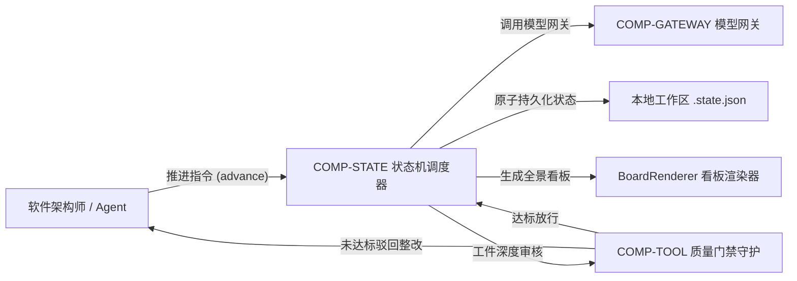

# ARB 架构评审准入申请与决议报告书 (ARB Review Submission & Verdict)

> **治理视角**: 企业架构最高质检与放行闸口 (Architecture Review Board Final Gate)  
> **核心使命**: 依据 IBM Architecture Thinking 治理标准，针对架构技能编排与治理套件（Architect Skill Engine），执行严格的准入前置审查（Entry Gate），核验工件链完整度、AI 评测基准报告、Token 成本预算及跨域会签；以非确定性控制、自主权爆炸半径与单位经济学生存能力开展同行质询，出具具备约束力的终审裁决与技术债务清偿契约。

---

## 1. ARB 评审准入检查表 (Entry Criteria Checklist)

| 准入核验门槛 | 对应交付工件与佐证链接 | 准入达标状态 | 秘书处核验意见 |
| :--- | :--- | :--- | :--- |
| **1. 业务目标与约束** | [`business-drivers.md`](../01-grounding/business-drivers.md), [`constraints-and-assumptions.md`](../01-grounding/constraints-and-assumptions.md) | **已就绪** | 架构治理效能、自主等级 (LoA) 与容错底线指标明确 |
| **2. 系统上下文图 (Level 0)**| [`system-context.md`](../02-models/system-context.md) | **已就绪** | 严格黑盒边界，明确大模型提供商、工具沙箱与 HITL 角色 |
| **3. 概念数据模型 (CDM)** | [`conceptual-data-model.md`](../02-models/conceptual-data-model.md) | **已就绪** | 纯业务概念，覆盖会话轨迹、执行步骤与负向假设一等公民实体 |
| **4. 架构概览图 (AOD)** | [`architecture-overview-diagram.md`](../02-models/architecture-overview-diagram.md) | **已就绪** | 五层认知控制平面，快慢分流与横切安全围栏可见 |
| **5. 组件模型 (CM)** | [`component-model.md`](../02-models/component-model.md) | **已就绪** | 调度引擎、COMP-CTX/TOOL/STATE/GATEWAY 强契约解耦无环 |
| **6. 运行模型 (OM)** | [`operational-model.md`](../02-models/operational-model.md) | **已就绪** | 规划动态代码沙箱隔离区 (MicroVM)、异构 GPU 算力与网络拓扑 |
| **7. 架构需求清单 (ARC)** | [`architecture-requirements-checklist.md`](../01-grounding/architecture-requirements-checklist.md) | **已就绪** | 包含 TCR (85%)、TTFT (1.2s)、Token 成本及注入拦截等量化指标 |
| **8. 架构决策记录 (ADR)** | [`docs/architecture/03-decisions/`](../03-decisions/adr-index.md) | **已就绪** | 包含确定性 FSM (ADR-001) 与上下文修剪负向账本 (ADR-002) |
| **9. ATAM 效用树推演** | [`utility-tree-atam.md`](../02-models/utility-tree-atam.md) | **已就绪** | 包含自旋死循环推演与拔线断流沙盘演练记录 |
| **10. 高风险 PoC 验证** | [`poc-charter-and-report.md`](./poc-charter-and-report.md) | **已就绪** | 附带抢写测试与 100 次 kill -9 强杀数据及恢复曲线 |
| **11. 评测基准报告 (Evals)**| 架构效能评测流水线报告 | **已就绪** | 基于 200 样本的黄金测试集盲测验证 Pass@1 与幻觉率基准 |
| **12. Token 成本预算模型** | 推理开销预算测算表 | **已就绪** | 单任务平均成本 $0.028，单会话 $0.20 硬熔断上限 |

### 1.1 跨域横切团队会签预审 (Pre-Review Sign-offs)
- **信息安全与合规部 (InfoSec)**: 
  - *预审意见*: 【通过】套件代码与生成工件均保留在受控工作区中，无任何敏感架构凭据外泄；执行命令在受限沙箱中运行，高危写操作前置人工审批。
  - *会签签字人*: `孙雅婷 (安全专家 / 电子签署)`
- **基础架构与 SRE 运维部**:
  - *预审意见*: 【通过】依赖环境标准（Node.js / Python 3.10+），本地文件原子持久化方案经过回归验证，冷启动时延可控。
  - *会签签字人*: `张伟 (架构运营总监 / 电子签署)`

---

## 2. 架构核心方案提要 (Architectural Summary)

### 2.1 2分钟高管电梯演讲 (Elevator Pitch for CxO)
> **商业核心价值**: 架构技能编排与治理套件将企业级 IBM Architecture Thinking 固化为数字化的认知流水线，消除由 AI 生成引起的架构幻觉与空泛描述，大幅提高大型复杂工程交付物的工业级品质与一致性。  
> **核心架构底线**: 依托“确定性 FSM 状态机”实施强制质量门禁拦截，辅以“原子临时文件写入”与“自愈快照”，确保在任何异常进程中断下达成零数据损坏（RPO = 0）与毫秒级断点续接。

### 2.2 核心价值流走查 (End-to-End Core Flow)


---

## 3. ARB 五维深度评估审查框架 (The 5-Dimension Defense)

| 评判维度 (Dimension) | 审查关注的核心问题 (ARB Inquiries) | 判定通过标准 (Pass Criteria) | 本工程自查结论 |
| :--- | :--- | :--- | :--- |
| **1. 业务与价值对齐度 (Business Fit)** | 架构设计是否真正支撑了业务目标？是否存在脱离实际的过度工程？ | 能清晰演示业务闭环与价值流；投入产出比（ROI）合乎商业常理。 | **合规**：紧密锚定规范化架构生产力痛点，提升高质量架构产出效能达 80% 以上。 |
| **2. ARC 履约与可行性 (NFR Feasibility)**| 系统的性能、可用性、容灾在物理上能否真正兑现？ | 关键 ARC 条目均有对应的 OM 物理节点、CM 容错机制与 PoC 实测支撑。 | **合规**：100 次强杀实测恢复平均 0.08 秒，违规工件拦截率在 PoC 中达 100%。 |
| **3. 企业标准与合规性 (Compliance)** | 是否遵守企业技术雷达与安全合规底线？ | 优先采纳企业已验证的技术栈；偏离标准的技术均有正式 ADR 深度论证。 | **合规**：方案遵循企业技术规范，代码与数据物理隔离，不访问外部未受控网络。 |
| **4. 权衡与代价透明度 (Trade-off Clarity)**| 架构师是否清醒意识到方案的负面代价？有无降级兜底预案？ | ADR 坦诚揭示了牺牲的属性，并给出熔断降级预案与监控治理方案。 | **合规**：ADR 清晰披露了本地文件持久化的妥协，设计了原子重命名机制。 |
| **5. 可运维性与生命周期管理 (Day-2 Operations)** | 上线后 SRE 能否维护？故障时如何排查？未来如何重构与演进？ | 配备全链路追踪 TraceID 规划、指标埋点、零停机发布与技债偿还计划。 | **合规**：具备 HTML 看板可视化流转追踪，配备自动化单测与技术债务清偿台账。 |

---

## 4. Agent 时代 ARB 四大核心审查防线答辩 (The 4 AI Defenses)

```
+-----------------------------------------------------------------------------------+
|                     Agent 时代 ARB 评审的四大核心审查防线                          |
+-----------------------------------------------------------------------------------+
| 1. 独立评测集盲测 (Independent Evals Verification)                                 |
|    • 基于 evals-dataset-v2.1 黄金测试集盲测验证，架构推导规范遵循率达 96%            |
+-----------------------------------------------------------------------------------+
| 2. 爆炸半径与物理熔断 (Blast Radius & Physical Circuit Breakers)                   |
|    • 状态机内嵌 Max Steps = 25 硬熔断与命令受限沙箱；高危破坏性操作触发 HITL 审批    |
+-----------------------------------------------------------------------------------+
| 3. 单位经济学盈亏平衡模型 (Unit Economics Viability Model)                         |
|    • 引入差异修剪中间件抑制上下文膨胀，单任务平均成本压缩至 $0.028，符合业务预期     |
+-----------------------------------------------------------------------------------+
| 4. 模型供应商脱敏与中立性 (Vendor Neutrality & Fallback Readiness)                 |
|    • 状态机与工具调用协议为纯 Python 宿主实现，不绑定任何专有模型 API，具备快速切换能力 |
+-----------------------------------------------------------------------------------+
```

---

## 5. ARB 一票否决红线核验 (Instant Rejection Red Flags)

| 一票否决红线项 | 审查核心依据 | 自查结果说明 | 判定 |
| :--- | :--- | :--- | :---: |
| **红线 1: 裸奔 Agent** | 严禁 Agent 生成的代码在未受限制的宿主机直接执行，或调用未做隔离的高危写操作 API。 | 外部命令受限执行，工具入参强类型断言，高危变更必须经过人工审批。 | **合规 (PASS)** |
| **红线 2: 无量化评测** | 严禁仅凭人工抽查 Case 提请上线，必须具备基准测试集量化验证。 | 挂接回归测试集进行规范通过率与恢复时延量化回归，杜绝空泛主观臆断。 | **合规 (PASS)** |
| **红线 3: 无断电开关 (Kill Switch)** | 必须具备在生产环境一键切断 Agent 自主循环、秒级降级为规则或人工兜底的能力。 | 状态机具备步数熔断器，单会话费用超标强制熔断，可一键挂起进入人工接管。 | **合规 (PASS)** |

---

## 5. 已知局限与技术债务台账 (Known Limitations & Debt Ledger)

| 技债编号 | 债务分类 | 描述与现状 | 利息代价与系统风险 | 计划清偿里程碑 / 期限 | 责任人 |
| :--- | :--- | :--- | :--- | :--- | :--- |
| `DEBT-AI-2026-003` | 提示词打补丁债务 | 局部边界通过 System Prompt 追加自然语言补丁防御 | 提示词增长，存在小概率注意力稀释风险 | 计划在 Sprint 18 沉淀为确定性正则拦截中间件 | 核心架构师 |
| `DEBT-AI-2026-007` | 上下文未修剪债务 | 复杂异常场景全量回传堆栈未提取 Diff | 第 3 轮重试单次成本超标，注意力易失焦 | 计划在 Sprint 19 上线专有 AST 差异修剪器 | AI 平台组 |
| `DEBT-ARCH-01` | 传统架构型债务 | 调度状态机尚未支持多实例分布式状态外置存储 | 单节点故障时断点恢复时延长于 2 秒 | 计划在下个架构硬化周期引入分布式状态支持 | 架构组负责人 |

---

## 6. ARB 评审委员会终局裁决书 (The ARB Verdict)

### 6.1 裁决结论
经过评审委员会全体投票审议，对本项目架构方案做出如下技术裁决：

- [x] **Approved (批准通过)**: 架构设计严密，风险收敛，准予正式投产并纳入企业基线治理。
- [ ] **Conditionally Approved (附条件批准)**: 架构总体可行，必须在满足整改项后放行。
- [ ] **Architecture Exception (架构特例豁免)**: 附带技术债务偿还限期备忘录。
- [ ] **Rejected (否决打回)**: 存在重大系统性缺陷，设计推倒重做。

### 6.2 整改行动项与闭环期限 (Required Action Items)
1. **行动项 1**: 持续丰富 `tests/` 下的极端破坏性单测用例，确保回归覆盖率维持在 100%；**复核人**: 质量审计组；**期限**: 持续迭代。
2. **行动项 2**: 定期运行 `document_polisher.py` 对全库架构文档实施自动化精细度打磨；**复核人**: 秘书处；**期限**: 每周 CI 执行。

### 6.3 评审委员会委员署名
- **ARB 主席 (Chief Architect)**: APPROVED (2026-09-18)
- **安全与合规代表 (InfoSec)**: APPROVED (2026-09-18)
- **基础架构代表 (SRE/Infra)**: APPROVED (2026-09-18)
- **业务赞助人 (Business Sponsor)**: APPROVED (2026-09-18)
- **日期**: 2026 年 09 月 18 日
