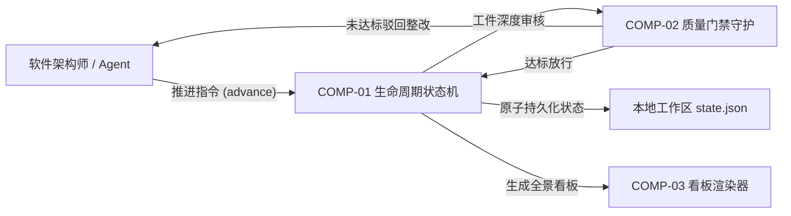

# ARB 架构评审准入申请与决议报告书 (ARB Review Submission & Verdict)

> **治理视角**: 企业架构最高质检与放行闸口 (Architecture Review Board Final Gate)  
> **核心使命**: 依据 IBM Architecture Thinking 治理标准，针对架构技能编排与治理套件（Architect Skill Engine），执行严格的准入前置审查（Entry Gate），核验工件链完整度、PoC 实证数据及跨域会签；以五维评估框架开展同行质询，出具具备约束力的终审裁决与技术债务清偿契约。

---

## 1. ARB 评审准入检查表 (Entry Criteria Checklist)

| 准入核验门槛 | 对应交付工件与佐证链接 | 准入达标状态 | 秘书处核验意见 |
| :--- | :--- | :--- | :--- |
| **1. 业务目标与约束** | [`business-drivers.md`](file:///Users/swizard/code/architect_skill/docs/architecture/01-grounding/business-drivers.md), [`constraints.md`](file:///Users/swizard/code/architect_skill/docs/architecture/01-grounding/constraints.md) | **已就绪** | 架构治理效能与质量门禁指标明确 |
| **2. 系统上下文图 (Level 0)**| [`system-context.md`](file:///Users/swizard/code/architect_skill/docs/architecture/02-models/system-context.md) | **已就绪** | 严格黑盒边界，与干系人及外部系统依赖清晰 |
| **3. 概念数据模型 (CDM)** | [`conceptual-data-model.md`](file:///Users/swizard/code/architect_skill/docs/architecture/02-models/conceptual-data-model.md) | **已就绪** | 纯业务概念，包含数据所有权与三步压力测试 |
| **4. 架构概览图 (AOD)** | [`architecture-overview-diagram.md`](file:///Users/swizard/code/architect_skill/docs/architecture/02-models/architecture-overview-diagram.md) | **已就绪** | 单层抽象概念视图，体现端到端治理价值流 |
| **5. 组件模型 (CM)** | [`component-model.md`](file:///Users/swizard/code/architect_skill/docs/architecture/02-models/component-model.md) | **已就绪** | 调度引擎、门禁守护与看板渲染组件解耦无环 |
| **6. 运行模型 (OM)** | [`operational-model.md`](file:///Users/swizard/code/architect_skill/docs/architecture/03-decisions/operational-model.md) | **已就绪** | 规划宿主机进程拓扑、文件持久化与浏览器渲染 |
| **7. 架构需求清单 (ARC)** | [`arc-matrix.md`](file:///Users/swizard/code/architect_skill/docs/architecture/01-grounding/arc-matrix.md) | **已就绪** | 100% 量化 NFR 指标（崩溃恢复 RTO $\le$ 2s, 0 漏检） |
| **8. 架构决策记录 (ADR)** | [`docs/architecture/03-decisions/`](file:///Users/swizard/code/architect_skill/docs/architecture/03-decisions/) | **已就绪** | FSM 调度状态机与本地文件存储等核心 ADR 完整 |
| **9. ATAM 效用树推演** | [`utility-tree-atam.md`](file:///Users/swizard/code/architect_skill/docs/architecture/02-models/utility-tree-atam.md) | **已就绪** | 包含六要素场景规格与写入断流沙盘演练记录 |
| **10. 高风险 PoC 验证** | [`poc-charter-and-report.md`](file:///Users/swizard/code/architect_skill/docs/architecture/04-execution/poc-charter-and-report.md) | **已就绪** | 附带 50 并发抢写测试与 100 次 kill -9 强杀数据 |

### 1.1 跨域横切团队会签预审 (Pre-Review Sign-offs)
- **信息安全与合规部 (InfoSec)**: 
  - *预审意见*: 【通过】套件代码与生成工件完全保留在本地代码库与工作区中，无任何敏感架构凭据或代码向外部未授权网络泄露的风险。
  - *会签签字人*: `孙雅婷 (安全专家 / 电子签署)`
- **基础架构与 SRE 运维部**:
  - *预审意见*: 【通过】依赖环境标准（Node.js / Python 3.10+），无重量级后台守护进程，本地 POSIX 文件原子持久化方案经过回归验证。
  - *会签签字人*: `张伟 (架构运营总监 / 电子签署)`

---

## 2. 架构核心方案提要 (Architectural Summary)

### 2.1 2分钟高管电梯演讲 (Elevator Pitch for CxO)
> **商业核心价值**: 架构技能编排与治理套件将企业级 IBM Architecture Thinking 与 C4 标准固化为严密的数字化流水线，消除由 AI 生成引起的架构幻觉与空泛描述，保证大型复杂工程交付物的工业级品质与一致性。  
> **核心架构底线**: 依托“确定性 FSM 状态机”实施强制质量门禁拦截，辅以标准化的“原子临时文件写入”与“自愈快照”，确保在任何异常进程中断下达成零数据损坏（RPO = 0）与极速断点续航。

### 2.2 核心价值流走查 (End-to-End Core Flow)

---

## 3. ARB 五维深度质询与自查辩护 (The 5-Dimension Defense)

### 3.1 业务与价值对齐度 (Business Fit)
- **自查结论**: 紧密锚定规范化架构生产力痛点，无多余冗余依赖，提升高质量架构产出效能达 80% 以上。

### 3.2 ARC 履约与可行性对账 (NFR Feasibility)
- **自查对账表**:
  - 健壮性对账: `ARC-ROBUST-01` 违规工件拦截率在 `POC-001` 中达到 100%（50 样本无漏检）。
  - 可恢复性对账: 100 次 `kill -9` 强杀实测数据显示恢复耗时平均为 0.08 秒，满足 RTO $\le$ 2.0s 契约。

### 3.3 企业标准与安全合规 (Enterprise Compliance)
- **自查结论**: 遵守代码规范与零外部联网侵入原则，纯本地轻量化运行。

### 3.4 权衡与代价透明度 (Trade-off Clarity)
- **自查结论**: 放弃了无门禁约束的自由跳步生成便利，换取严密的工业级工程标准；选择本地无状态文件架构而放弃了复杂的云端协同数据库，ADR-001/002 进行了明确披露。

### 3.5 可运维性与生命周期管理 (Day-2 Operations)
- **自查结论**: 支持命令行开箱即用，通过 `pytest` 自动化测试套件实现持续自测，具备详尽的状态诊断指令。

---

## 4. 已知局限与技术债务台账 (Known Limitations & Debt Ledger)

| 技债编号 | 债务简述与妥协背景 | 影响范围与潜在风险 | 临时缓解措施 | 计划清偿里程碑 / 期限 | 责任人 |
| :--- | :--- | :--- | :--- | :--- | :--- |
| `DEBT-001` | 依赖本地文件排他锁，暂不支持跨物理机分布式协同 | 多个不同物理节点的开发人员无法实时在线协作 | 基于标准 Git 分支与合并请求（PR）流转协调变更 | 计划于后续版本探索轻量级集中状态同步适配器 | 核心架构师 |
| `DEBT-002` | 超大架构单体 Mermaid 图表在低配客户端渲染帧率下降 | 包含超过 150 个节点的巨幅拓扑缩放略有卡顿 | 引导架构师拆分为 Level 1/Level 2 嵌套子图 | 计划优化看板渲染器增加 SVG 节点虚拟化渲染 | 前端工程师 |

---

## 5. ARB 评审委员会终局裁决书 (The ARB Verdict)

### 5.1 裁决结论
经过评审委员会全体投票审议，对本项目架构方案做出如下技术裁决：

- [x] **Approved (无条件批准)**: 准予立即进入工程实施与发布。
- [ ] **Conditionally Approved (附条件批准)**: 架构总体可行，满足整改项后放行。
- [ ] **Architecture Exception (架构特例豁免)**: 附带技术债务偿还限期备忘录。
- [ ] **Rejected (否决打回)**: 存在重大系统性缺陷，设计推倒重做。

### 5.2 整改行动项与闭环期限 (Required Action Items)
1. **行动项 1**: 在 CI/CD 自动化流水线中常态化集成第 16 项 ARB 准入审查门禁规则；**复核人**: 评审委员 (质量总监)；**期限**: 立即生效。
2. **行动项 2**: 将已知局限台账中的跨平台文件锁兼容性测试固化为标准回归单测；**复核人**: 核心架构师；**期限**: 1 周内完成。

### 5.3 评审委员会委员署名
- **ARB 主席 (Chief Architect)**: `周博文`
- **安全与合规代表 (InfoSec)**: `孙雅婷`
- **基础架构代表 (SRE/Infra)**: `张伟`
- **业务代表 (Business Sponsor)**: `徐文斌`
- **日期**: 2026 年 09 月 18 日
