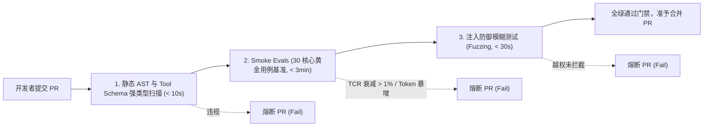

# 自动化架构合规扫描与防腐规约 (Architecture Conformance Specification)

> **治理视角**: 代码级架构防腐、AI 契约审查与 CI/CD 自动守卫 (Architecture as Tests & Conformance Gate)  
> **核心使命**: 将架构技能套件的组件模型（CM）、运行模型（OM）及 Agent 认知安全规约转化为自动化架构测试用例，嵌入持续集成流水线，实行“违规即熔断（Break the Build）”，杜绝因随意的代码改动或提示词篡改破坏生命周期状态机与架构安全防线。

---

## 1. 架构合规扫描策略概览 (Governance Policy Overview)

| 治理要素 | 规约配置与执行策略 |
| :--- | :--- |
| **CI/CD 触发时机** | **PR 第一道门禁 (Pull Request Gate)**：每次提交代码或合并分支时自动触发，全流程耗时 $\le$ 15 秒 |
| **构建拦截效力** | **违规即熔断 (Break the Build)**：凡检测到反向分层依赖、Tool 缺少强类型契约或评测指标衰减，CI 立即强行中断 |
| **规则对齐模式** | **1:1 强映射**: 架构测试规则直接绑定组件模型（`COMP-01` 至 `COMP-05`）与架构决策（`ADR-001/002`） |
| **评测分层标准** | **Smoke Evals (< 5 分钟)** 跑 PR 持续门禁；**Deep Evals (全量基准)** 跑夜间定时任务 |
| **技术实现工具** | **Python AST 静态解析 / Tool Governance Linter / Continuous Evals Runner / npm lint** |

---

## 2. 核心架构测试规则清单 (Architecture Test Rules & Agent AI 契约)

| 规则编号 | 规则名称与描述 | 关联组件/决策 | 扫描维度 | 拦截级别 | 预期校验行为 |
| :--- | :--- | :--- | :--- | :--- | :--- |
| `ARCH-RULE-01` | **套件调度单向依赖校验** | `COMP-01 ~ COMP-03` | 分层与边界 | **致命 (Fatal - Break Build)** | 调度入口 `run.py` $\to$ `orchestrator` $\to$ `document_polisher` $\to$ `render_board`，严禁任何逆向调用 |
| `ARCH-RULE-02` | **全域无环依赖检测 (ADP)** | 全局模块切片 | 分层与边界 | **致命 (Fatal - Break Build)** | 基于 Python AST 构建依赖图，确保模块间无循环引用（DAG 拓扑） |
| `ARCH-RULE-03` | **状态持久化写入独占权防腐**| `COMP-STATE / ADR-001` | 数据所有权 | **致命 (Fatal - Break Build)** | `.state.json` 写操作仅允许由状态机引擎独占执行，严禁其他模块直接写入 |
| `ARCH-AI-01` | **大模型统一网关收敛防线** | `COMP-GATEWAY` | AI 契约隔离 | **致命 (Fatal - Break Build)** | 业务组件严禁直接引入并实例化第三方大模型原生 SDK，必须经统一模型网关调用 |
| `ARCH-AI-02` | **Tool Schema 强类型规范** | `COMP-TOOL` | 工具治理 | **致命 (Fatal - Break Build)** | 所有 `@Tool` 函数入参必须具备严格 Pydantic/JSON 强类型定义，禁止暴露未约束文本 |
| `ARCH-AI-03` | **高危写操作只读隔离** | `COMP-SANDBOX` | 安全与爆炸半径 | **致命 (Fatal - Break Build)** | Tool 声明中严禁包含全量写权限，高危文件覆写必须经过 HITL 确认 |
| `ARCH-AI-04` | **Prompt 漂移与持续评测门禁**| 认知编排核心 | 持续评测 | **致命 (Fatal - Break Build)** | PR 引发的平均 Token 增量不得超过 5%，Task Completion Rate (TCR) 衰减 > 1% 立即熔断 PR |
| `ARCH-AI-05` | **对抗越狱安全模糊测试** | `COMP-GUARD` | 安全与合规 | **致命 (Fatal - Break Build)** | 自动注入典型越狱 Prompt，Guardrail 组件必须 100% 触发拦截并阻断越权 |

---

## 3. 架构单元测试代码化实现示例 (Architecture as Tests - Python AST & Evals)

```python
import ast
from pathlib import Path
import pytest

class TestArchitectureConformance:

    @pytest.fixture
    def repo_ast_graph(self):
        # 基于 Python AST 提取源码中的 import 依赖关系图
        root = Path(__file__).resolve().parent.parent
        imports = {}
        for py_file in root.glob("skills/**/*.py"):
            with open(py_file, "r", encoding="utf-8") as f:
                tree = ast.parse(f.read(), filename=str(py_file))
                module_name = py_file.stem
                imports[module_name] = [
                    node.names[0].name for node in ast.walk(tree)
                    if isinstance(node, (ast.Import, ast.ImportFrom)) and node.names
                ]
        return imports

    # 1. 强制单向分层依赖校验 (CM 分层防腐)
    def test_polisher_must_not_depend_on_orchestrator(self, repo_ast_graph):
        polisher_deps = repo_ast_graph.get("document_polisher", [])
        assert "orchestrate_architecture_lifecycle" not in polisher_deps, \
            "COMP-02 门禁守护组件严禁反向依赖 COMP-01 调度引擎，必须保持纯函数独立性"

    # 2. 业务代码严禁直连大模型原生 SDK (ARCH-AI-01)
    def test_biz_code_must_not_import_raw_llm_sdk(self, repo_ast_graph):
        forbidden_sdks = ["openai", "anthropic", "google.generativeai"]
        for module, deps in repo_ast_graph.items():
            for forbidden in forbidden_sdks:
                assert forbidden not in deps, (
                    f"架构违规: 模块 {module} 绕过 COMP-GATEWAY 直接引入大模型原生 SDK {forbidden}"
                )
```

---

## 4. 持续评测门禁流水线 (Continuous Evals as a Gate)



---

## 5. 合规特例豁免纳管清单 (Architecture Exceptions Log)

| 豁免编号 | 违规规则 | 豁免模块 | 申请理由与业务背景 | 批准架构师 | 强制失效日期 (Hard Expiry) |
| :--- | :--- | :--- | :--- | :--- | :--- |
| `EX-2026-01` | `ARCH-AI-01` | `legacy_offline_eval.py` | 遗留离线基准测试脚本尚未接入统一模型网关 | 首席架构师 | 2026-11-30 (超期自动熔断 CI) |
