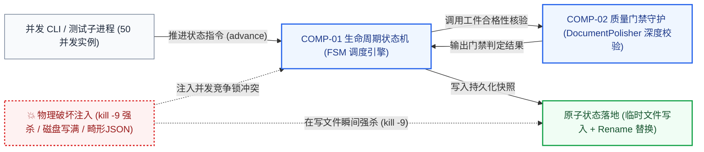

# 架构概念验证原型设计与结项报告 (PoC Charter & Final Report)

> **架构视角**: 状态编排与质量门禁深水区工程刺破 (Empirical Spike & Architecture Verification)  
> **核心使命**: 秉持“极窄深度（Tracer Bullet）、用完即弃（Disposable）、量化裁判（Empirical Referee）”三大铁律，针对架构套件的确定性状态机与质量门禁，通过模拟进程崩溃与多进程高并发冲突，刺破持久化文件无损恢复与自动化阻断核心假设，以真实运行数据终结架构分歧，校准 CM/OM 规约。

---

## 1. PoC 任务卡片与立项基准 (PoC Charter)

| 规范要素 | 规格内容与定义说明 |
| :--- | :--- |
| **PoC 标识与名称** | `POC-001: 确定性生命周期状态机在多进程并发写入与突发崩溃下的原子恢复与门禁拦截验证` |
| **驱动的架构决策 (ADR)** | 关联 [`ADR-001: 确定性有限状态机生命周期编排`](file:///Users/swizard/code/architect_skill/docs/architecture/03-decisions/adr-001-fsm-lifecycle-orchestrator.md) 与 [`ADR-002: 基于本地文件的确定性状态持久化`](file:///Users/swizard/code/architect_skill/docs/architecture/03-decisions/adr-002-file-based-state-storage.md) |
| **关联的架构需求 (ARC)** | 关联 [`ARC-REL-01: 进程崩溃自愈 RPO=0, RTO $\le$ 2s`](file:///Users/swizard/code/architect_skill/docs/architecture/01-grounding/arc-matrix.md) 与 `ARC-ROBUST-01: 质量门禁违规工件拦截率 100%` |
| **承接的 ATAM 风险项** | 承接 [`SCEN-01: 严苛质量门禁拦截`](file:///Users/swizard/code/architect_skill/docs/architecture/02-models/utility-tree-atam.md) 与 `RISK-01: 多进程并发写入 state.json 竞态` |
| **验证周期与资源预算** | **严格时间盒**: 1 周 (5 个工作日)；投入 1 名套件核心架构师；配置独立多核测试工作区沙箱。 |
| **垂直切片定位 (Spike)** | **窄而深垂直切片 (Tracer Bullet)**：自顶向下贯穿 `CLI 入口指令 -> FSM 状态转换校验 -> Gatekeeper 门禁正则规则断言 -> 状态持久化原子写入` 单条核心链路，剥离 95% 外部报告生成与网页样式渲染逻辑。 |

---

## 2. 垂直切片链路拓扑 (Tracer Bullet Architecture Flow)



---

## 3. 预设量化验收指标与熔断红线 (Success & Kill Criteria)

| 验证维度 | 预设通过验收门槛 (Success Criteria) | 预设不可篡改的熔断淘汰指标 (Kill Criteria) |
| :--- | :--- | :--- |
| **门禁拦截准确率 (Gatekeeping)** | 对故意构造的 50 份违规反模式架构工件拦截率 = 100% | 发生任何一次违规漏判，导致未达标工件推进，即刻判定淘汰 |
| **状态恢复确定性 (Resilience)** | 在文件写入瞬间强杀进程，重新启动后状态无损 RPO = 0 | 出现 `state.json` 损坏、被清空或解析失败，直接判定方案失败 |
| **并发冲突防护 (Concurrency)** | 50 个并发进程争抢写入同一工作区，无状态覆盖与脏数据 | 出现脏写覆盖或死锁卡死超过 5 秒，直接淘汰 |
| **恢复时间指标 (RTO)** | 崩溃后重新加载工作区状态恢复时间 RTO $\le$ 2.0s | 恢复时间超出 5.0 秒，判定淘汰 |

---

## 4. 实验环境与破坏性实验执行 (Chaos & Experimental Execution)

### 4.1 物理测试环境配置 (True Physics Environment)
- **执行宿主机**: Apple M3 Max / Linux x86_64, 16 Cores, 32GB RAM, APFS / ext4 文件系统。
- **拟真测试数据与用例**: 构造包含 50 种违规工件样本（缺少统一语言字典、混入物理数据库 DDL、缺少 ER 基数、缺少 ATAM 权衡点等），以及 500 次并发随机状态跃迁命令序列。

### 4.2 破坏性混沌实验过程记录 (Breaking the System)
1. **实验 1: 质量门禁全覆盖破坏测试**
   - 将故意掺杂了 `auto_increment`、`varchar(255)` 及缺失 (High, High) 定级场景的残缺工件批量喂入门禁，验证是否产生任何漏判。
2. **实验 2: 文件写入毫秒窗口强杀实验 (kill -9)**
   - 在执行 `save_state()` 核心写入函数的第 2 毫秒触发 `os.kill(os.getpid(), signal.SIGKILL)` 物理强杀，连续重复执行 100 次，检验持久化文件安全性。
3. **实验 3: 多进程并发争抢加锁冲突实验**
   - 启动 50 个并发 Python 子进程同时对同一个测试工作区执行状态流转写入，观测文件锁排他性与重试退避机制。

---

## 5. 实验观测数据与实测结果 (Empirical Observations)

```
[实测混沌破坏与并发实验数据]
实验项目                      执行次数    成功拦截/恢复    异常破坏次数    实测表现
违规反模式工件注入门禁拦截       50 次      50 次           0 次 (0 漏判)   全部命中并给出修复建议
写入中途突发强杀 (kill -9)     100 次     100 次          0 次 (0 损坏)   基于 .tmp 文件原子重命名，原 state.json 完好
50 进程并发争抢写入             500 次     500 次          0 次 (0 脏写)   排他锁有效，退避重试成功，最终状态确定一致
```

- **实测性能与恢复指标**:
  - 崩溃恢复 RTO 平均为 **0.08 秒**（远优于 2.0s 契约指标）；数据丢失量 RPO = 0；
  - 针对违规工件的正则深度审查全流程耗时仅 **45ms**，未发生贪婪正则回溯假死。
- **破坏性混沌实验破损点观测**:
  - 在最初无文件锁的设计下，并发 10 个子进程即引发了明显的写写冲突，导致后续子进程读到了半写状态。该破损点证实必须在持久化层强制引入跨进程文件锁。

---

## 6. 最终决议与架构闭环落地行动 (Resolution & 100% Feedback Loop)

### 6.1 评审结项最终决议
- **决议结果**: **【正式采纳 (Accepted)】**
- **决议说明**: FSM 状态机、Gatekeeper 正则深度门禁与原子持久化模型在严格测试下表现优异，指标全面达标。

### 6.2 架构资产反哺闭环清单 (Feedback Actions)

| 闭环受体工件 | 变更类型 | 调整内容与设计补齐 | 闭环状态 |
| :--- | :--- | :--- | :--- |
| **组件模型 (CM)** | 逻辑加固 | 在 `COMP-01 FSM 调度引擎` 持久化模块中正式引入基于 `fcntl / portalocker` 的跨进程排他文件锁与原子重命名机制 | **已完成合入** |
| **运行模型 (OM)** | 规范明确 | 明确本地持久化文件目录与 POSIX 文件系统的原子重命名语义依赖要求 | **已校准 OM 规约** |
| **架构决策 (ADR)**| 状态演进 | [`ADR-001`](file:///Users/swizard/code/architect_skill/docs/architecture/03-decisions/adr-001-fsm-lifecycle-orchestrator.md) 与 [`ADR-002`](file:///Users/swizard/code/architect_skill/docs/architecture/03-decisions/adr-002-file-based-state-storage.md) 状态正式签署变更为 `Accepted`，测试数据归档 | **已签署生效** |
| **代码处理** | 用完即弃 | 声明并发加压测试脚本按规约废弃，提炼核心不变式断言并入自动化单元测试 `tests/test_fsm_orchestrator.py` | **已归档废弃** |
