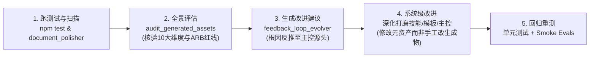

# 架构工程化落地手册与规范指南

## 1. 体系定位与核心哲学

本工程旨在将高级架构思维（Architecture Thinking）与“确定性工程外壳 + 概率性推理内核（Deterministic Shell + Stochastic Core）”的方法论沉淀为可直接在生产环境落地的自动化代码、Prompt 规范与模板工程。

面对传统软件与现代智能体（Agent）开发中的两极分化——即“过度依赖概率推理导致逻辑失控与代码熵增”，或者“过度僵化导致无法利用大模型语义泛化能力”——本体系提供了一套物理围栏：
1. **宏观控制由有限状态机（FSM）掌控**：状态单向演进，阶段资产具备单向基线锁定与准出门禁检查（Gatekeeper Validation），关键决策节点阻塞等待人类确认（HITL）。
2. **微观推理交由智能体在沙箱内完成**：在明确的上下文视图、AST 符号索引和强类型契约内生成局部补丁与概念模型，严禁越界读写。
3. **向下游 Vibe Coding 施加三大红线**：通过 `.agent-rules.md` 锁定契约只读、单向依赖倒置与测试自检闭环，确保 AI 编码助手不偏离架构轨道。

---

## 2. 工程目录体系与资产拓扑

```text
skills/
├── 00_orchestrator/
│   ├── orchestrate_architecture_lifecycle.py   # 主控状态机驱动引擎 (FSM 调度实现)
│   ├── fsm_config.json                         # 状态转移规则、门禁与路径配置
│   └── README.md                               # 编排引擎运行说明与 CLI 命令
├── 01_grounding/
│   ├── grill_architecture_requirements.md      # 苏格拉底式审问 Prompt 与准出门禁
│   ├── distill_nfr_matrix.md                   # NFR 度量矩阵提取 Prompt 与模板
│   └── catalog_invariants_and_constraints.md   # 不变量与硬约束编目 Prompt 与模板
├── 02_structural_modeling/
│   ├── generate_system_context.md              # C4 Context (L1) 建模 Prompt 与 Mermaid 规范
│   ├── derive_logical_domain_model.md          # DDD 限界上下文与状态机 Prompt
│   └── synthesize_architecture_overview.md     # C4 Container (L2) 拓扑 Prompt
├── 03_contracts_and_decisions/
│   ├── record_architecture_decision.md         # ADR 决策生成 Prompt (MADR 规范)
│   ├── scaffold_boundary_contracts.md          # OpenAPI / JSON Schema 提取与验证 Prompt
│   └── generate_failure_resilience_matrix.md   # FMEA 容灾降级矩阵 Prompt
├── 04_execution_and_scaffolding/
│   ├── bootstrap_walking_skeleton.md           # 工程物理骨架生成 Prompt
│   └── sequence_delivery_milestones.md         # 敏捷里程碑与 First Step PoC Prompt
templates/                                      # 产出文档的标准 Markdown / YAML 模板
│   ├── nfr-matrix-template.md
│   ├── constraints-template.md
│   ├── adr-template.md
│   ├── resilience-matrix-template.md
│   └── agent-rules-template.md                 # 供 Vibe Coding 防跑偏的 .agent-rules 核心模板
tests/
│   └── test_fsm_orchestrator.py                # 针对主控状态机推进、卡点与拦截的单元测试
└── run.py                                      # 启动交互式架构设计会话的入口脚本
```

---

## 3. 状态机推进与门禁规则说明

有限状态机严格按照以下顺序推进：
`INIT` -> `GRILLING` -> `GROUNDING` -> `MODELING` -> `CONTRACTS` -> `SCAFFOLDING` -> `FINALIZED`

### 3.1 门禁拦截策略
- **不可跳步**：若当前阶段前置产物（如 `grounding-spec.json`）缺失或格式损坏（如非法 JSON），状态机抛出 `GatekeeperError` 并中断跃迁。
- **人机审查卡点 (HITL)**：
  - 在 `GRILLING` 准出时：要求确认业务驱动力、NFR 目标与核心不变量。
  - 在 `CONTRACTS` 准出时：要求签署架构决策（ADR）、OpenAPI 强类型契约与 FMEA 容灾降级矩阵。
- **打回与自愈**：若人类审查判定不合格并打回，状态机自动记录打回原因并回退到上一工作状态。

---

## 4. Skill 实战使用指引与人机协同工作流

本系统中的 12 个 Skill 既支持通过 FSM 状态机端到端驱动，也支持作为独立 Prompt 注入给各类 AI 智能体（如 Cursor、Windsurf、Claude Code）：

### 4.1 核心操作模式
1. **主控状态机驱动模式（推荐）**：
   - 开发者运行 `python run.py --step` 查看当前阶段与要求产出。
   - 将对应阶段的 Skill 提示词输入给 AI 智能体，智能体结合业务输入完成产物生成并落盘至 `docs/architecture/`。
   - 再次运行 `python run.py --step`，状态机执行门禁校验与人工审核（HITL），通过后推进至下一阶段。
2. **AI 辅助工具 Prompt 挂载**：
   - 在 Cursor 或 Windsurf 中直接使用 `@grill_architecture_requirements.md` 进行苏格拉底式深挖；
   - 引用 `@generate_system_context.md` 驱动大模型输出高质量的 C4 Context Mermaid 拓扑图。
3. **下游 Vibe Coding 防护约束**：
   - 状态机最终生成的 `.agent-rules.md` 锁定契约只读、单向依赖倒置与测试闭环，防止 AI 在后续编码中产生架构漂移。

> 完整实操步骤、输入依赖与逐步演练细节请参阅：[docs/skill_usage_guide.md](skill_usage_guide.md)。

---

## 5. 运行与验证指令

```bash
# 执行单元测试套件
pytest -v

# 查看状态机状态
python run.py --status

# 交互式单步流转
python run.py --step

# 生成全链路演示资产并自动批准推进
python run.py --init-sample-assets
python run.py --auto-approve
```

---

## 6. CI 持续集成与自动化流水线 (GitHub Actions)

项目内置 `.github/workflows/ci.yml` 自动化工作流，在提交或拉取请求时自动触发：
1. **多版本矩阵验证**：覆盖 Python 3.11 与 3.12 运行时。
2. **静态语法检查**：执行 `npm run lint` 验证 Python 核心逻辑与测试模块编译合法性。
3. **单元测试回归**：执行 `npm run test`（`pytest -v`），验证门禁拦截、状态持久化与全生命周期流转。
4. **端到端冒烟测试**：运行 `run.py` 驱动状态机自检，验证演进闭环与退出状态。

---

## 7. IBM Architecture Thinking 十大核心环节全景演进对照表

| 架构环节 | 传统软件时代的交付形态 (Traditional IT) | AI / Agent 时代的工程形态 (Agent-Native) |
| :--- | :--- | :--- |
| **1. 业务目标与约束** | 功能闭环、确定性响应时间、固定基础设施预算 | **自主度分级（HITL/LoA）、Token 单位经济学、容错边界与幻觉底线** |
| **2. 系统上下文图** | 用户 + 传统企业应用黑盒 + 关系型数据库 | **增加模型基座提供商、受控工具执行沙箱、RAG 向量池与人工仲裁角色** |
| **3. 风格与 CDM** | 微服务、分层架构、EDA；业务名词实体模型 | **认知循环（ReAct/Graph）、快慢思考分层；会话轨迹、执行步骤与分层记忆模型** |
| **4. AOD / CM / OM** | 接入层-应用层-数据层；微服务集群与容器拓扑 | **认知路由网关、上下文修剪中间件、状态机；MicroVM 动态微沙箱与长连接流式拓扑** |
| **5. 架构需求清单 (ARC)** | 99.99% 可用性、P99 < 200ms、ACID 强一致性 | **任务完成率 (TCR)、首字延迟 (TTFT)、单任务 Token 成本上限、注入防御拦截率** |
| **6. 架构决策记录 (ADR)** | 选型 MySQL vs. PG、Kafka vs. MQ、单体 vs. 拆分 | **模型基座选型、端到端循环 vs. 显式图编排、单 Agent vs. 多 Agent 隔离协同** |
| **7. 场景推演与 PoC** | 模拟机房断网、拔网线测试；跑通业务功能 Demo | **“土拨鼠之日”自旋死循环推演、间接注入逃逸测试；自动化 Evals 离线评测集压测** |
| **8. ARB 评审准入** | 审查表结构设计、容量核算、组件依赖图 | **独立评测集盲测验证、爆炸半径与物理熔断审查、单位经济学财务模型审查** |
| **9. 自动化合规扫描** | ArchUnit 分层规则检查、代码圈复杂度检测 | **Tool Schema 静态强类型校验、CI/CD 持续评测门禁、自动化对抗注入模糊测试** |
| **10. 技术债务台账** | 重复代码、过长方法、旧版本框架未升级 | **“提示词打补丁”债务、上下文无序膨胀债务、特定闭源模型强绑定债务** |

---

## 8. “跑测试 -> 评估 -> 生成改进建议 -> 改进 -> 测试” 持续演进闭环

为了确保在引入 Agent AI 全套复杂度后，架构体系依然具备自愈与自演进能力，本系统固化了双环持续迭代机制：



### 8.1 五步循环职责与对应技能

1. **跑测试 (Run Tests & Audits)**：
   - 运行工程级单测：`npm run compile && npm run lint && npm test`；
   - 运行工件质量扫描：`python3 skills/06_refinement_and_polishing/document_polisher.py docs/architecture/`。
2. **全景评估 (Evaluate Architecture Assets)**：
   - 激活技能：[`audit_generated_architecture_assets.md`](file:///Users/swizard/code/architect_skill/skills/05_audit_and_evolution/audit_generated_architecture_assets.md)；
   - 严格审查 10 大核心维度，重点核验 ARB AI 原生三大一票否决项（裸奔 Agent、无量化评测、无物理断电开关）。
3. **生成改进建议 (Synthesize Evolution Proposals)**：
   - 激活技能：[`feedback_loop_orchestrator_evolver.md`](file:///Users/swizard/code/architect_skill/skills/05_audit_and_evolution/feedback_loop_orchestrator_evolver.md)；
   - 应用“问题反推与映射矩阵法则”，将下游代码与文档缺陷定向反推至对应的 Prompt、模板或主控门禁，输出 `docs/orchestrator_evolution_proposal.md`。
4. **系统级改进 (Refine Orchestration & Specs)**：
   - 激活技能：[`architecture-documentation-refinement`](file:///Users/swizard/code/architect_skill/skills/06_refinement_and_polishing/SKILL.md)；
   - 坚持“**只修改主控、规则与模板，通过重跑测试使生成物自然达标**”的原则，更新 `skills/`、`templates/` 与 `fsm_config.json`。
5. **回归重测 (Retest & Golden Baseline Verification)**：
   - 重新执行测试与质量扫描，验证缺陷消除，确保各工件综合评分达标且 CI 门禁放行。


