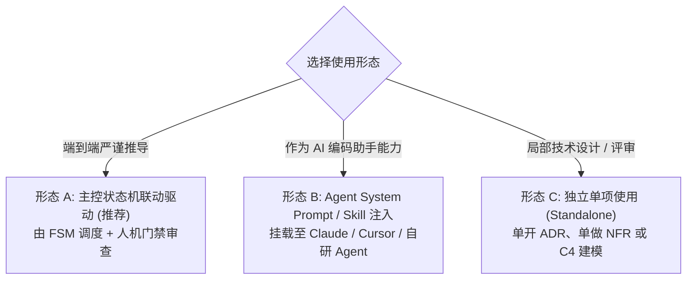
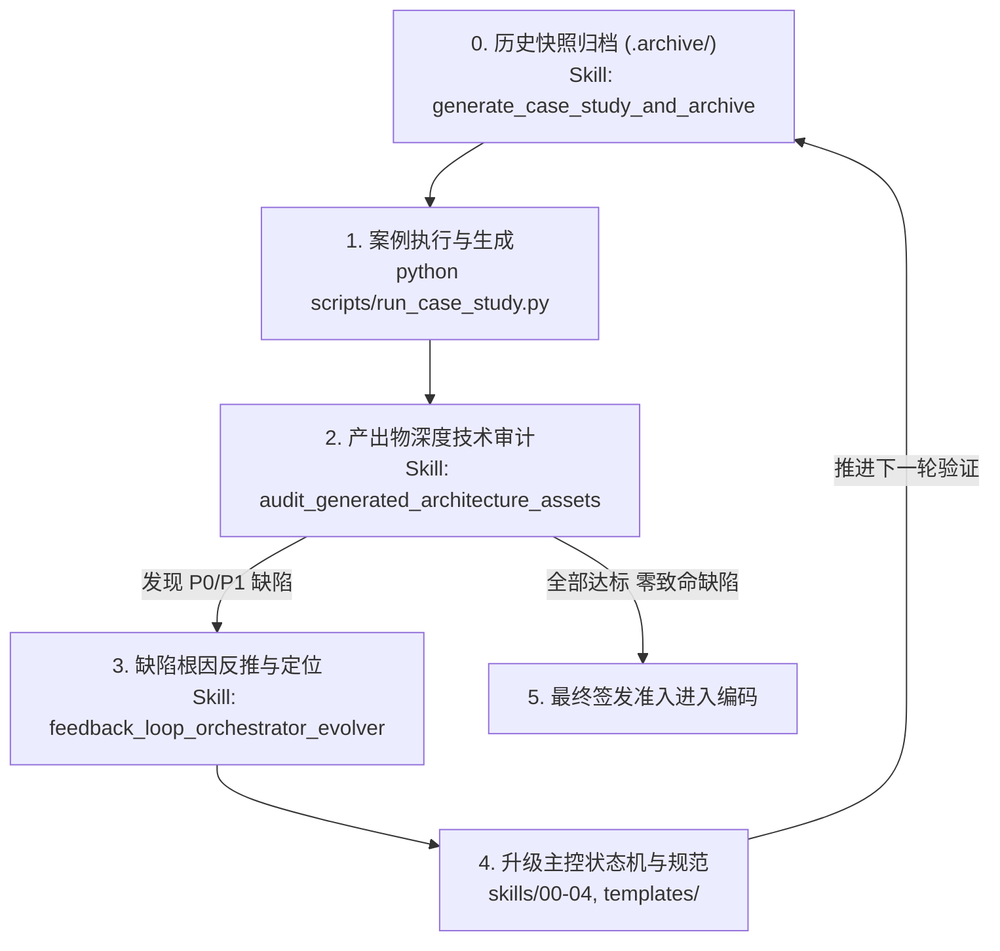

# Skill 实战使用与人机协同操作指南

本指南旨在详细解答：**这 12 个 Skill 在实际开发中到底如何使用、如何与 AI Agent 配合、以及如何与主控状态机（FSM）联动。**

---

## 一、三种核心使用形态

你可以根据团队当前的研发模式，选择以下三种形态之一来使用这套 Skill：



### 形态 A：主控状态机联动驱动 (端到端推荐)
这是推荐的标准化工作流。状态机负责把控流程、门禁和人工卡点，Agent 负责在每个阶段执行 Skill 的具体生成。
1. 启动状态机：运行 `python run.py --step`，状态机会输出当前所处的阶段（例如 `GRILLING`）以及必须产出的目标文件路径。
2. 调度执行：将对应阶段的 Skill Markdown（例如 `skills/01_grounding/grill_architecture_requirements.md`）作为 Prompt 喂给 Agent，由 Agent 与用户交互完成产出。
3. 门禁验证：产物落盘后再次执行 `python run.py --step`，状态机会自动执行门禁自检与人工审批判定，判定通过后单向跃迁至下一阶段。

### 形态 B：作为 Agent 专用 System Prompt / Skill 注入
将具体的 Skill Markdown 文件直接挂载到你的 AI 辅助工具中：
- **在 Claude Code / Antigravity / 自研 Agent 中**：将 `skills/**/*.md` 文件路径配置为 Skill 或 Subagent 的 System Prompt。
- **在 Cursor / Windsurf / Copilot 中**：在执行特定任务时，使用 `@grill_architecture_requirements.md` 引用该 Skill 作为对话上下文，AI 会自动变身为严苛的审问官或架构师。

### 形态 C：独立单项使用 (离线 / 单点设计)
无需启动整个生命周期，直接按需调用单个 Skill：
- 需要为争议技术方案留痕？直接参考 `skills/03_contracts_and_decisions/record_architecture_decision.md` 并结合 `templates/adr-template.md` 产出 ADR。
- 需要梳理系统外部接口？直接使用 `skills/02_structural_modeling/generate_system_context.md` 生成标准 Mermaid C4 图。

---

## 二、各阶段 Skill 详细操作手册

### 阶段 1：需求深挖阶段 (GRILLING)

#### 涉及 Skill：`grill_architecture_requirements.md`
- **目标产物**：`docs/architecture/00-grounding/grounding-spec.json`
- **使用场景**：项目立项之初，或者当需求方给出模糊、技术自嗨型的伪需求时。
- **实操步骤**：
  1. 将 `skills/01_grounding/grill_architecture_requirements.md` 的内容设置为 Agent 的角色指令。
  2. 开发者向 Agent 提供原始需求背景（例如：“我们想用微服务和向量库做一个自动化客服调度系统”）。
  3. **对抗式提问过程**：Agent 每次仅抛出 1-2 个硬核问题逼问物理指标（例如：“不用微服务单机运行第一天会遇到什么瓶颈？”、“允许宕机多久？RPO/RTO 指标是多少？”）。
  4. **门禁判定与输出**：当 4 项准出门禁全部明确后，Agent 停止提问并输出符合 Schema 的 `grounding-spec.json`，保存至 `docs/architecture/00-grounding/`。
  5. 开发者检查 JSON 内容，执行 `python run.py --step` 并在终端输入 `y` 批准，流转至下一阶段。

---

### 阶段 2：约束基准确立 (GROUNDING)

#### 涉及 Skill：
1. `distill_nfr_matrix.md` -> 产出 `docs/architecture/01-grounding/nfr-matrix.md`
2. `catalog_invariants_and_constraints.md` -> 产出 `docs/architecture/01-grounding/constraints-and-assumptions.md`

- **实操步骤**：
  1. 将上一步生成的 `grounding-spec.json` 和 `templates/nfr-matrix-template.md` 传入 Agent，执行 `distill_nfr_matrix`，输出涵盖传统性能与 AI 经济学的双轨度量矩阵。
  2. 将 `grounding-spec.json` 和 `templates/constraints-template.md` 传入 Agent，执行 `catalog_invariants_and_constraints`，输出领域不变量与硬约束列表。
  3. 执行 `python run.py --step`，状态机自动验证两个文件是否存在且非空，无误后自动流转至 `MODELING` 阶段。

---

### 阶段 3：结构建模与概念抽象 (MODELING)

#### 涉及核心规范与 Skill：
1. `architecture_diagramming_principles.md` (吸收 Archify 视觉设计精髓的画图标准)
2. `generate_system_context.md` -> 产出 `docs/architecture/02-models/c4-context.mmd`
3. `derive_logical_domain_model.md` -> 产出 `docs/architecture/02-models/domain-logical-model.md`
4. `synthesize_architecture_overview.md` -> 产出 `docs/architecture/02-models/c4-container-overview.mmd`
5. `generate_sequence_and_dataflow.md` -> 产出 `02-models/interaction-sequence.mmd` 与 `02-models/data-flow.mmd`

- **实操步骤**：
  1. **遵循语义与几何规范**：参考 `architecture_diagramming_principles.md`，使用 7 大组件语义分类（frontend/backend/database/security/external 等）与正交避障规则，连线严格标注协议与操作动词。
  2. **C4 Level 1 上下文图**：Agent 将目标系统黑盒化，绘制 Mermaid C4Context 图，标注外部依赖与防腐层 `[via ACL]`。
  3. **DDD 领域模型与状态机**：Agent 提炼统一语言，划分限界上下文、聚合根，并生成带成功、自愈与熔断三条分支的生命周期状态机。
  4. **C4 Level 2 双环容器图**：Agent 绘制双环模型，展现确定性控制外壳与概率推理内核的物理拓扑。
  5. **微观时序与数据流动**：Agent 生成包含 30s 超时强杀、错误堆栈剪枝与负向账本记录的时序图，以及冷热数据分层管道图。
  6. **一键生成交互式全景画板**：
     ```bash
     python run.py --render-board
     ```
     一键编译输出 `docs/architecture/architecture_board.html`，支持在浏览器中进行浅色/深色主题切换、平移缩放 (Pan & Zoom) 与高清 SVG 导出。
  7. 执行 `python run.py --step`，状态机校验模型资产，自动跃迁至 `CONTRACTS` 阶段。

---

### 阶段 4：决策固化与强契约签署 (CONTRACTS)

#### 涉及 Skill：
1. `record_architecture_decision.md` -> 产出 `docs/architecture/03-decisions/ADR-001*.md` 及 `adr-index.md`
2. `scaffold_boundary_contracts.md` -> 产出 `docs/architecture/04-contracts/openapi.yaml`
3. `generate_failure_resilience_matrix.md` -> 产出 `docs/architecture/03-decisions/failure-resilience-matrix.md`

- **实操步骤**：
  1. **沉淀 ADR**：根据容器图中的关键选型（如双环模型选型、数据库选型），使用 `templates/adr-template.md` 规范生成 MADR 决策记录，明确记录被否决方案与负向代价。
  2. **输出 OpenAPI 强契约**：根据领域模型，生成机器可读的 OpenAPI 3.1 规范，严格限定入参格式、防路径穿越正则与统一错误码。
  3. **推演 FMEA 容灾矩阵**：针对模型超时、沙箱死循环、锚点失效等场景制定降级与 30s 强杀策略。
  4. **关键人机审核卡点 (HITL)**：运行 `python run.py --step`，状态机会在终端阻塞提示：
     ```text
     [HITL 人机审核卡点] 请审查生成的 ADR 架构决策、强类型接口契约与 FMEA 容灾降级矩阵。签署确认后将进入工程骨架搭建。
     请输入审批意见 [Y: 批准 / N: 打回并输入理由]:
     ```
     架构师人工检查契约与 ADR，确认无误后输入 `Y` 批准，状态机跃迁至 `SCAFFOLDING`。

---

### 阶段 5：工程骨架交付与下游 Vibe Coding 防跑偏 (SCAFFOLDING)

#### 涉及 Skill：
1. `bootstrap_walking_skeleton.md` -> 产出工程目录、代码桩与根目录 `.agent-rules.md`
2. `sequence_delivery_milestones.md` -> 产出 `docs/architecture/04-execution/roadmap-and-first-step.md`

- **实操步骤**：
  1. **建立物理工程骨架**：
     - 生成六边形目录体系：`src/domain/`（纯领域模型）、`src/ports/`（抽象接口）、`src/adapters/`（外部适配器）。
     - 生成方法槽位空实现，标注统一占位标记：`# TODO: [VibeCoding Slot]`。
  2. **注入防跑偏红线**：
     - 在代码库根目录生成 `.agent-rules.md`（并符号链接至 `.cursorrules` 或 `.windsurfrules`）。
  3. **规划穿刺测试 (Milestone 0)**：
     - 制定 3 天内验证核心技术风险的 Tracer Bullet 验证方案与敏捷垂直切片。
  4. 运行 `python run.py --step`，状态机确认骨架就绪，顺利抵达终态 `FINALIZED`。

---

## 三、如何对接下游 Vibe Coding (Cursor / Windsurf / Claude Code)

当架构状态机抵达 `FINALIZED` 终态后，整套设计资产如何物理约束后续的 AI 辅助编码？

1. **规则自动生效**：
   - 根目录的 `.agent-rules.md` 会被现代 IDE 自动读取，它声明了三大不可逾越红线：
     - **契约只读**：严禁 AI 私自修改 `04-contracts/` 与 `src/ports/` 下的接口定义。
     - **依赖倒置**：`src/domain/` 严禁导入 `fastapi`、`sqlalchemy` 等具体框架或适配器。
     - **测试闭环**：代码生成后必须自动执行 `npm run lint && npm run test`，严禁擅改测试用例掩盖错误。
2. **AI 只在限定槽位填空**：
   - 下游工程师只需在 Cursor / Windsurf 中向 AI 下达指令：“*请在 `src/adapters/` 中实现存储接口，并填充标记为 `# TODO: [VibeCoding Slot]` 的计算函数*”。
   - AI 的输出被牢牢限制在预留的槽位与沙箱中，整体工程结构和业务逻辑绝不跑偏。

---

## 四、多案例独立目录管理规范与推演

在实际研发与架构评审中，团队常有多个微服务或跨系统案例需要独立推演。为杜绝资产混乱，所有案例在测试区统一按独立目录组织：

```text
architect_skill_tests/
├── README.md                      # 案例集索引总览 (包含各案例直达链接)
├── cbs_engine/                    # 案例 1: 跨境清算与反洗钱推理系统
│   ├── README.md                  # 该案例专属工程说明
│   ├── .agent-rules.md            # 该案例专属防跑偏规则
│   ├── docs/architecture/         # 该案例全生命周期架构资产 (10 大环节)
│   │   ├── 01-grounding/
│   │   ├── 02-models/
│   │   ├── 03-decisions/
│   │   ├── 04-execution/
│   │   └── architecture_board.html# 该案例专属交互画板
│   └── src/                       # 该案例专属物理工程代码骨架
└── <next_case>/                   # 案例 2: 其他独立业务系统
```

### 运行指定案例：
```bash
python scripts/run_case_study.py <case_name>
```
例如：
```bash
python scripts/run_case_study.py cbs_engine
```
驱动脚本将自动创建隔离目录、推进状态机生命周期、生成交互画板与工程骨架，并同步更新根目录下的 `README.md` 索引。

---

## 四、元架构闭环演进：测试 -> 评审 -> 反推 -> 归档演进大循环

系统在 `skills/05_audit_and_evolution/` 下提供了三位一体的闭环自愈能力，贯彻“**杜绝直接修改生成物，只修改主控与规范，通过重跑测试自愈达标**”的原则：



### 三大闭环 Skill 角色与使用说明：
1. **测试案例生成与历史归档 (`generate_case_study_and_archive.md`)**：
   - 在触发新推演前，自动将 `~/code/architect_skill_tests/<case_name>` 快照至 `.archive/round_YYYYMMDD_HHMMSS_<case_name>/`，防止历史痕迹覆盖。
   - 编写或调整新的全流程推演驱动脚本（如 `scripts/cases/cbs_engine.py`），生成新鲜测试工程。
2. **架构资产全方位审计 (`audit_generated_architecture_assets.md`)**：
   - 针对最新生成的 `src/`、`04-contracts/` 与不变量进行代码级硬约束检查，出具 P0/P1/P2 缺陷报告。
3. **评审问题反推与主控演进 (`feedback_loop_orchestrator_evolver.md`)**：
   - 将缺陷按映射矩阵定位至主控门禁 `orchestrate_architecture_lifecycle.py`、Prompt 规范或模板。
   - 升级主控引擎后，重新触发第 1 步并自动归档，形成持续自愈演进循环。


