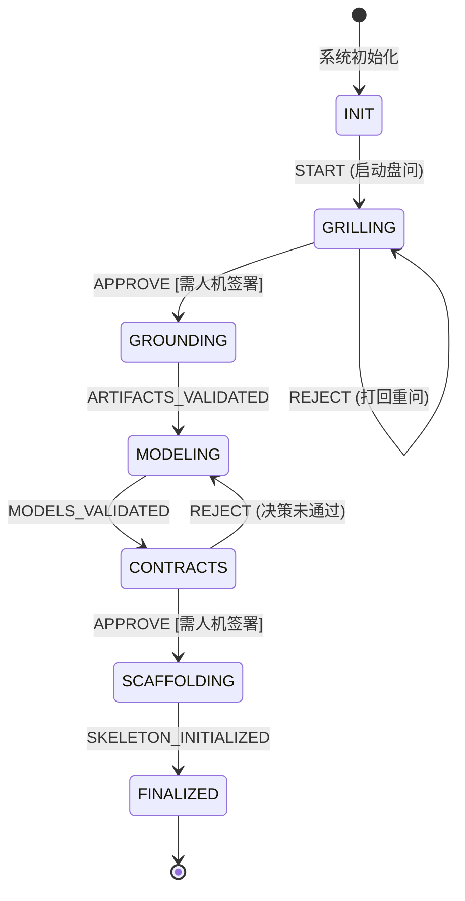

# 架构生命周期主控编排引擎 (Architecture Lifecycle Orchestrator)

## 1. 核心设计哲学

本编排引擎采用“**传统确定性外壳 + 现代概率性内核 (Deterministic Shell + Stochastic Core)**”的双环控制模型：
- **确定性外壳 (Deterministic Shell)**：使用有限状态机（FSM）驱动架构设计的端到端推进，对各阶段产物进行单向基线锁定与硬性门禁（Gatekeeper Validation）拦截，杜绝跨阶段跳步，并在关键节点设置人机审核卡点（Human-in-the-Loop, HITL）。
- **概率性内核 (Stochastic Core)**：在沙箱及明确上下文边界内调用具体的架构 Skill（如苏格拉底深挖、C4 建模、OpenAPI 契约生成），智能体只负责推理与填空，受外壳规则严格约束。

---

## 2. 状态机流转与门禁规则



### 状态阶段与准出门禁清单

| 阶段 (State) | 核心驱动 Skill | 准出依赖资产 (Exit Gate Artifacts) | 是否需人工介入 (HITL) |
|---|---|---|---|
| **INIT** | 无 | 无 | 否 |
| **GRILLING** | `grill_architecture_requirements.md` | `00-grounding/grounding-spec.json` | **是**（需人工确认意图真理源） |
| **GROUNDING** | `distill_nfr_matrix.md`<br>`catalog_invariants_and_constraints.md` | `01-grounding/nfr-matrix.md`<br>`01-grounding/constraints-and-assumptions.md` | 否（自动化非空与结构检查） |
| **MODELING** | `generate_system_context.md`<br>`derive_logical_domain_model.md`<br>`synthesize_architecture_overview.md` | `02-models/c4-context.mmd`<br>`02-models/domain-logical-model.md`<br>`02-models/c4-container-overview.mmd` | 否（模型一致性校验） |
| **CONTRACTS** | `record_architecture_decision.md`<br>`scaffold_boundary_contracts.md`<br>`generate_failure_resilience_matrix.md` | `03-decisions/adr-index.md`<br>`04-contracts/openapi.yaml`<br>`03-decisions/failure-resilience-matrix.md` | **是**（需签署 ADR 与 API 契约） |
| **SCAFFOLDING** | `bootstrap_walking_skeleton.md`<br>`sequence_delivery_milestones.md` | `.agent-rules.md`<br>`04-execution/roadmap-and-first-step.md`<br>`04-execution/walking-skeleton-spec.json` | 否 |
| **FINALIZED** | 无 (资产归档与锁定) | 全部架构基线就绪 | 终态 |

---

## 3. CLI 运行与交互命令

可以通过根目录的 `run.py` 驱动引擎：

```bash
# 1. 查看当前架构状态机状态报告
python run.py --status

# 2. 交互式单步推进状态（遇到 HITL 会提示人工输入确认）
python run.py --step

# 3. 自动放行模式运行（适用于自动化流水线或快速测试）
python run.py --auto-approve

# 4. 指定工作区或从断点恢复
python run.py --workspace docs/architecture --resume

# 5. 重置工作区状态（重新开始）
python run.py --reset
```

---

## 4. 状态持久化与断点恢复

状态机会在每次跃迁后自动将状态序列化持久化至：
`docs/architecture/.state.json`

包含当前状态、元数据时间戳以及每一次跃迁动作的审计历史（含人工审批记录与打回原因）。若会话意外中断，直接再次运行 `python run.py` 即可无缝承接上次中断点。

---

## 5. 编排引擎与 Skill 协同实操闭环

编排引擎本身并不直接调用大模型，而是充当**确定性调度总线**：
1. **状态机通知需求**：运行 `python run.py --step`，状态机输出当前阶段激活的 Skill 路径与所需交付的资产清单。
2. **AI Agent 执行推理**：开发者将该阶段关联的 Skill Markdown 文件作为 Prompt 喂给 AI Agent（例如 Claude Code、Cursor），由 Agent 生成符合 Schema 的结构化资产并写入对应目录。
3. **状态机校验与卡点**：开发者再次运行 `python run.py --step`，状态机通过自动化规则校验文件非空与结构有效性，并在关键阶段挂起等待人工签署确认。

> 详尽的 Skill 使用方法与场景实战请参阅：[docs/skill_usage_guide.md](../../docs/skill_usage_guide.md)。
