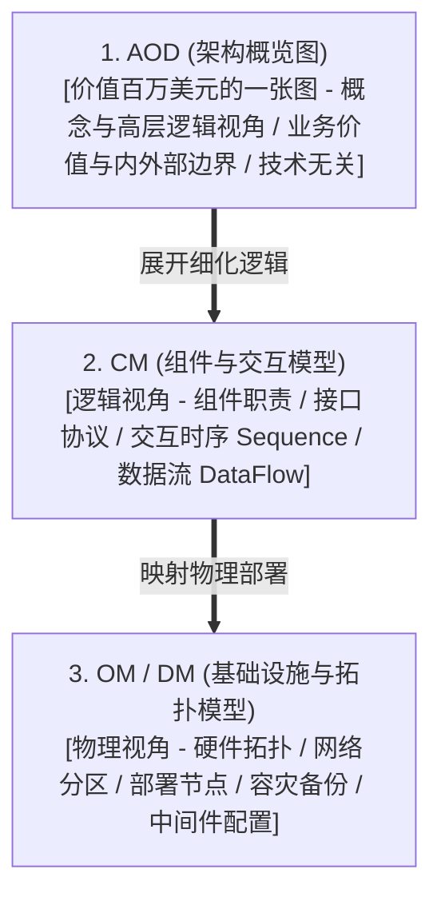

# 架构图绘制准则与视觉设计规范 (Architecture Diagramming Principles)

> 本规范全面吸纳了现代可视化架构引擎（如 Archify）的核心精华，将“**语义分类（Semantic Typing）、确定性几何避障（Executable Geometry）、双主题高对比度配色（Dual-Theme Palettes）与故事化多视图（Chaptered Views）**”融为一体，彻底告别粗制滥造、连线混乱的架构草图。

---

## 1. 核心图元语义与组件分类法 (Component Semantics)

在架构设计中，每一个节点必须属于明确的语义类别，禁止使用毫无语义特征的灰色平铺方块。本系统定义 7 类语义图元与 4 种变体：

| 图元类别 (Kind) | 语义定位 | 推荐图标/标识 | 视觉特征 (浅色/深色) |
|---|---|---|---|
| **frontend** | 客户端、Web 控制台、移动端、CLI 命令行 | 🖥️ / 📱 | 靛蓝/青色边框，轻盈前景 |
| **backend** | 核心服务、API 网关、FSM 编排引擎、微服务 | ⚙️ | 稳重蓝灰色，居中主干 |
| **database** | 持久化关系库、事务状态库、时序库 (ACID) | 🗄️ | 圆柱形态，森林绿基调，强调数据安全 |
| **cloud** | 容器沙箱、K8s 集群、云基础设施运行时 | ☁️ | 云朵形态或虚线边界，柔和紫灰 |
| **security** | IAM 鉴权、RBAC 拦截网关、隔离防火墙 | 🛡️ | 琥珀金/警戒黄，显眼警示边框 |
| **messagebus** | 消息队列 (Kafka/MQ)、事件总线、发布订阅 | 📨 | 跑道形/平行线，品红/青蓝流线 |
| **external** | 外部不可控三方依赖 (模型 API、三方 Git) | 🌐 | 虚线双边框，灰度衬底，显式标注 `[ACL]` |

### 4 种视觉变体 (Variants)
1. **`default` (标准常态)**：普通业务模块与依赖组件。
2. **`emphasis` (核心主干)**：系统的核心计算单元（如状态机主控、认知推理核心），高亮加粗边框。
3. **`security` (安全壁舱)**：涉及权限校验、网络隔离或数据脱敏边界。
4. **`dashed` (异步解耦)**：异步消费通道、备份存储或旁路监控链路。

---

## 2. 几何排版与走线硬性准则 (Executable Geometry & Routing)

优秀架构图的第一原则是“**信息信噪比最高，无视觉歧义**”。严禁违反以下几何规则：

### 2.1 连线与避障铁律
1. **绝对禁止连线穿透无关节点（No Crossing Unrelated Nodes）**：
   - 连线严禁从其他不透明组件正上方横穿。必须通过合理规划子图分层（Top-to-Bottom 或 Left-to-Right）与中继路由，保持正交间隙。
2. **净间距法则（Clear Gap over Center Distance）**：
   - 相邻组件之间必须保留足够的像素净距，禁止组件贴合。
   - 连线上的文字标签两端必须保留空隙，严禁标签遮挡相邻连线或组件拐角。
3. **正交走线与方向契约（Orthogonal Routing & Direction Contract）**：
   - 端口出入方向必须垂直于组件边框，避免出现微小折角（dogleg）。
   - 面对面组件应共享水平或垂直轴线，保持整齐对称。

### 2.2 连线语义丰富度原则
严禁只画箭头不写文字。每一条连线都是一段结构化契约，必须包含：
- **传输协议**：`HTTPS` / `gRPC` / `WebSocket` / `Internal IPC` / `OTLP`
- **操作动词与语义负载**：说明“传递了什么”（如“下发剪枝 Prompt”、“上报分布式追踪 Trace”）
- **边界防腐标识**：跨越企业或不受控边界时，必须附加 `[via ACL]`（防腐层）。

```text
[规范示例] Rel(agent, model_gw, "发送结构化 Prompt [via Semantic ACL]", "HTTPS / JSON-RPC")
[反面教材] Rel(agent, model_gw, "调用")
```

---

## 3. 标准 Mermaid 样式注入表 (Mermaid Design System)

在输出任何 Mermaid 图表时，请在图表末尾注入统一的现代化配色 `classDef` 规范：

```mermaid
%% 现代化架构视觉设计规范样式表
classDef feStyle fill:#f0f9ff,stroke:#0284c7,stroke-width:2px,color:#0c4a6e;
classDef beStyle fill:#f8fafc,stroke:#475569,stroke-width:2px,color:#0f172a;
classDef coreStyle fill:#eff6ff,stroke:#2563eb,stroke-width:3px,color:#1e3a8a;
classDef dbStyle fill:#f0fdf4,stroke:#16a34a,stroke-width:2px,color:#14532d;
classDef cacheStyle fill:#fef2f2,stroke:#dc2626,stroke-width:2px,color:#7f1d1d;
classDef secStyle fill:#fffbeb,stroke:#d97706,stroke-width:2px,color:#78350f;
classDef extStyle fill:#f3f4f6,stroke:#9ca3af,stroke-width:2px,stroke-dasharray: 4 4,color:#374151;
classDef mqStyle fill:#faf5ff,stroke:#9333ea,stroke-width:2px,color:#581c87;
```

---

## 4. 架构可视化的三层抽象与五维图谱矩阵 (Abstraction Levels & Views)

架构设计必须守住“**严格分层抽象**”铁律，严禁跨层混淆：
1. **概念与高层逻辑层 (AOD - Architecture Overview Diagram)**：面向业务赞助人与架构评审委员会，**技术无关 (Technology Agnostic)**。表达的是“统一接入反向代理”、“极速事前穿透风控”、“单线程确定性撮合核心”、“主数据分发中心”，严禁混入“MySQL 8.0”、“Kafka 3节点”、“Spring Boot”等具体物理软件。
2. **逻辑组件与交互层 (CM - Component Model)**：面向研发主管与领域专家。界定子系统内部的逻辑组件、接口边界、调用时序（Sequence）与数据流向（Data Flow）。
3. **基础设施与拓扑层 (OM - Operational Model / DM)**：面向运维 SRE 与底层工程师。详细标定物理机型、网络分区、机房分布、NUMA 绑核、操作系统内核参数与具体数据库中间件实例。



### AOD 标准布局与核心元素要求：
- **布局格式**：必须采用经典“三横两纵”布局（接入层、核心业务域、数据资产层、外部系统区、横切关注点区）。
- **连线要求**：所有连线必须具有方向性与清晰的业务语义/协议说明，严禁光板线。
- **图例标准**：必须配有明确自解释的图例（Legend），标注实线、虚线、颜色与框体含义。
- **图说契约**：必须配套 1~2 页架构叙事文本（Accompanying Narrative），通过 3 分钟合格性压力测试。


---

## 5. 故事化多章节视图 (Chaptered Stories)

大而全的全景图容易造成信息过载。在展示复杂架构时，提倡**按章节拆分视图**：
- **Chapter 1: 黄金调用链路 (Happy Path)**：展示正常请求从网关 -> 状态机 -> 智能体推理 -> 补丁落盘的顺畅流程。
- **Chapter 2: 故障熔断与自愈链路 (Resilience & Circuit Break)**：突出超时被强杀、错误进入负向假设账本、重试超限触发 Git 快照硬回滚的防御路径。
- **Chapter 3: 数据同步与审计链路 (Audit & Persistence)**：突出状态跃迁日志异步同步至外部可观测平台的完整流水。
