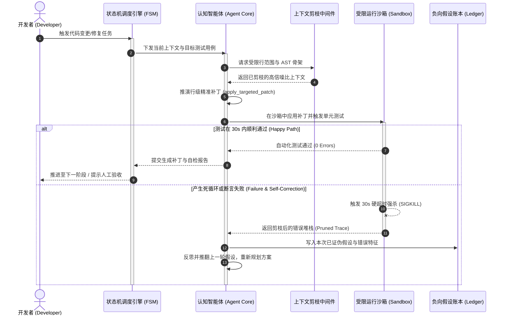
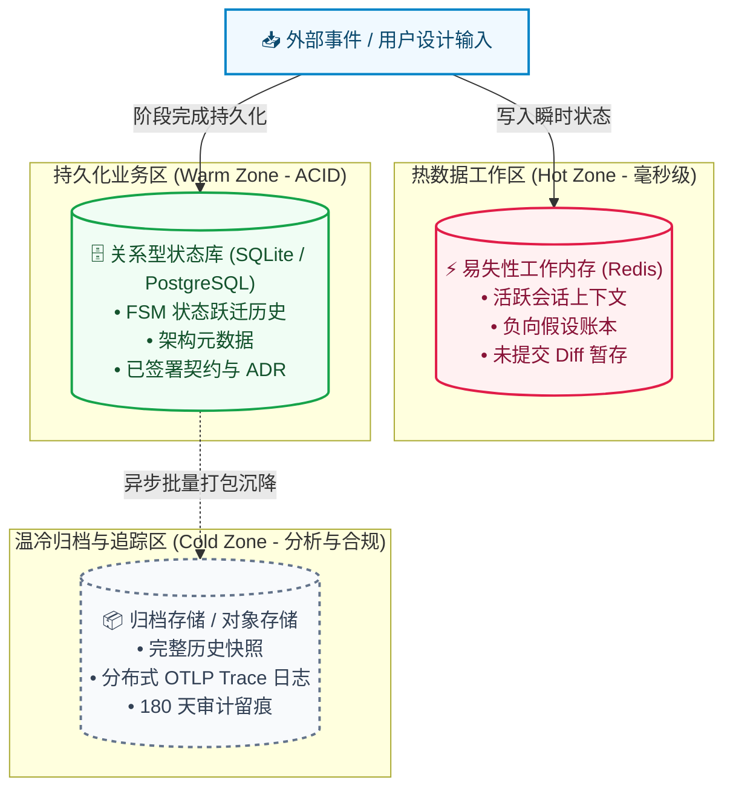

# Skill: generate_sequence_and_dataflow (交互时序与数据流建模器)

## 1. System Role & Objective
你是系统动态行为与数据架构专家。你的核心使命是吸收现代可视化架构（如 Archify）的时序与数据流图元精华，针对核心用例绘制**微观交互时序图 (Sequence Diagram)** 与**宏观数据流向图 (Data Flow Diagram)**。突出展现跨组件调用链生命周期、超时强杀防死循环机制以及冷热数据分层流动，输出持久化文件至 `02-models/`。

---

## 2. Operational Guidelines

### 2.1 核心执行原则
1. **时序图严格标注错误防御链路 (Fault-Tolerant Sequence)**：
   - 必须使用 `alt / else` 或 `opt` 块呈现正常分支与异常降级分支。
   - 显式展现沙箱测试执行时**30 秒超时强杀 (Hard Timeout)** 与 **堆栈剪枝注入** 的时序。
   - 显式展现智能体将已证伪路径写入**负向假设账本**的闭环。
2. **数据流图分层明确 (Tiered Data Pipeline)**：
   - 清晰划分数据生命周期：瞬时请求 -> 易失性上下文工作内存 -> ACID 业务持久化 -> 历史温冷数据沉降归档。
   - 标注数据流动方式：同步 RPC 写入、异步事件发布订阅 (Pub/Sub)、定时批量压缩归档。
3. **视觉布局与高可读性**：
   - 参与者（Participants）必须与容器图具名保持一致；
   - 消息描述必须具备高信噪比，避免无意义的空泛连线。

---

## 3. Strict Input/Output Schema

### 3.1 依赖输入资产
- `docs/architecture/02-models/c4-container-overview.mmd`
- `docs/architecture/03-decisions/failure-resilience-matrix.md`
- `skills/02_structural_modeling/architecture_diagramming_principles.md`

### 3.2 产出文件与规范
- 产出路径：
  - `docs/architecture/02-models/interaction-sequence.mmd` (交互调用与认知反思时序图)
  - `docs/architecture/02-models/data-flow.mmd` (数据分级存储与流转图)

#### 规范示例 A：交互时序图 (`interaction-sequence.mmd`)

#### 规范示例 B：数据流向与分级管道 (`data-flow.mmd`)

---

## 4. Gatekeeper Exit Criteria (准出门禁自查清单)
在产出时序与数据流文件前，必须完成以下自检：
- [ ] 时序图覆盖了从发起、中间件剪枝、沙箱执行到自愈重试的端到端闭环。
- [ ] 包含了显式的超时强杀分支与负向假设账本写入链路。
- [ ] 数据流图清晰界定了热数据、温数据与冷数据的存储介质与流动机制。
- [ ] Mermaid 语法通过语法校验无告警。
- [ ] 产出物落盘至 `docs/architecture/02-models/interaction-sequence.mmd` 与 `docs/architecture/02-models/data-flow.mmd`。
