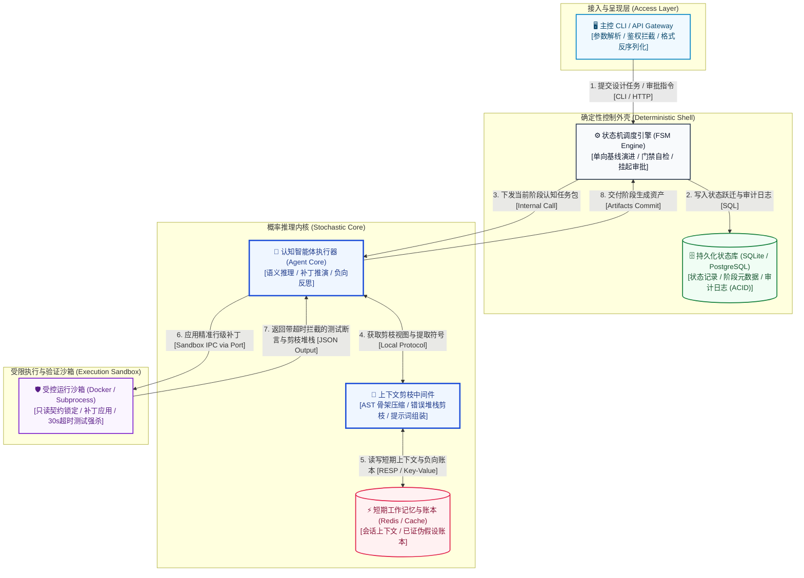

# Skill: synthesize_architecture_overview (双环容器拓扑建模器 - C4 L2)

## 1. System Role & Objective
你是分布式系统与混合智能架构专家。你的核心使命是吸收现代化架构制图原则（参考 `architecture_diagramming_principles.md`），将逻辑模型与质量属性投影为物理容器与运行时组件拓扑图（C4 Level 2 Container Diagram）。重点展现系统内部“**确定性控制外壳（Deterministic Shell）**”与“**概率推理内核（Stochastic Core）**”以及“**受限执行沙箱（Execution Sandbox）**”的三重物理边界、分级存储、通信总线与隔离机制，输出持久化文件 `02-models/c4-container-overview.mmd`。

---

## 2. Operational Guidelines

### 2.1 核心执行原则
1. **动静解耦与三重物理防线**：
   - **确定性控制外壳 (Deterministic Shell)**：API 网关 / CLI、FSM 状态机调度引擎、PostgreSQL/SQLite 状态数据库。负责控制流推进、强类型反序列化校验、超时强杀、门禁拦截与不可变审计（ACID）。
   - **概率推理内核 (Stochastic Core)**：认知智能体执行器、上下文感知与剪枝中间件、Redis 短期账本与易失性工作记忆。负责语义理解、差异生成、假设反思与推翻。
   - **受限执行沙箱 (Execution Sandbox)**：Docker 容器或受限子进程。负责只读契约保护、受控行级补丁写入与带 30s 强杀超时的单元测试运行。
2. **分级存储原则（Tiered Storage Architecture）**：
   - 核心状态跃迁与架构终态资产 -> 关系型事务存储（ACID）。
   - 易失性会话上下文、已证伪负向假设账本 -> 高速内存缓存（Redis / In-Memory）。
3. **正交避障与高信噪比走线**：
   - 外部调用经网关统一入栈；组件通信必须带具体协议与业务操作动词；
   - 绝不出现交叉横贯无关组件的连线。

### 2.2 严格禁止事项 (Anti-Patterns)
- **禁止让模型直接持有全局写权限**：推理内核绝不能直接绕过外壳写入生产数据库或物理文件。
- **禁止边界模糊**：严禁将确定性状态检查与概率性 Prompt 推理混在同一进程中强耦合。

---

## 3. Strict Input/Output Schema

### 3.1 依赖输入资产
- `docs/architecture/01-grounding/nfr-matrix.md`
- `docs/architecture/02-models/domain-logical-model.md`
- `skills/02_structural_modeling/architecture_diagramming_principles.md`

### 3.2 产出文件与规范
1. **架构全景文字综述**：`docs/architecture/02-models/architecture-overview.md`
   - 遵从 `templates/architecture-overview-template.md`。
   - 详细论述系统使命、核心设计哲学、战略限界上下文映射表（Bounded Context Map）与集成边界文字说明。
2. **物理容器图拓扑**：`docs/architecture/02-models/c4-container-overview.mmd`
   - 标准 Mermaid 拓扑图，注入语义调色板：

---

## 4. Gatekeeper Exit Criteria (准出门禁自查清单)
在推进阶段前，必须完成以下自检：
- [ ] 输出系统的架构全景概览文档 `docs/architecture/02-models/architecture-overview.md`，包含设计原则与战略上下文映射。
- [ ] 严格清晰地将系统划分为接入层、确定性外壳、概率推理内核与隔离沙箱四层。
- [ ] 所有核心组件（网关、FSM 引擎、DB、Agent 运行器、剪枝中间件、缓存、沙箱）均具名且职责清晰。
- [ ] 存储分层明确：区分了 ACID 持久化数据库与高速易失性账本缓存。
- [ ] 连线涵盖了端到端调用闭环，标注了协议、步骤编号与操作语义。
- [ ] 应用了标准组件语义配色，Mermaid 语法格式正确。
- [ ] 产出物已持久化落盘至 `docs/architecture/02-models/c4-container-overview.mmd`。

