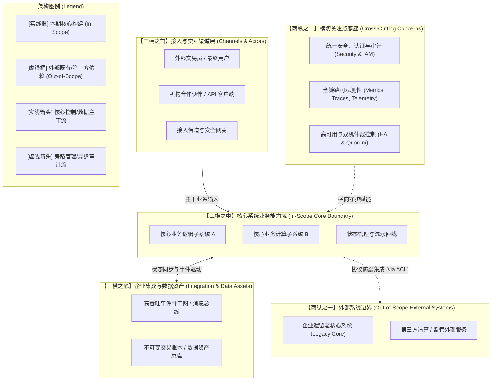

# Skill: synthesize_architecture_overview (架构概览图 AOD 建模器)

> 本技能吸纳 IBM 经典架构方法论（Team Solution Design / Architecture Thinking）中对 **AOD（Architecture Overview Diagram，架构概览图）**“价值百万美元的一张图”的最高标准。AOD 是整个系统架构的“门面”与“全景地图”——向上让业务决策者看懂系统的商业价值与核心边界，向下为各领域架构师与技术主管划定子系统职责与交互契约。

---

## 1. 优秀 AOD 的四大核心标准 (What Makes a Good AOD)

在专业架构评审（Architecture Review Board / Board Certification）中，一张优秀的 AOD 必须满足以下四大关键特征：

### 1.1 严格守住“一层抽象”，绝不混淆逻辑与物理
- **正确做法**：AOD 仅表达**概念/高层逻辑视角（Conceptual / High-Level Logical View）**。展示的是“统一接入反向代理”、“极速事前穿透风控”、“单线程确定性撮合核心”、“主数据分发中心”，而不是具体的“Spring Boot 3.2”、“Nginx + Lua”、“Redis Cluster 16GB”、“MySQL 8.0”、“Kafka 3节点”。
- **反模式 (Anti-Patterns)**：塞满具体物理软件与部署规格。一旦混入物理细节，AOD 的沟通跨度就会断层，沦为杂乱的“物理拓扑初稿”，失去概念抽象价值。物理实现细节必须严格下沉至 **Operational Model (OM / DM)**。

### 1.2 边界清晰，内外部系统界限分明
- 清晰区分**作用域内（In-Scope）**与**作用域外（Out-of-Scope / Legacy / Third-Party）**。
- 通过视觉围栏（Bounding Box / Boundary）清晰表达：
  1. 哪些是本期需要构建或重点改造的核心业务能力域？
  2. 哪些是既有外部依赖系统（如企业 ERP、核心老账务总账）？
  3. 哪些是第三方外部公共服务（如监管网关、支付渠道、公有云外部 API）？

### 1.3 “有主有次”的视觉层级与信息流
- **30 秒一眼看清**：
  1. **谁是主叫方（Actors/Channels）**：做市商、高频量化机构、风控管理员、企业合作伙伴。
  2. **主干业务流向何处**：核心数据流与控制流如何穿透系统。
- **连线方向与语义契约**：所有连线必须具备明确的方向性，并清晰标注业务交互语义（如 `1. 提交委托 (SBE/TCP)`、`2. 广播深度行情 (Multicast)`、`3. 异步持久化 (I/O Stream)`），严禁出现无语义标注的“光板线”。

### 1.4 完整的“架构图例（Legend）”与图说叙事契约
- **图例契约（Legend）**：图中的每一种视觉元素（实线、虚线、不同底色、不同围栏边框）必须在图例中有唯一对应的解释。
- **架构叙事文本（Accompanying Narrative）**：**AOD 绝不能只有一张裸图**，必须配套 1~2 页的文字说明，阐明该架构如何支撑核心业务目标（Key Drivers）与关键非功能属性（NFRs）。

---

## 2. IBM 经典 AOD 标准骨架（“三横两纵”分层分区布局）

标准 AOD 采用“三横两纵”或“分层分区”的经典布局，使干系人一目了然：

---

## 3. AOD 合格性“3 分钟压力测试”（The 3-Minute Test）

在架构评审会前，架构师必须通过以下 4 个问题进行自检：

1. **白板复述测试 (Whiteboard Test)**：
   - 架构师脱离电脑，能否在白板上 3 分钟内画出该 AOD 骨架，并向非技术的业务高管讲清楚价值闭环？如果画不出，说明概念切分过细、主干失焦。
2. **职责定位测试 (Responsibility Test)**：
   - 抛出一个核心业务场景（如：“当发生一笔撮合成交时”或“当用户发起退款时”），在图上能否一眼看出信息穿过了哪几个框？如果同一个职责在多个框中反复纠缠，说明子系统职责划分不清。
3. **技术无关测试 (Technology Agnostic Test)**：
   - 如果把底层的存储介质从 Oracle 换为分布式数据库，或者把消息中间件从 Kafka 换为内部无锁 RingBuffer，**这张 AOD 需要重新画吗？** 如果需要，说明混入了物理实现细节，严重违反了 AOD 的抽象层级原则。
4. **横切可见测试 (Cross-Cutting Test)**：
   - 当安全负责人问“安全合规与权限在哪里校验”，运维负责人问“高可用容灾与监控告警在哪里统一汇聚”，在图上的横切关注点中是否有清晰、显式的承载位置？

---

## 4. 交付文件与门禁规范

- **Mermaid 架构图源文件**：`02-architecture-design/aod.mmd`
- **架构全景说明书**：`02-architecture-design/architecture-overview-diagram.md`
  - 必须包含：
    1. AOD 架构图（内嵌标准 Mermaid 代码块并自带 Legend 图例）。
    2. 核心设计哲学与商业价值对齐说明（支撑哪些 Key Drivers 与量化 NFRs）。
    3. 子系统职责边界与交互协议清单表。
    4. 横切关注点（安全、观测、高可用）保障机制论述。
    5. 3 分钟合格性压力测试自检记录。
