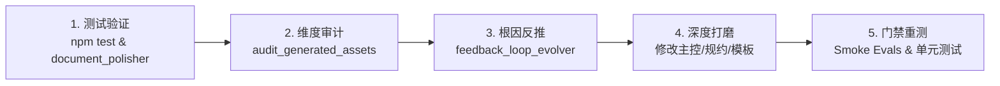

# 架构文档深度打磨与质量深化技能 (Architecture Documentation Refinement)

## 技能定位与核心职责
初版生成的架构文档往往偏向框架结构和骨架概述，容易出现粗糙、表述笼统、缺少落地技术参数的问题。
本技能作为架构全生命周期中的**深度打磨（Polishing & Refinement）环节**，对系统全生命周期文档进行逐一深化与强化。

## 核心深化维度 (Refinement Dimensions)
1. **业务与需求层 (01-requirements)**:
   - 杜绝笼统叙述，必须具备清晰的量化商业 KPI、投资回报模型（ROI）；
   - **Agent 自主权与容错边界**：明确自主度等级（LoA 1~5）、非确定性输出容错边界与动态 Token 经济学模型（单任务成本上限与盈亏平衡点）；
   - 端到端用例必须包含主成功流、备选流、极端异常分支（Exception Paths）、HITL 人工接管降级点以及并发竞态应对；
   - 功能需求规约 (FR) 必须逐项具备输入、业务规则、算法逻辑、输出以及优先级。
2. **概念与逻辑层 (02-architecture-design)**:
   - 全面落地 Architecture Thinking 图谱 (AOD, CM, LM, DM, FSM, Sequence, DataFlow)；
   - **认知架构与拓扑模式**：明确认知推理循环（ReAct/Reflection/Plan-and-Solve/Multi-Agent）、时序情境记忆、会话轨迹与负向假设反思账本；
   - 领域模型必须明确聚合根内聚范围、实体生命周期、值对象不可变性与数学级不变量定理；
   - 逻辑组件与物理微服务、容器、基础设施及外部模型网关的映射关系必须完备。
3. **物理与工程层 (03-engineering-and-physics)**:
   - **确定性 Shell 与概率 Core 分离**：明确物理隔离沙箱规格、动态 AST 剪枝中间件、单向只读契约锁定与 30s SIGKILL 超时强杀机制；
   - 物理拓扑必须具备具体节点规格（GPU/CPU/内存/网络绑核/内核参数）、多机房专线时延 RTT、网络隔离区划；
   - 数据架构必须具备生产级 DDL、向量/关系/时序混合存储模型、冷热分层存储生命周期与 TTL 规则；
   - 容灾与韧性矩阵必须具备 FMEA 故障模式分析、混沌注入指令、Token 熔断限流与 RTO/RPO 恢复指标；
   - ADR 决策记录必须包含被否决方案的详细对比与不得不承担的代价权衡，涵盖模型抽象、沙箱隔离与评测设计。
4. **实施、治理与组织层 (04-delivery-and-organization & 05-audit)**:
   - 康威定律组织拓扑必须具备明确的代码路径所有权矩阵（Code Ownership）与认知上下文对齐；
   - WBS 估算必须具备故事点（SP）与人天（PD）推导逻辑；
   - 穿刺测试 (Tracer Bullet PoC) 规约必须具备可落地的验收断言；
   - **持续架构合规与评测门禁**：挂载 CI 架构合规扫描（禁止业务直连原生 SDK、Tool Schema Pydantic 校验）、Golden Evals 持续评测门禁（TCR 衰减 > 1% 熔断 PR）与技术债务台账闭环管理。

## 闭环执行流程 (Test-Eval-Propose-Refine-Retest)

