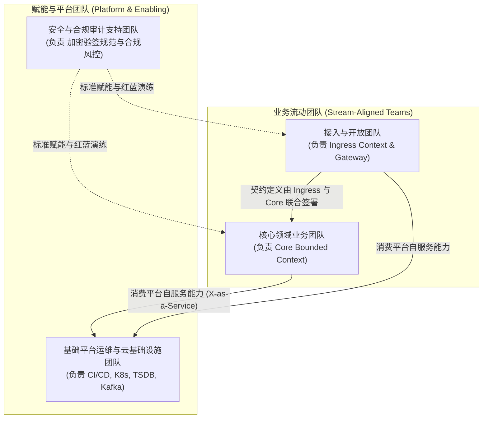

# 组织架构、交付估算与工作计划 (Organization, Estimation & Working Plan)

> 架构层次：Layer 4 - 组织与交付实施 (Who & Rhythm)  
> 状态：APPROVED / IN_REVIEW  
> 目标系统：[系统全称]  
> 责任架构师：[架构师姓名/代号]

---

## 1. 组织拓扑与康威定律应用 (Team Topology & Conway's Law)

### 1.1 康威定律对齐设计
> "Organizations which design systems are constrained to produce designs which are copies of the communication structures of these organizations." —— Melvin Conway

为确保微服务/模块边界与团队组织边界形成正向同构，避免跨团队摩擦与隐性技术耦合，系统按照以下团队拓扑进行划分：



### 1.2 团队职责与代码属主 (Code Ownership)
| 团队名称 | 团队类型 | 负责限界上下文 / 代码仓库路径 | 核心 SLA / 成果物交付 |
| :--- | :--- | :--- | :--- |
| **接入流团队** | Stream-Aligned | `services/ingress/`, `04-contracts/` | 外部对接 API、网关鉴权插件、协议转换器 |
| **领域核心团队** | Stream-Aligned | `services/core/`, `domain/` | 核心聚合根、不变量规则库、状态机推进引擎 |
| **基础平台团队** | Platform | `infra/k8s/`, `monitoring/` | 容器编排清单、分布式追踪与监控告警看板 |
| **安全合规团队** | Enabling | `security/`, `audit/` | 自动化合规测试、代码审计门禁脚本 |

---

## 2. 工程规模与工作量估算 (Effort Estimation)

### 2.1 估算方法论与基准
- 采用规划扑克 (Planning Poker) 与故事点 (Story Points) 估算体系。
- **基准锚点**：1 故事点 ≈ 0.5 人天（包含开发、单元测试、契约校验与 PR 审查）。
- **技术风险缓冲系数**：1.25x（针对分布式并发、跨区容灾与高频性能压测的不可预知开销）。

### 2.2 模块规模与故事点拆解矩阵
| 工作分解项 (WBS) | 复杂度评估 | 故事点 (SP) | 预估人月 (Person-Months) | 关键技术风险 |
| :--- | :--- | :--- | :--- | :--- |
| **M1: 核心领域模型与不变量引擎** | 高 | 21 SP | 1.0 PM | 并发状态争用、不变量断言漏判 |
| **M2: 接入网关与强契约校验层** | 中 | 13 SP | 0.6 PM | 外部协议适配与防腐层开销 |
| **M3: 数据持久化与 WAL 机制** | 高 | 21 SP | 1.0 PM | 高并发追加写性能与分片选型 |
| **M4: 容灾隔离、限流与熔断机制** | 中 | 13 SP | 0.6 PM | 极端边界下熔断恢复震荡 |
| **M5: 可观测性看板与分布式链路集成**| 低 | 8 SP | 0.4 PM | 链路 Context 异步丢失 |
| **M6: 端到端骨架压测与破冰验收** | 中 | 13 SP | 0.6 PM | 压测环境与生产异构导致指标偏差 |
| **总计** | - | **89 SP** | **4.2 PM** | 整体按 4 人研发小组 5 周完成交付 |

---

## 3. 分阶段交付计划 (Phased Working Plan)

### 3.1 交付里程碑总览
```mermaid
timeline
    title 交付实施推进时间线
    section Sprint 1 : 骨架破冰
      M1-M2 核心领域与契约骨架 : 验证端到端调用链与单元测试
      Walking Skeleton 建立 : CI 自动化门禁跑通
    section Sprint 2 : 核心闭环
      M3 数据持久化与事件机制 : 事务一致性跑通
      状态机流转集成测试 : 覆盖 90% 异常分支
    section Sprint 3 : 韧性增强
      M4 熔断限流与降级防护 : 混沌工程故障注入
      M5 可观测性与告警部署 : 指标大屏就绪
    section Sprint 4 : 验收上线
      M6 极限压力与稳定性测试 : 满足 P99 NFR 目标
      灰度上线与业务引流 : 正式转入稳定运维期
```

### 3.2 阶段验收准则 (Definition of Done)
1. **代码质量门禁**：单元测试覆盖率 > 85%，核心聚合根不变量覆盖率 100%。
2. **规范遵从门禁**：无未解决的 P0/P1 安全缺陷，强类型接口契约无漂移。
3. **架构看板门禁**：`architecture_board.html` 各视图清晰无语法报错，状态机停留在 `FINALIZED`。

---

## 4. 第一步破冰验证行动 (First Step: Walking Skeleton & PoC)

### 4.1 最小垂直切片定义 (Thin Vertical Slice)
- 选取最核心的用例（如 UC-01 核心业务主线接入），实现从入口网关 -> 领域模型处理 -> 内存快照持久化 -> 状态返回的极简闭环。
- **排除项**：首个垂直切片暂不引入复杂的跨机房多活与深度历史审计分析。

### 4.2 验证标准
- 研发人员只需克隆仓库，执行单一构建命令即可在本地通过全部核心不变量集成测试。
- 确立代码仓库的目录规约、类型定义与 CI 拦截规则。
