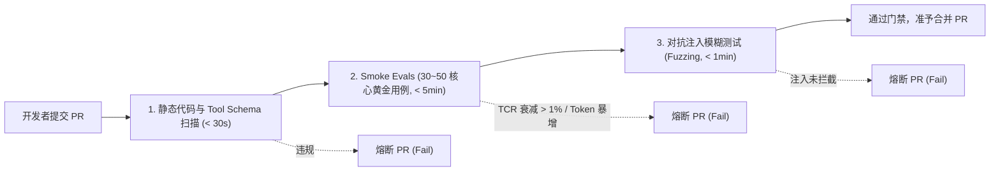

# 自动化架构合规扫描与防腐规约 (Architecture Conformance Specification)

> **治理视角**: 代码级架构防腐、AI 契约审查与 CI/CD 自动守卫 (Architecture as Tests & Conformance Gate)  
> **核心使命**: 将组件模型（CM）、运行模型（OM）及 Agent 认知安全规约代码化为架构自动化测试用例，嵌入持续集成流水线，实行“违规即熔断（Break the Build）”，杜绝代码腐化、Prompt 架构漂移与未受控工具越权。

---

## 1. 架构合规扫描策略概览 (Governance Policy Overview)

| 治理要素 | 规约配置与执行策略 |
| :--- | :--- |
| **CI/CD 触发时机** | **PR 第一道门禁 (Pull Request Gate)**：每次代码提交、创建 PR 或合并主干时自动全量触发 |
| **构建拦截效力** | **违规即熔断 (Break the Build)**：凡检测到严重分层违规、Tool 缺乏 Schema 或评测指标衰减，CI 立即中断并禁止代码合入 |
| **规则对齐模式** | **1:1 强映射**: 架构测试规则编号直接绑定组件模型（`COMP-XXX`）、运行模型（`OM-XXX`）与设计决策（`ADR-XXX`） |
| **评测分层治理** | **Smoke Evals (< 5 分钟)** 跑 PR 门禁；**Deep Evals (全量)** 跑夜间定时任务 |
| **技术实现工具** | **ArchUnit / AST 扫描插件 / Tool Governance Linter / Continuous Evals Runner** |

---

## 2. 核心架构测试规则清单 (Architecture Test Rules & Agent AI 契约)

| 规则编号 | 规则名称与描述 | 关联组件/决策 | 扫描维度 | 拦截级别 | 预期校验行为 |
| :--- | :--- | :--- | :--- | :--- | :--- |
| `ARCH-RULE-01` | **分层单向依赖校验** | `COMP-001 ~ 006` | 分层与边界 | **致命 (Fatal - Break Build)** | 表现层严禁直接调用持久层，领域层不得反向依赖具体基础设施 |
| `ARCH-RULE-02` | **无环依赖检查 (ADP)** | 全局包结构 | 分层与边界 | **致命 (Fatal - Break Build)** | 所有包与切片之间必须保持无环，禁止 A $\to$ B $\to$ C $\to$ A |
| `ARCH-AI-01` | **LLM 统一网关收敛防线** | `COMP-GATEWAY` | AI 契约隔离 | **致命 (Fatal - Break Build)** | 业务组件严禁直接引入并实例化大模型厂商原生 SDK，必须经统一模型网关调用 |
| `ARCH-AI-02` | **Tool Schema 强类型规范** | `COMP-TOOL` | 工具治理 | **致命 (Fatal - Break Build)** | 所有 `@Tool` 暴露函数参数必须具备严格 Pydantic/JSON 强类型定义，禁止暴露未约束文本 |
| `ARCH-AI-03` | **高危写操作只读隔离** | `COMP-SANDBOX` | 安全与爆炸半径 | **致命 (Fatal - Break Build)** | Tool 声明中严禁包含全量数据库写权限等危险描述，写操作必须标记审批流 |
| `ARCH-AI-04` | **Prompt 漂移与评测门禁** | 认知编排核心 | 持续评测 | **致命 (Fatal - Break Build)** | PR 引发的平均 Token 增量不得超过 5%，Task Completion Rate (TCR) 衰减 > 1% 立即熔断 PR |
| `ARCH-AI-05` | **对抗越狱模糊测试** | `COMP-GUARD` | 安全与合规 | **致命 (Fatal - Break Build)** | 自动注入典型越狱 Prompt，Guardrail 组件必须 100% 触发拦截并阻断出网 |

---

## 3. 架构单元测试代码化实现示例 (Architecture as Tests)

```python
# 示例 1: 业务代码严禁绕过 Gateway 直连大模型原生 SDK (ArchUnit Python AST 规则)
def test_biz_code_must_not_import_raw_llm_sdk():
    import ast
    import glob
    
    forbidden_modules = ["openai", "anthropic", "google.generativeai"]
    for py_file in glob.glob("src/biz/**/*.py", recursive=True):
        with open(py_file, "r") as f:
            tree = ast.parse(f.read(), filename=py_file)
            for node in ast.walk(tree):
                if isinstance(node, ast.Import):
                    for alias in node.names:
                        assert alias.name not in forbidden_modules, (
                            f"架构违规: {py_file} 绕过 COMP-GATEWAY 直接引入 {alias.name}"
                        )

# 示例 2: 工具函数必须具备 Pydantic 强类型与 Docstring 说明
def test_all_tools_must_have_typed_schemas():
    from src.tools.registry import get_registered_tools
    
    for tool in get_registered_tools():
        assert tool.description and len(tool.description.strip()) > 10, (
            f"工具 {tool.name} 缺少清晰的语义描述"
        )
        assert tool.args_schema is not None, f"工具 {tool.name} 缺少强类型 Schema 参数契约"
```

---

## 4. 持续评测门禁与耗时分层标准 (Continuous Evals Pipeline)



---

## 5. 合规特例豁免纳管清单 (Architecture Exceptions Log)

| 豁免编号 | 违规规则 | 豁免模块 | 申请理由与业务背景 | 批准架构师 | 强制失效日期 (Hard Expiry) |
| :--- | :--- | :--- | :--- | :--- | :--- |
| `EX-2026-01` | `ARCH-AI-01` | `legacy-rag-eval` | 遗留离线评估脚本尚未迁移至统一网关 | 首席架构师 | 2026-11-30 (超期自动熔断 CI) |
