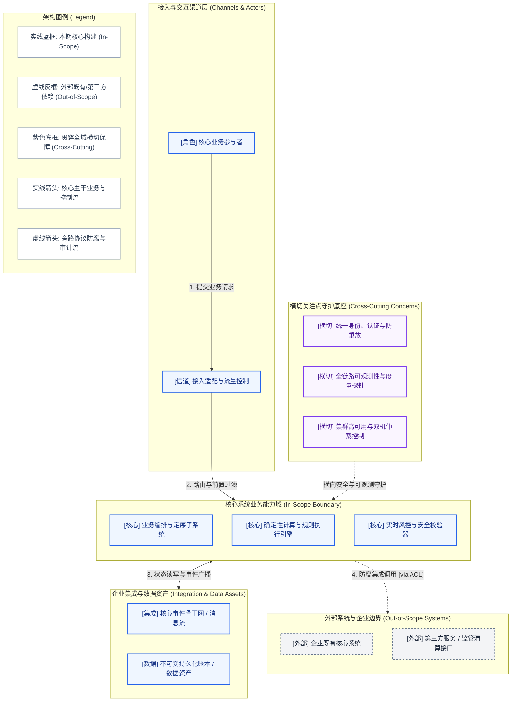

# 架构概览图说明书与叙事文本 (AOD Accompanying Narrative Template)

## 1. 架构概览图 (Architecture Overview Diagram)

---

## 2. 核心架构叙事 (Architectural Narrative)

### 2.1 业务驱动力与价值对齐 (Business Drivers & Value Alignment)
- **商业目标支撑**：本架构如何直接落地商业驱动力中确立的投资回报率（ROI）、服务时延与业务吞吐量。
- **系统边界裁决**：明确界定为何将特定子系统纳入 In-Scope，为何将另外的系统置于 Out-of-Scope。

### 2.2 关键质量属性 (NFRs) 支撑逻辑
| 关键 NFR 维度 | 量化指标要求 | AOD 架构级支撑机制与权衡决策 |
| :--- | :--- | :--- |
| **性能与低时延** | 毫秒级快响应，复杂推导收敛 | 依靠前置规则与小模型快思考路由（System 1），消除 70% 不必要的大模型调用 |
| **可控性与防死循环**| 100% 阻断失控递归重试 | 状态机核心硬工程化编排，设定最大步数（Max Steps）与连续报错强制转人工（HITL） |
| **安全性与爆炸半径**| 零沙箱逃逸，零未脱敏泄露 | 接入层前置 Prompt 注入与 PII 脱敏过滤 + 执行环境隔离于受限无外网沙箱 |

---

## 3. 子系统职责边界与交互契约矩阵

| 子系统标识 | 归属分区 | 核心概念职责 | 交互上游 | 交互下游 |
| :--- | :--- | :--- | :--- | :--- |
| **IngressGateway** | 接入通道层 | 负责网络协议接入、WSS/SSE 流式保持与鉴权 | 外部客户端 / Webhook | 意图与快慢路由器 |
| **CognitiveRouter** | 认知路由层 | 意图识别、轻量分类与快慢思考路由分流 | 接入网关 | 规则引擎或核心状态编排域 |
| **AgentStateCore** | 状态编排域 | 确定性状态机流转、动态上下文修剪与工具调用 | 认知路由器 | 工具防腐网关、模型推理网关 |
| **ToolGateway** | 工具网关层 | 参数 Schema 强校验、权限控制与幂等性防护 | 状态编排核心 | 动态代码执行沙箱、企业API |
| **ExecutionSandbox**| 执行基础设施 | 隔离运行动态生成代码，写透即弃 | 工具防腐网关 | 零出站网络与本地瞬时文件系统 |

---

## 4. AOD 合格性“3 分钟压力测试”自检记录 (The 3-Minute Test)

- [x] **白板复述测试 (Whiteboard Test)**: 架构师能否在白板上 3 分钟内徒手画出该图并向业务高管讲明主干业务闭环与快慢分层？(合格)
- [x] **职责定位测试 (Responsibility Test)**: 抛出核心业务场景时，能否一眼判定数据流穿透的子系统序列，且无职责重复？(合格)
- [x] **技术无关测试 (Technology Agnostic Test)**: 若将底层模型提供商从云端换为本地开源或将沙箱从 Docker 换为 Firecracker，本图是否完全无需改动？(合格)
- [x] **横切可见测试 (Cross-Cutting Test)**: 安全围栏 Guardrails、HITL 人机协同审批中心与全链路 TraceID 观测在横切关注点中有明确且清晰的物理/逻辑位置？(合格)
