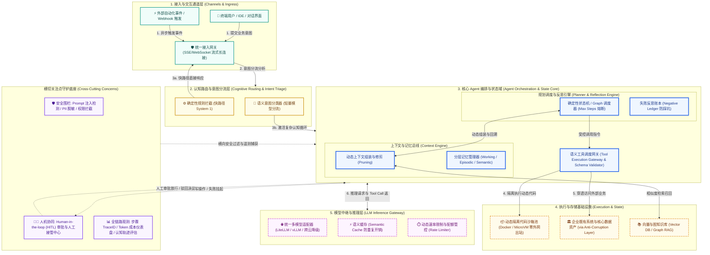

# 架构全景概览图规约 (Architecture Overview Diagram, AOD)

> 架构视角：系统全局逻辑全景 (Global Overview & Cognitive Plane)  
> 核心作用：面向高层干系人与业务负责人的高阶抽象图，展示系统边界、认知控制平面、上下文状态域、执行沙箱、模型网关与横切安全围栏。

---

## 1. AOD 架构全景抽象图 (Mermaid Visual)

---

## 2. 系统分层与信息流阐释 (Context & Information Flows)

1. **通道与接入层 (Channels & Ingress)**:
   - 终结外部客户端连接，提供统一身份凭证校验与支持分钟级保持的 WebSocket / SSE 流式通信管道。
2. **意图路由层 (Cognitive Routing)**:
   - 贯彻“快慢思考分级”原则：标准查询由规则引擎和轻量模型就近快速答复（毫秒级）；复杂未决推理才导入核心 Agent 编排域。
3. **Agent 编排与状态核心域 (State Core)**:
   - 由确定性状态机硬工程化推进，严守最大步数限制（Max Steps）以防死循环；
   - 动态上下文修剪模块（Context Pruner）负责剥离冗余堆栈与维护负向失败账本，杜绝 Token 浪费。
4. **受控执行与模型中继网关**:
   - 动态代码只能运行于零外网出站权限的独立沙箱（Tool Sandbox）；模型推理统一经由语义缓存与限流网关中继，消除跨云厂商锁定。
5. **横切安全与人机协同底座**:
   - 纵向覆盖 Prompt 注入防护、输入输出 PII 脱敏、全链路单步 TraceID 追踪以及关键节点专职审批人（HITL）拦截通道。

---

## 3. AOD 合格性“3 分钟压力测试”自检记录 (The 3-Minute Test)

- [x] **白板复述测试 (Whiteboard Test)**: 架构师可在 3 分钟内画出“接入 -> 意图分流 -> 状态与上下文编排 -> 沙箱/推理 -> 横切围栏”骨架，讲清快慢路径与死循环熔断。
- [x] **职责定位测试 (Responsibility Test)**: 抛出高危写操作场景，信息流清晰流经“意图路由 -> 状态编排 -> HITL审批挂起 -> 授权签字 -> 沙箱执行”，职责边界清晰无重叠。
- [x] **技术无关测试 (Technology Agnostic Test)**: 概念图中不包含任何具体框架或云厂商专有私有类，更换底层 LLM 或沙箱驱动无需重画。
- [x] **横切可见测试 (Cross-Cutting Test)**: 安全围栏 Guardrails、HITL 人机协同中心与全链路可观测性在横切层中均具有显式承载位置。
