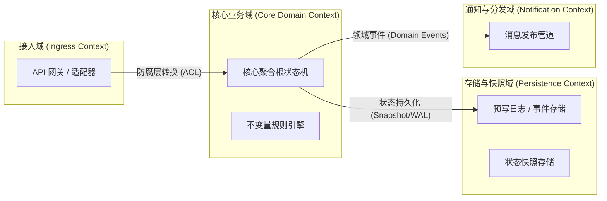
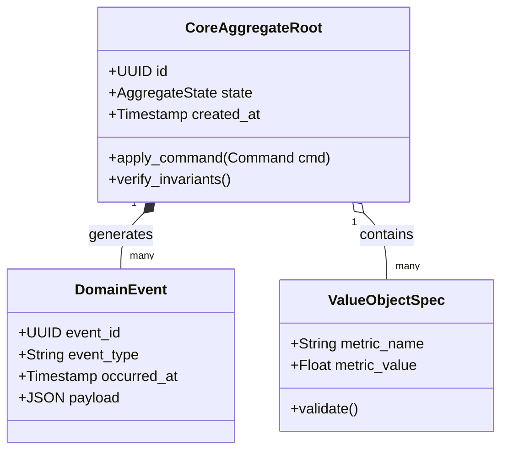

# 系统架构全景概览 (Architecture Overview)

> 架构层次：Layer 2 - 概念与逻辑抽象 (Domain & Boundaries)  
> 状态：APPROVED / IN_REVIEW  
> 目标系统：[系统全称]  
> 责任架构师：[架构师姓名/代号]

---

## 1. 架构总览与设计哲学 (Executive Architecture Overview)

### 1.1 系统使命与设计原则
- **系统核心定位**：一句话阐明系统的核心职责与边界（做什么，不做什么）。
- **核心设计哲学**：
  1. *关注点分离 (Separation of Concerns)*：严格区隔接入协议、业务领域逻辑、状态持久化与事件通信。
  2. *防御式设计 (Defensive Architecture)*：无信任边界，所有外部输入经模式验证并隔离在防腐层 (ACL)。
  3. *显式状态机驱动 (Explicit State Engine)*：严禁隐式业务状态转移，所有状态变更由强类型事件触发并受聚合根不变量守护。

### 1.2 高阶架构风格
- 选用的核心架构风格：六边形架构 (Hexagonal / Ports & Adapters) + 领域驱动设计 (DDD) + 事件驱动流水线 (Event-Driven)。

---

## 2. 战略限界上下文映射 (Bounded Context Map)

### 2.1 上下文关系图

### 2.2 上下文协作契约
| 限界上下文 | 上游/下游关系 | 集成机制 (RPC / Message / Shared DB) | 防腐层 (ACL) 说明 |
| :--- | :--- | :--- | :--- |
| **Ingress 接入域** | 上游 | 同步 RESTful / gRPC | 将外部 DTO 转换为强类型 Domain Command |
| **Core 核心域** | 核心 | 进程内纯领域模型 | 严禁引入外部框架或持久化 SDK 依赖 |
| **Persistence 存储域**| 下游 | 异步追加写 + 批量事务提交 | 实现领域仓储端口 (Repository Port) |
| **Dispatch 分发域** | 下游 | 事务消息 / 保证至少一次投递 | 解耦下游业务订阅方 |

---

## 3. 概念与逻辑领域模型 (Conceptual & Domain Logical Model)

### 3.1 核心领域实体与值对象
- **聚合根 (Aggregate Root)**：
  - 核心属性、生命周期、不变量规则。
  - 为什么将其作为事务一致性边界。
- **实体 (Entities)**：
  - 具有独立唯一生命周期标识的业务对象。
- **值对象 (Value Objects)**：
  - 不可变、无状态标识、自验证的业务属性对象（例如金额、货币、时间戳、地理坐标）。

### 3.2 领域模型类图与关系

---

## 4. 系统上下文与集成边界 (System Context & Integration Boundaries)

### 4.1 外部参与者与依赖系统
- **输入集成边界**：
  - 认证与身份提供者 (IdP)
  - 上游业务源系统的通信协议与限流配额
- **输出集成边界**：
  - 下游实时消费方 / 报表同步通道
  - 监管上报 / 审计存储管道

### 4.2 C4 Context & Container 索引
- 详见同级图表资产：
  - `02-models/c4-context.mmd`：外部参与者与系统黑盒交互边界。
  - `02-models/c4-container-overview.mmd`：系统内部可独立部署容器及通信拓扑。
  - `02-models/domain-logical-model.md`：深入的聚合根状态转移图与代码骨架定义。
