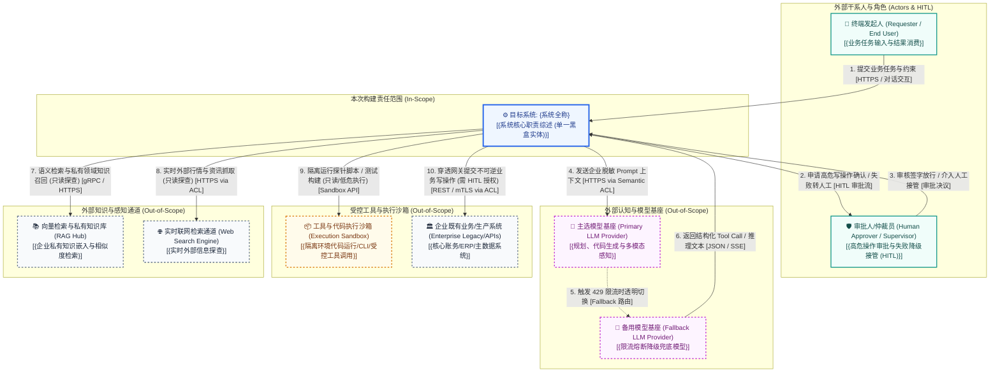

# 系统上下文与边界规约 (System Context & Boundary Specification)

> **架构视角**: 架构第 0 层 (Level 0) - 生态位与绝对边界 (System Context & The Black-box Rule)  
> **核心使命**: 确立系统的绝对范围边界，明确“我们在建什么（In-Scope）”与“我们依赖谁（Out-of-Scope）”。中心系统被严格视作单一黑盒实体，严禁暴露任何内部微服务或数据库细节。

---

## 1. Level 0 系统上下文图 (System Context Diagram)

---

## 2. 上下文实体交互矩阵 (Context Interaction Matrix)

| 实体分类 | 实体名称 (Entity) | 职责与系统关系描述 (Description & Interaction) | 交互类型与副作用界限 (Side-effect Boundary) | 数据流向与核心契约 (Data Flow & Contract) | 边界责任归属 (Ownership) |
| :--- | :--- | :--- | :--- | :--- | :--- |
| **中心系统** | **{目标系统全称}** | **[核心黑盒 / 本次构建范围]** 提供核心全生命周期闭环服务。 | 业务中枢调度 (中心黑盒) | 不适用 (中心黑盒) | **本团队研发与 SLA 责任区 (In-Scope)** |
| **外部角色** | 终端发起人 (Requester) | 负责输入业务意图、初始参数与约束边界。 | 输入驱动 / 无直接副作用 | `发起人` $\to$ {任务参数} [{通信协议}] $\to$ `系统` | 最终业务用户 / 发起方 |
| **外部角色** | 审批人 (Human Approver) | 拦截高危操作，在模型置信度不足或失败时介入兜底接管。 | 决策仲裁 / 安全截断门禁 (HITL) | `系统` $\leftrightarrow$ {高危审批申请/放行签字} [{HITL 协议}] $\leftrightarrow$ `审批人` | 领域专家 / 业务监督方 (Out-of-Scope) |
| **外部系统** | 主选模型基座 (Primary LLM) | 提供底层语义理解、推理决策与 Tool Call 生成。 | 推理决策 / 概率输出依赖 | `系统` $\to$ {脱敏 Prompt} [HTTPS via ACL] $\to$ `模型服务` | 云模型厂商 / 私有部署 (Out-of-Scope) |
| **外部系统** | 备用模型基座 (Fallback LLM) | 主选模型遭遇 429 限流、网络中断或不可用时的降级兜底提供方。 | 降级备援 / 确定性保底 | `系统` $\to$ {降级 Prompt} [HTTPS via ACL] $\to$ `备用模型` | 备用模型供应商 (Out-of-Scope) |
| **外部系统** | 工具与执行沙箱 (Tool Sandbox) | 提供隔离的运行时容器或命令行执行空间，执行代码与临时探针。 | 受控隔离执行 / 物理防穿透 | `系统` $\to$ {脚本/命令执行} [Sandbox API] $\to$ `沙箱容器` | 容器平台 / 安全隔离区 (Out-of-Scope) |
| **外部系统** | 向量知识库 (RAG Hub) | 提供私有文档分块索引与语义相似度召回。 | 只读探查 (Read-only Probe) / 零业务副作用 | `系统` $\to$ {向量查询} [gRPC/HTTPS] $\to$ `知识库` | 向量数据平台团队 (Out-of-Scope) |
| **外部系统** | 企业既有系统 (Enterprise Legacy) | 企业底账核心系统、ERP、支付网关等业务数据落地区。 | **不可逆业务副作用 (Irreversible Side-effect)** | `系统` $\to$ {受控写操作} [mTLS via ACL] $\to$ `核心系统` | 业务线团队 / 核心资产方 (Out-of-Scope) |

---

## 3. 三道安检门检验结论 (The 3 Gatekeeper Tests)

- [x] **“X 射线”违规测试 (The X-Ray Test)**:
  - 经严格自查，图中目标系统仅体现为单一黑盒节点，没有任何内部数据库、内部微服务、线程池、缓存或底层代码框架细节流出。
- [x] **责任切割测试 (The "Who owns this?" Test)**:
  - 明确划分了本团队系统（In-Scope）与外部协作方系统（Out-of-Scope）的边界，针对外部模型基座与三方依赖均界定了明确的 SLA 与交互契约。
- [x] **“孤岛”与“无源之水”排查 (Orphan & Magic Flow Check)**:
  - 确认系统具备清晰的外部业务触发源（输入流），同时对外产生明确的业务交付价值与下游输出流，形成端到端业务闭环。

---

## 4. Agent 爆炸半径沙盘检验记录 (Blast Radius Walkthrough)

> **检验目的**: 针对 Agent AI 系统概率性与自主行动特性，验证系统在遭遇幻觉失控、恶意 Prompt 注入或外部大模型断网极端工况下的安全防护与截断机制。

1. **失控指令截断测试 (Malicious / Runaway Command Interception)**:
   - **推演场景**: 外部大模型突发幻觉或遭遇 Prompt 注入攻击，生成了越权写入核心系统或格式化存储的危险指令。
   - **防护闭环**: 上下文图中明确设置了隔离的受控执行沙箱（Tool Sandbox）与专职审批人（Human Approver）。所有不可逆业务副作用写操作必须经由审批人放行，绝不可绕过沙箱直接物理击穿企业既有生产库。
2. **模型故障降级演练 (429 Rate Limit & Outage Resilience)**:
   - **推演场景**: 外部主选模型基座突发服务中断、超时或 429 频控告警。
   - **防护闭环**: 上下文图明确标定备用模型基座（Fallback LLM Provider）与确定性降级规则，保障核心业务链路平稳降级，杜绝雪崩。

---

## 5. 从上下文图到 AOD 的关键过渡 (Zooming In)
> **“当前系统上下文图处于万米高空视角，着重界定‘系统大楼外观及外部交通马路’（纯黑盒）。当下一步无人机降落穿过大楼屋顶时，将正式进入 AOD（架构概览图），展开大楼内部的‘接待大厅（网关层）’、‘业务核心区（子系统划分）’与‘底层金库（数据持久层）’的白盒全景结构。”**

---

## 6. 责任边界签署 (Boundary Sign-off)
- **主导架构师**: APPROVED (确认系统绝对边界与黑盒法则)
- **外部系统协调代表**: APPROVED (确认外部系统交互契约与 SLA 划分)
- **签署生效日期**: {YYYY-MM-DD}
