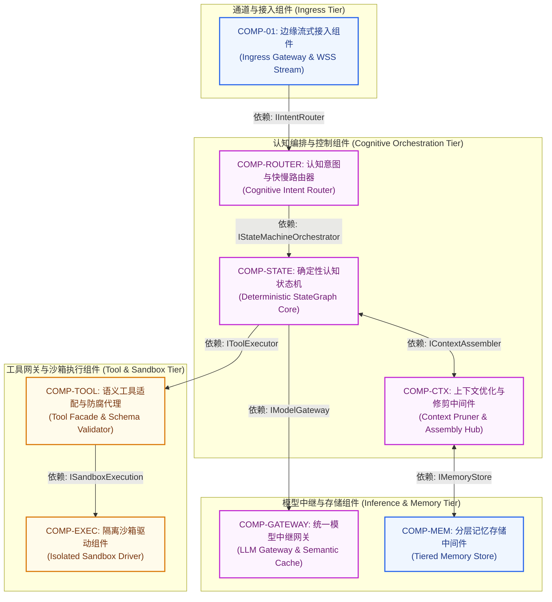
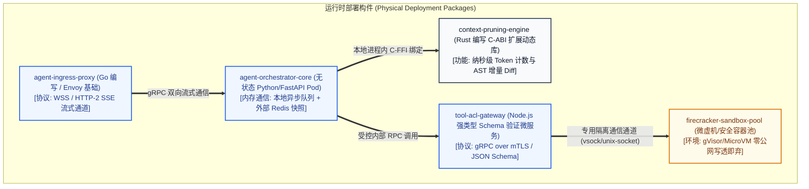
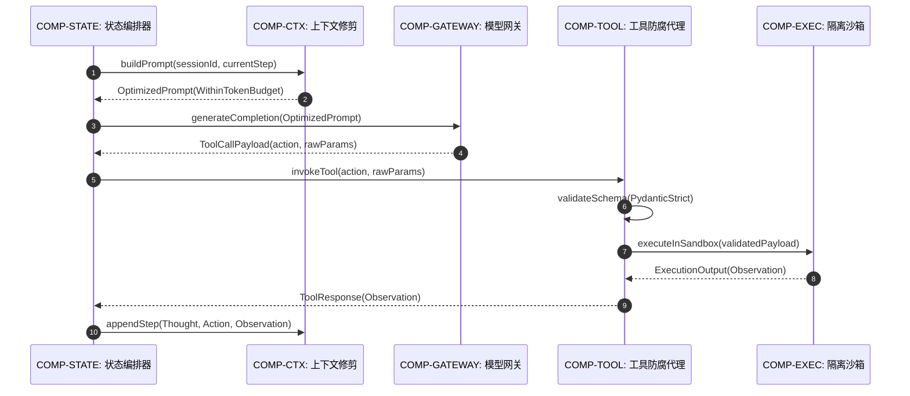

# 组件模型说明书 (Component Model - CM Template)

> 本文档遵循 IBM Team Solution Design 与 Architecture Thinking 规范，作为承接 AOD 全景概览图、指导下游团队工程实现的核心架构解剖工件。

---

## 1. 逻辑组件模型 (Logical Component Model - Logical CM)

---

## 2. 物理组件模型 (Physical Component Model - Physical CM)

---

## 3. 核心组件规范卡片集 (Component Specifications)

### 3.1 COMP-CTX: 上下文优化与修剪中间件 (Context Pruner & Assembly)
| 规范要素 | 架构内容说明 |
| :--- | :--- |
| **组件标识** | `COMP-CTX: 上下文优化与修剪中间件` |
| **组件类型** | 核心认知中间件组件（自研） |
| **核心职责** | 监控 Token 预算，在多轮重试循环中动态修剪无用堆栈追踪（Stack Trace Pruning）、执行代码增量 Diff，维护负向假设账本 |
| **提供接口 (Provided)**| `IContextAssembler (buildPrompt, pruneContextWindow, appendNegativeHypothesis)` |
| **依赖接口 (Required)**| `IMemoryStore (fetchLongTermMemory), ISessionCache (getStepHistory)` |
| **质量属性/NFR 要求** | 单次上下文组装延迟 ≤ 15ms；Token 冗余消除率 ≥ 60%；完全无状态 |
| **数据所有权 (Ownership)**| 独占管理当前认知轮次的即时上下文组装缓冲区 |
| **物理技术映射** | 嵌入在 Agent 编排容器内的 Rust 预编译扩展模块，无本地持久化状态 |

### 3.2 COMP-TOOL: 语义工具适配与防腐代理 (Tool Facade & ACL)
| 规范要素 | 架构内容说明 |
| :--- | :--- |
| **组件标识** | `COMP-TOOL: 语义工具适配与防腐代理` |
| **组件类型** | 边界安全与防腐组件（自研） |
| **核心职责** | 暴露 JSON Schema 工具声明；基于 Pydantic 执行参数强类型静态校验；实施权限隔离与幂等性保证 |
| **提供接口 (Provided)**| `IToolExecutor (invokeTool, queryToolManifest)` |
| **依赖接口 (Required)**| `ISandboxDriver (runIsolatedScript), ILegacyApi (invokeEnterpriseService)` |
| **质量属性/NFR 要求** | 拦截 100% 格式非法参数；工具参数验证时延 ≤ 5ms；操作具备幂等重试保护 |
| **数据所有权 (Ownership)**| 独占管理工具 Schema 注册表与幂等性令牌记录 |
| **物理技术映射** | 独立运行的轻量级 gRPC 微服务容器，提供严苛的输入防御契约 |

---

## 4. 核心架构场景动态时序验证 (Component Sequence Diagrams)

### 场景一：工具调用、参数校验与沙箱执行链路 (Happy Path)

---

## 5. 领域数据所有权归属矩阵 (Data Ownership Matrix)

| 业务数据实体 / 资产 | 独占写入组件 (Exclusive Owner) | 只读消费组件 (Read-Only Consumers) | 持久化与存储模式 |
| :--- | :--- | :--- | :--- |
| **CognitiveSession (会话状态)** | COMP-STATE: 状态机编排组件 | Gateway, HITL Center | 外部分布式 Redis / Postgres |
| **ExecutionStep (单步执行轨迹)**| COMP-STATE: 状态机编排组件 | Telemetry, AuditDashboard | Append-only 轨迹数据库 |
| **NegativeLedger (失败反思账本)**| COMP-CTX: 上下文修剪中间件 | StateMachine, Planner | 结构化会话持久化存储 |
| **ToolManifest (工具 Schema)** | COMP-TOOL: 语义工具代理 | LLMGateway, Orchestrator | 代码声明与内存注册表 |

---

## 6. CM 合格性“四道防线”评审自检记录

- [x] **防线一：团队分配测试 (Team Allocation Test)**: 敏捷小组可仅凭 `Provided/Required` 接口签名与 JSON Schema 独立开发工具代理，无需同步内部实现。
- [x] **防线二：变更隔离测试 (Change Impact Test)**: 调整底层代码沙箱实现（如从 Docker 切换为 Firecracker），仅影响 COMP-EXEC，上游业务完全不感知。
- [x] **防线三：OM 衔接测试 (Operational Readiness Test)**: 运维团队可根据无状态编排器与隔离沙箱的物理组件定义，精确规划 Pod HPA 与 MicroVM 沙箱池。
- [x] **防线四：Agent 契约与无状态测试 (Agent Contract & Statelessness Test)**: 编排服务本身完全无状态，全部工具参数实行强类型 Schema 校验，具备最大步数熔断控制。
