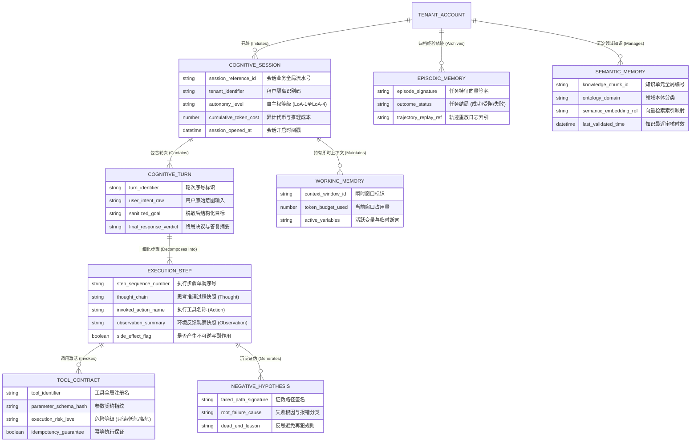

# 概念数据模型规约 (Conceptual Data Model, CDM)

> **架构视角**: 数据视角顶层抽象 (Data Architecture - Conceptual Level)  
> **核心使命**: 遵循“CDM $\to$ LDM $\to$ PDM”三层演进路径，用业务统一语言厘清系统核心业务实体、实体关系基数（Cardinality）与边界归属。保持技术中立，严禁出现任何物理数据库特性或字段。

---

## 1. 统一语言与领域概念字典 (Ubiquitous Language Dictionary)

| 概念术语 (Term) | 英文标识 (Identifier) | 商业定义与业务语义 | 概念边界与排他性澄清 |
| :--- | :--- | :--- | :--- |
| **{核心概念 1}** | `EntityName1` | {该实体在商业世界中的明确定义} | {明确与相似概念的区隔，消除歧义} |
| **{核心概念 2}** | `EntityName2` | {该实体在商业世界中的明确定义} | {明确与相似概念的区隔，消除歧义} |
| **{核心概念 3}** | `EntityName3` | {该实体在商业世界中的明确定义} | {明确与相似概念的区隔，消除歧义} |

---

## 2. 概念实体关系拓扑图 (Conceptual ER Diagram)

---

## 3. 核心实体详细规格卡片 (Core Entity Specifications)

### 3.1 实体: 认知会话 (CognitiveSession)
- **归属概念子域**: 认知会话与成本管控域 (Session & Economics Governance)
- **核心商业特征**: 承载用户发起的完整 Agent 任务生命周期，管理安全上下文、租户策略约束与 Token 消耗限额。
- **关键业务属性**:
  - `session_reference_id`: 全局业务唯一编号。
  - `autonomy_level`: 任务自主度等级（如人类审批确认、部分自主、全自主闭环）。
  - `cumulative_token_cost`: 累计推理消耗折算金额，达到硬上限强制挂起。
- **核心业务不变量 (Business Invariants)**:
  - 累计 Token 消耗严禁超过租户设定的预算包络；超额必须强制阻断并触发审批。
  - 会话必须能够通过关联的步骤快照无损复原上下文。

### 3.2 实体: 执行步骤 (ExecutionStep)
- **归属概念子域**: 轨迹追溯与沙盒执行域 (Trajectory & Step Replay)
- **核心商业特征**: 记录 Agent 内部每次单步认知与行动原子快照，是一等公民实体。
- **关键业务属性**:
  - `step_sequence_number`: 步骤全局单调自增序号。
  - `thought_chain`: 模型单步思考与推导过程（Thought）。
  - `invoked_action_name`: 调用的外部工具或指令标识（Action）。
  - `observation_summary`: 工具执行后返回的环境观察（Observation）。
  - `side_effect_flag`: 是否包含不可逆业务写操作。
- **核心业务不变量**:
  - 步骤实体一旦持久化即为不可篡改的事实记录（Append-only）。
  - 若 `side_effect_flag` 为真，必须关联外部审批授权凭据。

### 3.3 实体: 负向假设 (NegativeHypothesis)
- **归属概念子域**: 失败反思与经验沉淀域 (Reflective Learning)
- **核心商业特征**: 记录被事实证伪的探索路径，作为“失败账本”供后续反思回路查阅。
- **关键业务属性**:
  - `failed_path_signature`: 证伪路径的特征哈希。
  - `root_failure_cause`: 失败根因分类（工具参数错误、权限不足、逻辑悖论）。
  - `dead_end_lesson`: 提取的反思规训。
- **核心业务不变量**:
  - 单一会话内部如果检测到命中相同特征的负向假设，严禁第三次重复执行同一分支。

---

## 4. 限界上下文与数据所有权矩阵 (Data Ownership Matrix)

| 概念实体 (Entity) | 所属限界上下文 (Bounded Context) | 唯一归属组件 (Owning CM Component) | 数据所有权模式 (Ownership) | 跨边界访问契约 |
| :--- | :--- | :--- | :--- | :--- |
| **`CognitiveSession`** | 会话治理上下文 | `SessionGovernor` (CM-001) | **独占写入 (Exclusive Write)** | 提供会话生命周期与预算核减事件 |
| **`ExecutionStep`** | 轨迹审计上下文 | `TrajectoryAuditor` (CM-002) | **追加写入 (Append-Only Write)** | 支撑时间旅行回放与调试查询 |
| **`ToolContract`** | 工具网关上下文 | `ToolRegistry` (CM-003) | **独占写入 (Exclusive Write)** | 暴露 Schema 契约并校验执行权限 |
| **`NegativeHypothesis`**| 反思学习上下文 | `ReflectionEngine` (CM-004) | **独占写入 (Exclusive Write)** | 供规划器在探索前只读查询防踩坑 |
| **`WorkingMemory`** | 瞬时认知上下文 | `ContextWindowManager` (CM-005) | **独占写入 (Exclusive Write)** | 窗口超限时触发向情节记忆归档 |
| **`SemanticMemory`** | 领域知识上下文 | `KnowledgeHub` (CM-006) | **独占写入 (Exclusive Write)** | 向量语义检索只读召回 |

---

## 5. 四步压力测试与“重放审计”自检结论 (Stress Tests & Replay Walkthrough)

- [x] **1. 业务代言人对齐测试 (The Business Proxy Walkthrough)**:
  - 经领域专家走查，业务实体与认知一等实体边界清晰，基数精准反映“一个会话包含多轮，一轮拆解为多个思考执行步骤”的客观认知规律。
- [x] **2. 生命周期完整性测试 (Lifecycle & State Completeness)**:
  - 任务从发起、探索、报错、反思、工具调用到终局确认，每一步演进均有对应实体与状态支撑，无断流。
- [x] **3. 驱动组件模型 (CM) 验证**:
  - 各实体在 CM 中拥有唯一独占管理组件，轨迹记录与工具注册完全解耦，符合单一职责原则。
- [x] **4. “重放与审计”实战验证 (The Replay Walkthrough)**:
  - 选取异常高危操作执行轨迹进行历史推演：**仅凭 `ExecutionStep` 与 `ToolContract` 记录，即 100% 完整还原出当时模型在第几步想了什么、依据什么观察、调用了哪个工具**，通过可解释性与时间旅行重放调试合规验证。

---

## 6. 概念模型签署 (CDM Sign-off)
- **业务领域专家 (Domain Expert / PO)**: APPROVED (确认业务实体概念与基数正确)
- **数据架构师 (Data Architect)**: APPROVED (确认技术中立性与一等认知实体建模规范)
- **签署生效日期**: {YYYY-MM-DD}
