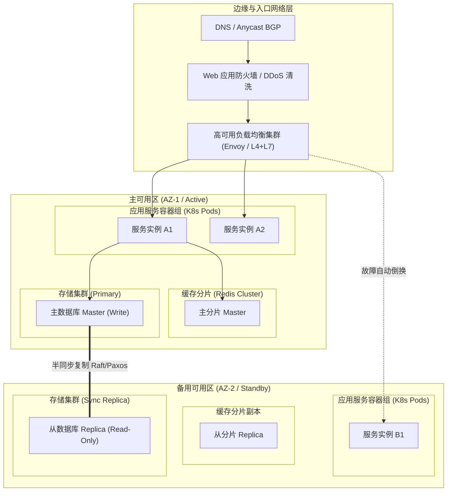

# 物理部署、数据架构与可观测性设计 (Deployment, Data & Observability)

> 架构层次：Layer 3 - 物理与工程权衡 (How & Resilience)  
> 状态：APPROVED / IN_REVIEW  
> 目标系统：[系统全称]  
> 责任架构师：[架构师姓名/代号]

---

## 1. 物理部署架构 (Physical Deployment Architecture)

### 1.1 部署拓扑全景

### 1.2 计算、网络与资源规划
| 组件类型 | 容器规格 (CPU / Mem) | 副本数 (Min - Max) | 伸缩策略 (HPA 指标) | 网络隔离区划 |
| :--- | :--- | :--- | :--- | :--- |
| **接入网关** | 2 Core / 4 GB | 3 - 10 | CPU > 70% 或 连接数 > 5000 | 生产 DMZ 区 |
| **核心领域计算引擎**| 4 Core / 8 GB | 4 - 12 | P99 延迟 > 50ms 或 队列积压 | 业务核心专用子网 |
| **异步消费工作单元**| 2 Core / 4 GB | 2 - 8 | 消费者 Lag > 1000 | 业务核心专用子网 |

---

## 2. 数据架构与存储策略 (Data Architecture & Storage Strategy)

### 2.1 数据分层与持久化方案
| 数据类型 | 存储引擎选型 | 持久化模型 | 读写特征 | 备份与保留策略 |
| :--- | :--- | :--- | :--- | :--- |
| **核心事务流水 (WAL)** | 关系型 / Append-Only Log | 行存 + 强一致事务 | 写多读少，顺序追加 | 实时多副本，保留 10 年 |
| **高频状态快照** | 分布式 KV / 内存索引 | Key-Value / 内存网格 | 高频点读点写 | 定期全量快照 + 变更日志 |
| **时序与度量数据** | 时序数据库 (TSDB) | 列存压缩 | 高吞吐批量写入 | 降采样归档，热数据 30 天 |
| **审计追溯证据链** | 对象存储 (WORM 机制) | 不可变文件归档 | 一次写多次读 | 跨区域容灾归档，保留 15 年 |

### 2.2 读写分离与缓存一致性设计
- **缓存模式**：Cache-Aside / Read-Through + Write-Through。
- **一致性保障**：变更时基于 binlog / 领域事件异步失效缓存，设置防御性 TTL，杜绝缓存穿透、击穿与雪崩。
- **数据分片键 (Shard Key)**：选择业务自然主键作为分片散列键，避免跨分片分布式事务。

---

## 3. 韧性、容灾与高可用机制 (Resilience & Disaster Recovery)

### 3.1 容灾等级与核心目标指标
- **RPO (Recovery Point Objective)**：核心数据 RPO = 0（零数据丢失，同步复制机制）。
- **RTO (Recovery Time Objective)**：同城双活 RTO < 30 秒，异地容灾 RTO < 5 分钟。

### 3.2 故障防御与降级策略 (Resilience Patterns)
1. **限流保护 (Rate Limiting)**：
   - 令牌桶算法，对不同客户端按 TenantId、API 路径实施多维度配额隔离。
2. **熔断器 (Circuit Breaker)**：
   - 下游外部依赖失败率达到 50% 且样本数 > 20 时自动开启熔断，静默 15s 后半开探测。
3. **隔离仓 (Bulkhead)**：
   - 隔离核心请求与异步报表导出线程池/数据库连接池，杜绝资源耗尽连锁反应。
4. **重试退避 (Exponential Backoff with Jitter)**：
   - 仅针对幂等异常实施指数退避重试，叠加全随机抖动（Full Jitter），避免惊群效应。

---

## 4. 可观测性设计 (Observability Architecture)

### 4.1 分布式链路追踪 (Distributed Tracing)
- **协议标准**：W3C TraceContext (`traceparent`, `tracestate`)。
- **上下文透传**：跨进程、跨消息队列严格注入并提取全局唯一 `trace_id` 与 `span_id`。
- **采样策略**：普通成功请求按 1% 采样，错误请求、慢请求（> 200ms）及高价值业务事务实施 100% 强制采样。

### 4.2 核心监控指标 (RED / USE Metrics)
| 指标分类 | 具体指标项 | 报警阈值 | 应对预案 |
| :--- | :--- | :--- | :--- |
| **Rate (吞吐率)** | `http_requests_total`, `events_ingested_per_sec` | 突降 50% 或 突增 300% | 启动流量清洗与扩容 |
| **Errors (错误率)** | `http_request_errors_total / total` | 错误率 > 1% (持续 1min) | 触发 P1 运维告警与自动排查 |
| **Duration (延迟)** | `request_duration_seconds{quantile="0.99"}` | P99 > 100ms (持续 2min) | 检查慢查询与线程池排队 |
| **Saturation (饱和度)**| `process_cpu_usage`, `jvm_memory_used_ratio` | 使用率 > 85% | 触发自动弹性伸缩 (HPA) |

### 4.3 结构化审计日志 (Structured Logging)
- 统一 JSON 格式输出，必填字段：`timestamp`, `trace_id`, `service`, `level`, `caller`, `event_type`, `payload_digest`。
- 敏感数据自动掩码脱敏（PII 过滤）。
