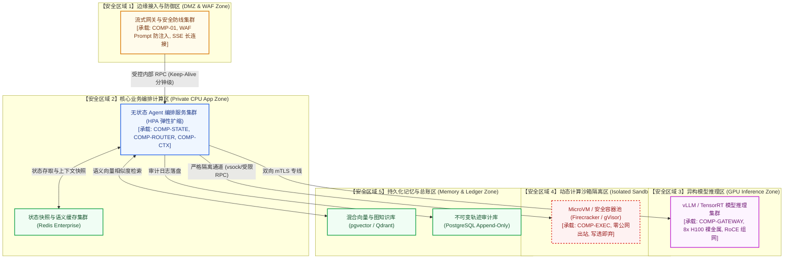
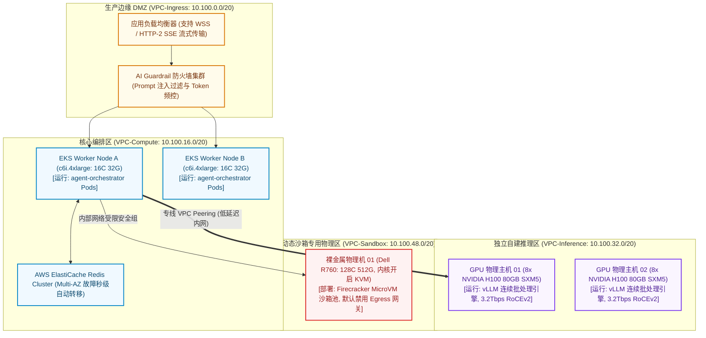

# 运行模型说明书 (Operational Model - OM Template)

> 本文档遵循 IBM Team Solution Design 与 Architecture Thinking 规范，作为承接非功能性需求（NFRs）与 CM 物理组件的运行基础设施架构工件。

---

## 1. 逻辑运行模型 (Logical Operational Model - Logical OM)

---

## 2. 物理运行模型 (Physical Operational Model - Physical OM)

---

## 3. 核心节点规范卡片集 (Node Specifications)

### 3.1 NODE-SANDBOX-01: 隔离执行沙箱物理宿主机 (Sandbox Host)
| 规范要素 | 架构内容说明 |
| :--- | :--- |
| **节点标识** | `NODE-SANDBOX-01: 动态隔离沙箱宿主集群` |
| **承载组件 (CM 映射)** | `firecracker-sandbox-pool`, `COMP-EXEC` |
| **网络区域归属** | 隔离计算沙箱专区 (Zone 4 - Isolated Sandbox VPC) |
| **硬件/实例规格** | Dell PowerEdge R760, 2x AMD EPYC 9754 (256核), 512GB DDR5, PCIe 5.0 NVMe |
| **可用性与生命周期** | 单个 MicroVM 实例生命周期随执行结束立即销毁，最长存活 60 秒强制回收 |
| **网络与安全策略** | 严格禁止任何公网出站（No NAT Gateway, No IGW）；内部仅允许指定代理端口拉取依赖 |
| **存储与隔离模式** | 基于 OverlayFS 的临时写透即弃文件系统，容器退出后内存与磁盘空间即刻清零 |

### 3.2 NODE-GPU-01: 大模型推理加速集群节点 (GPU Serving Node)
| 规范要素 | 架构内容说明 |
| :--- | :--- |
| **节点标识** | `NODE-GPU-01: 本地大模型并行推理集群` |
| **承载组件 (CM 映射)** | `vLLM-engine`, `COMP-GATEWAY` |
| **网络区域归属** | 内部专用 GPU 推理专区 (Zone 3 - Low-Latency GPU Subnet) |
| **硬件/实例规格** | 8x NVIDIA H100 80GB SXM5, 2TB 系统内存, 3.2Tbps RoCEv2 低延迟网卡 |
| **可用性与调度** | 开启连续批处理（Continuous Batching）与 PagedAttention；配置 OOM 显存背压队列 |
| **网络与交互策略** | 仅接受来自 CPU 编排集群的 mTLS 认证请求，禁止公网直连 |

---

## 4. CM 构件部署映射与隔离规则矩阵 (Deployment Allocation Matrix)

| 物理 CM 构件名称 | 目标运行物理节点 | 部署形态 (Process/Container) | 共存与隔离规则 (Colocation/Isolation) |
| :--- | :--- | :--- | :--- |
| `agent-ingress-proxy` | `ALB / EKS Ingress Nodes` | Envoy/Go 容器 Pod | 维持数千并发流式长连接，开启 Keep-Alive 与平滑断线重连 |
| `agent-orchestrator` | `K8s_CPU_Node1/Node2` | Python/FastAPI 无状态 Pod | 纯逻辑无状态编排，配置 HPA 基于 CPU/并发数横向扩缩 |
| `vLLM-engine` | `NODE-GPU-01/02` | 裸金属独占进程 | 独占 8 卡 GPU 与显存，严格隔离非推理进程防止内存抖动 |
| `firecracker-pool` | `NODE-SANDBOX-01` | MicroVM 安全隔离轻量虚机 | 物理机开启 KVM 虚拟化硬隔离，单沙箱配额 1C/1G，禁用一切出站外网 |

---

## 5. 容量规划、伸缩与长连接流式策略 (Capacity Sizing & Streaming)

- **并发与长连接基线**: 网关层针对峰值 5,000 活跃流式会话设计，单会话平均持续 15 秒，内存占用约 12GB，文件描述符配额预留 65,535。
- **沙箱冷启动指标**: 采用 MicroVM 快照预热池技术，单沙箱拉起冷启动时延 ≤ 150ms，满足实时代码调试反馈要求。
- **显存与 Token 预算**: 每台 H100 承载 70B 模型时预留 25% 显存供 KV Cache 动态分配，高负载下自动触发队列限流保护，避免 OOM 宕机。

---

## 6. OM 压力实战测试验证记录 (Stress & Failure Walkthrough)

- [x] **拔电源与容灾测试 (Chaos / Failure Scenario Test)**:
  - 模拟单可用区断网：无状态编排 Pod 5 秒内由 K8s 调度至存活 AZ，Redis 集群完成秒级主备切换，会话状态根据快照无损复原。(合格)
- [x] **逃逸防御拓扑测试 (Escape Containment Test)**:
  - 模拟 Agent 在沙箱内执行 `rm -rf /` 与内网 IP 扫描脚本：宿主机安全隔离拦截所有逃逸行为，沙箱 200ms 内销毁清零，相邻服务零受损。(合格)
- [x] **长连接雪崩与重连风暴评估 (Streaming Storm Resilience)**:
  - 模拟 2,000 会话瞬时并发流式重连：网关实施令牌桶平滑限流与指数退避，未发生连接句柄耗尽或内存崩溃。(合格)
- [x] **容量与成本测试 (Cost & Sizing Walkthrough)**:
  - CPU Pod 与 GPU 节点按需分离，夜间空闲期通过弹性扩缩缩容编排实例，GPU 资源利用率保持在 85% 以上，精准符合 TCO 预算。(合格)
