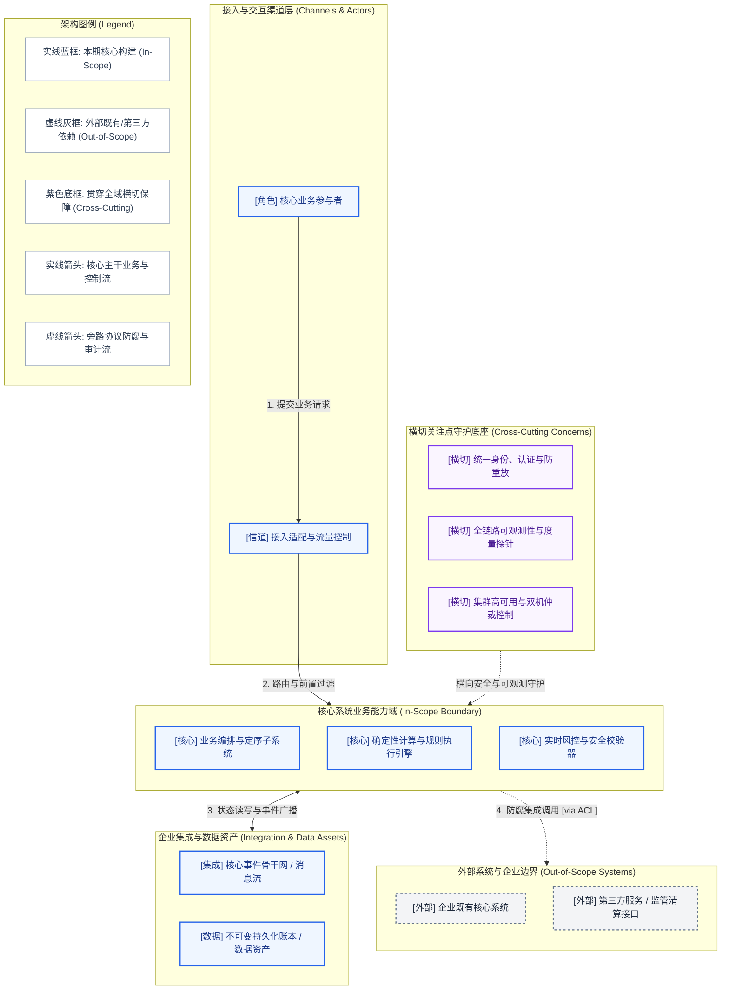

# 架构概览图说明书与叙事文本 (AOD Accompanying Narrative Template)

## 1. 架构概览图 (Architecture Overview Diagram)

---

## 2. 核心架构叙事 (Architectural Narrative)

### 2.1 业务驱动力与价值对齐 (Business Drivers & Value Alignment)
- **商业目标支撑**：本架构如何直接落地商业驱动力中确立的投资回报率（ROI）、服务时延与业务吞吐量。
- **系统边界裁决**：明确界定为何将特定子系统纳入 In-Scope，为何将另外的系统置于 Out-of-Scope。

### 2.2 关键质量属性 (NFRs) 支撑逻辑
| 关键 NFR 维度 | 量化指标要求 | AOD 架构级支撑机制与权衡决策 |
| :--- | :--- | :--- |
| **性能与低时延** | 例如 P99 ≤ 5.0 µs | 依靠单向定序流与纯计算内核，消除跨子系统网络与锁竞争 |
| **可靠性与可用性**| 例如 99.999%, RPO=0 | 双机热备配合横切仲裁控制器，避免单点崩塌 |
| **安全性与合规性**| 纳秒级事前审计 | 接入层前置硬拦截 + 横切统一身份认证与不可变追加账本 |

---

## 3. 子系统职责边界与交互契约矩阵

| 子系统标识 | 归属分区 | 核心概念职责 | 交互上游 | 交互下游 |
| :--- | :--- | :--- | :--- | :--- |
| **IngressGateway** | 接入层 | 负责网络协议接入、流量清洗与初步参数反序列化 | 外部客户端 | 业务编排与定序子系统 |
| **CoreEngine** | 核心域 | 负责纯逻辑业务状态机计算与领域规则执行 | 接入网关 | 事件骨干网、数据资产总库 |
| **StorageAsset** | 数据资产 | 保证不可变事件流水与最终一致性账本存储 | 核心引擎 | 离线报表与事后审计仓库 |

---

## 4. AOD 合格性“3 分钟压力测试”自检记录 (The 3-Minute Test)

- [ ] **白板复述测试 (Whiteboard Test)**: 架构师能否在白板上 3 分钟内徒手画出该图并向业务高管讲明主干业务闭环？(合格)
- [ ] **职责定位测试 (Responsibility Test)**: 抛出核心业务场景时，能否一眼判定数据流穿透的子系统序列，且无职责重复？(合格)
- [ ] **技术无关测试 (Technology Agnostic Test)**: 若将底层数据库或消息中间件从实现 A 替换为实现 B，本图是否完全无需改动？(合格)
- [ ] **横切可见测试 (Cross-Cutting Test)**: 安全、可观测性与高可用是否在横切关注点中有明确且清晰的物理/逻辑位置？(合格)
