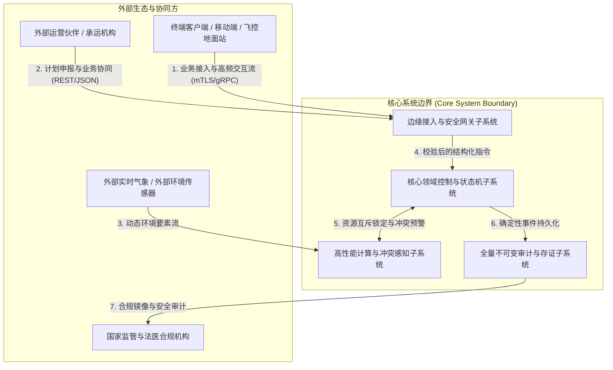

# 架构全景概览图规约 (Architecture Overview Diagram, AOD)

> 架构视角：全局概览 (Global Overview)  
> 核心作用：面向高层干系人与业务负责人的高阶抽象图，展示系统边界、核心子系统、外部集成接口及关键信息流。

---

## 1. AOD 架构全景抽象图 (Mermaid Visual)

## 2. 系统边界与信息流阐释 (Context & Information Flows)
1. **系统边界定义**: 划分核心系统管辖边界与外部不可信网络，所有交互必须穿透接入网关完成协议转换与鉴权。
2. **核心子系统职责**:
   - **接入与网关子系统**: 处理握手、认证、限流与快速滤波。
   - **领域控制子系统**: 驱动业务状态机，维护单向推进基线与不变量。
   - **高性能计算子系统**: 负责实时算法求交、时空索引与动态调度。
   - **审计存证子系统**: 采用 WAL/列式落盘保证数据防篡改与长期合规。
3. **关键信息流方向**: 遵循“外部输入 -> 边缘解耦 -> 领域互斥执行 -> 状态下沉存证”的确定性流向。
