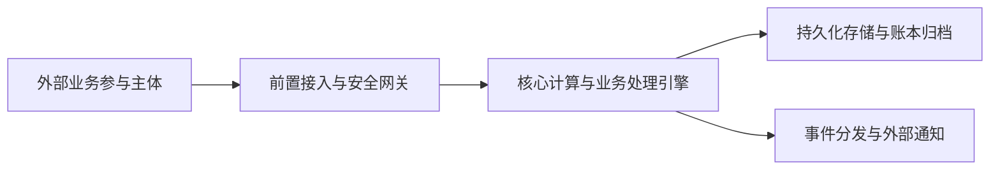

# ARB 架构评审准入申请与决议报告书 (ARB Review Submission & Verdict)

> **治理视角**: 企业架构最高质检与放行闸口 (Architecture Review Board Final Gate)  
> **核心使命**: 依据 IBM Architecture Thinking 治理标准，执行严格的准入前置审查（Entry Gate），核验工件链完整度、PoC 实证数据及跨域会签；以五维评估框架开展同行质询，出具具备约束力的终审裁决与技术债务清偿契约。

---

## 1. ARB 评审准入检查表 (Entry Criteria Checklist)

| 准入核验门槛 | 对应交付工件与佐证链接 | 准入达标状态 | 秘书处核验意见 |
| :--- | :--- | :--- | :--- |
| **1. 业务目标与约束** | [`business-drivers.md`](file:///path/to/business-drivers.md), [`constraints.md`](file:///path/to/constraints.md) | **已就绪** | 商业目标具备明确 SMART 度量 |
| **2. 系统上下文图 (Level 0)**| [`system-context.md`](file:///path/to/system-context.md) | **已就绪** | 严格黑盒边界，依赖关系清晰 |
| **3. 概念数据模型 (CDM)** | [`conceptual-data-model.md`](file:///path/to/conceptual-data-model.md) | **已就绪** | 技术中立，基数与所有权明确 |
| **4. 架构概览图 (AOD)** | [`architecture-overview-diagram.md`](file:///path/to/aod.md) | **已就绪** | 单层抽象，包含端到端价值流 |
| **5. 组件模型 (CM)** | [`component-model.md`](file:///path/to/component-model.md) | **已就绪** | 单向依赖无环，接口契约完整 |
| **6. 运行模型 (OM)** | [`operational-model.md`](file:///path/to/operational-model.md) | **已就绪** | 包含网络安全分区与节点规格 |
| **7. 架构需求清单 (ARC)** | [`arc-matrix.md`](file:///path/to/arc-matrix.md) | **已就绪** | 100% 量化 NFR 契约，无主观口号 |
| **8. 架构决策记录 (ADR)** | [`docs/architecture/03-decisions/`](file:///path/to/adrs/) | **已就绪** | 核心技术选型论证严密且透明 |
| **9. ATAM 效用树推演** | [`utility-tree-atam.md`](file:///path/to/utility-tree-atam.md) | **已就绪** | 包含六要素场景与拔线沙盘推演 |
| **10. 高风险 PoC 验证** | [`first-step-poc.md`](file:///path/to/poc.md) | **已就绪** | 附带破坏性混沌压测与实测曲线 |

### 1.1 跨域横切团队会签预审 (Pre-Review Sign-offs)
- **信息安全与合规部 (InfoSec)**: 
  - *预审意见*: 【通过 / 附条件通过】数据在传输与存储阶段均已配置国密/标准加密算法，无跨主权跨境合规违规，边界访问已落实最小特权控制。
  - *会签签字人*: `[安全合规代表姓名 / 电子签名]`
- **基础架构与 SRE 运维部**:
  - *预审意见*: 【通过】OM 中规划的物理节点计算规格与网络带宽申请已完成容量核定，现有硬件机房基础设施具备承载能力。
  - *会签签字人*: `[SRE 运维总监姓名 / 电子签名]`

---

## 2. 架构核心方案提要 (Architectural Summary)

### 2.1 2分钟高管电梯演讲 (Elevator Pitch for CxO)
> **商业核心价值**: {用不超过 3 句话清晰解释：该系统解决了什么关键商业痛点，带来什么实质回报}  
> **核心架构底线**: {阐明系统如何通过何种核心技术架构守护企业安全、合规与可用性底线}

### 2.2 核心价值流走查 (End-to-End Core Flow)

---

## 3. ARB 五维深度质询与自查辩护 (The 5-Dimension Defense)

### 3.1 业务与价值对齐度 (Business Fit)
- **自查结论**: 方案聚焦核心商业场景，拒绝不必要的过度工程，架构组件划分与业务领域边界保持 1:1 映射。

### 3.2 ARC 履约与可行性对账 (NFR Feasibility)
- **自查对账表**:
  - 吞吐与延迟对账: `ARC-PERF-01` 承诺指标与 `OM` 物理节点 CPU/网络带宽参数相符，并已通过 `POC-001` 实测验证。
  - 高可用对账: 全链路无单点故障（SPOF），核心组件均具备双机热备或多节点共识容错。

### 3.3 企业标准与安全合规 (Enterprise Compliance)
- **自查结论**: 方案采用企业技术雷达推荐栈，网络拓扑严格划分隔离区、内网核心区与持久化存储区。

### 3.4 权衡与代价透明度 (Trade-off Clarity)
- **自查结论**: ADR 中清晰披露了所放弃的属性（如：以限制单标的跨核扩展换取微秒级无锁撮合）；具备完整的熔断降级与异常补偿方案。

### 3.5 可运维性与生命周期管理 (Day-2 Operations)
- **自查结论**: 具备全链路统一 TraceID 追踪机制，配置集中告警埋点，提供不停机滚动部署或主备无缝倒换规约。

---

## 4. 已知局限与技术债务台账 (Known Limitations & Debt Ledger)

> 架构师主动披露因工期、技术发展或成本限制所做出的妥协，建立透明台账：

| 技债编号 | 债务简述与妥协背景 | 影响范围与潜在风险 | 临时缓解措施 | 计划清偿里程碑 / 期限 | 责任人 |
| :--- | :--- | :--- | :--- | :--- | :--- |
| `DEBT-001` | {如：单交易标的撮合吞吐受制于单核主频极限} | 单一品种超过 100,000 TPS 时可能触发队列反压 | 实施客户端事前令牌桶限流，阻断突发脉冲 | 计划在 V2.0 引入多核分区订单簿模型 | 首席架构师 |
| `DEBT-002` | {如：备份存储仅支持全量冷备，增量对账耗时略长} | 灾备数据重放对账窗口较长（约 30 秒） | 每日非交易时段自动触发双缓冲快照归档 | 计划在下季度引入分布式流式复制增量归档 | SRE 负责人 |

---

## 5. ARB 评审委员会终局裁决书 (The ARB Verdict)

### 5.1 裁决结论
经过评审委员会全体投票审议，对本项目架构方案做出如下技术裁决：

- [ ] **Approved (无条件批准)**: 准予立即进入工程实施与采购。
- [x] **Conditionally Approved (附条件批准)**: 架构总体可行，必须在满足下述整改项后放行。
- [ ] **Architecture Exception (架构特例豁免)**: 附带技术债务偿还限期备忘录。
- [ ] **Rejected (否决打回)**: 存在重大系统性缺陷，设计推倒重做。

### 5.2 整改行动项与闭环期限 (Required Action Items)
1. **行动项 1**: {明确整改内容，如：在 CM 中补齐有界环形缓冲区的背压丢弃日志记录与告警埋点}；**复核人**: `[指定架构委员]`；**期限**: 1 周内完成。
2. **行动项 2**: {明确整改内容，如：在 OM 中追加双路市电与冗余光纤专线 SLA 协议附录}；**复核人**: `[SRE 代表]`；**期限**: 2 周内完成。

### 5.3 评审委员会委员署名
- **ARB 主席 (Chief Architect)**: `_______________________`
- **安全与合规代表 (InfoSec)**: `_______________________`
- **基础架构代表 (SRE/Infra)**: `_______________________`
- **业务代表 (Business Sponsor)**: `_______________________`
- **日期**: 2026 年 09 月 18 日
