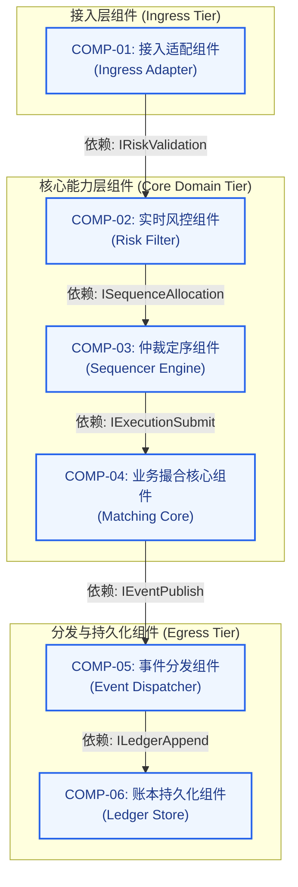
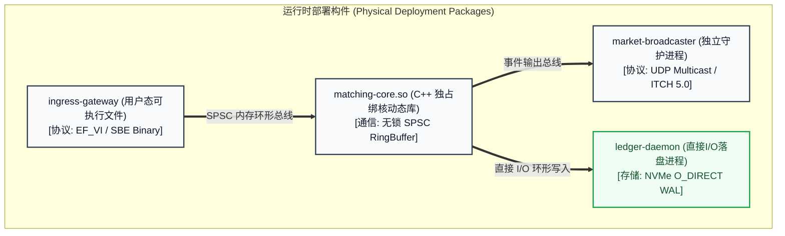
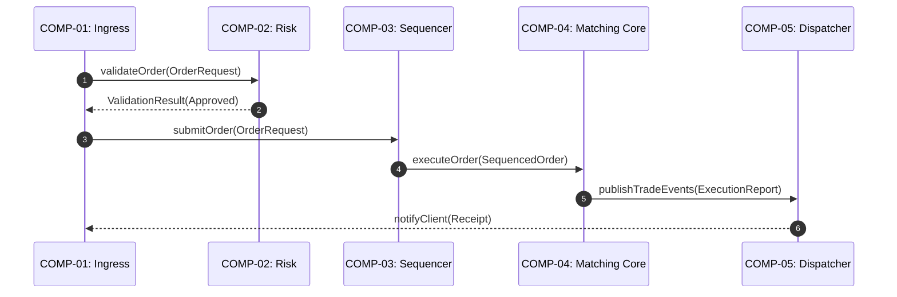

# 组件模型说明书 (Component Model - CM Template)

> 本文档遵循 IBM Team Solution Design 与 Architecture Thinking 规范，作为承接 AOD 全景概览图、指导下游团队工程实现的核心架构解剖工件。

---

## 1. 逻辑组件模型 (Logical Component Model - Logical CM)

---

## 2. 物理组件模型 (Physical Component Model - Physical CM)

---

## 3. 核心组件规范卡片集 (Component Specifications)

### 3.1 COMP-01: 接入适配组件 (Ingress Adapter)
| 规范要素 | 内容说明 |
| :--- | :--- |
| **组件标识** | `COMP-01: Ingress Adapter` |
| **组件类型** | 边界通信组件（自研） |
| **核心职责** | 终结网络连接，解析客户端报文，完成防重放时间戳校验 |
| **提供接口 (Provided)**| `IIngressSession (connect, disconnect, receivePacket)` |
| **依赖接口 (Required)**| `IRiskValidation (validateOrder), ISequenceAllocation (submitOrder)` |
| **质量属性/NFR 要求** | 单包反序列化延迟 ≤ 300ns；吞吐量 ≥ 2,000,000 ops/s；无锁设计 |
| **数据所有权 (Ownership)**| 独占管理外部会话连接描述符表与会话状态 |
| **物理技术映射** | C++ 纯轮询用户态驱动进程，通过连续定长内存池分配报文 |

---

## 4. 核心架构场景动态时序验证 (Component Sequence Diagrams)

### 场景一：常规业务黄金调用链路 (Happy Path)

---

## 5. 领域数据所有权归属矩阵 (Data Ownership Matrix)

| 业务数据实体 / 资产 | 独占写入组件 (Exclusive Owner) | 只读消费组件 (Read-Only Consumers) | 持久化与存储模式 |
| :--- | :--- | :--- | :--- |
| **AccountBalance (账户资金)** | COMP-02: 实时风控组件 | Ingress, Admin | 内存预扣表 + WAL 镜像 |
| **OrderBookDepth (盘口深度)** | COMP-04: 撮合核心组件 | Dispatcher, MarketBroadcaster | 纯内存红黑树与双向链表 |
| **ClearingAuditLog (审计日志)** | COMP-06: 账本持久化组件 | External Audit, Analytics | NVMe 追加写日志文件 |

---

## 6. CM 合格性“三道防线”评审自检记录

- [ ] **防线一：外包/团队分配测试 (Team Allocation Test)**: 敏捷团队能否仅凭规范卡片中的 `Provided/Required` 接口独立开发？(合格)
- [ ] **防线二：变更隔离测试 (Change Impact Test)**: 内部算法或存储重构是否不波及其他组件接口？(合格)
- [ ] **防线三：OM 衔接测试 (Operational Readiness Test)**: SRE 能否依据物理 CM 直接推导部署拓扑与资源配置？(合格)
