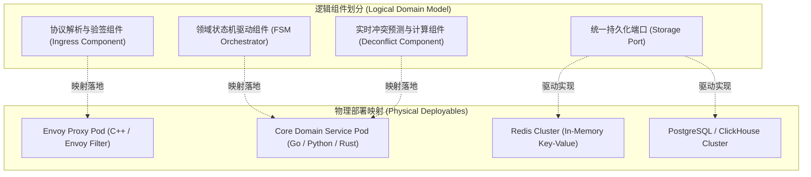

# 逻辑与物理组件模型规约 (Component Model, CM)

> 架构视角：逻辑视角 (Logical View)  
> 核心作用：定义系统的结构单元。包括组件职责、对外接口、交互协议（Sequence/Interaction）及内部依赖关系，通常分为逻辑组件与物理组件。

---

## 1. 逻辑组件与物理组件划分 (Component Taxonomy)

## 2. 组件职责与接口依赖矩阵 (Component Responsibilities & Dependencies)

| 组件名称 | 类型 | 职责边界 | 暴露接口与协议 | 依赖组件 |
| :--- | :--- | :--- | :--- | :--- |
| **Ingress Component** | 接入层组件 | 终结 TLS、提取调用者标识、流量整流削峰 | gRPC / HTTP2 / Protobuf | 依赖安全凭证库与认证服务 |
| **FSM Orchestrator** | 领域核心组件 | 承载聚合根、维护领域不变量、驱动状态跃迁 | 内部消息事件流 / 内存函数调用 | 依赖 Storage Port 与计算组件 |
| **Deconflict Engine** | 计算核心组件 | 执行空间八叉树/H3索引碰撞检测，生成避让向量 | 内存原生调用 (C++/Rust FFI) | 依赖内存体素网格快照 |
| **Storage Port Adapter** | 基础设施组件 | 实现领域模型到物理数据库表的双向映射与缓存穿透防护 | 专用数据库连接池 (TCP/SQL) | 依赖物理数据库集群 |

## 3. 组件交互时序规约 (Interaction Protocols)
组件间交互遵循严格的依赖倒置（DIP）准则，核心领域组件绝不反向依赖物理基础设施。详细交互时序见同目录下的 [`interaction-sequence.mmd`](./interaction-sequence.mmd)。
