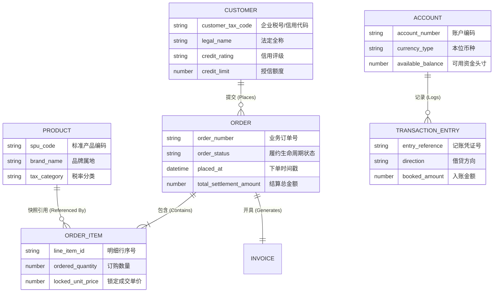

# 概念数据模型规约 (Conceptual Data Model, CDM)

> **架构视角**: 数据视角顶层抽象 (Data Architecture - Conceptual Level)  
> **核心使命**: 遵循“CDM $\to$ LDM $\to$ PDM”三层演进路径，用业务统一语言厘清系统核心业务实体、实体关系基数（Cardinality）与边界归属。保持技术中立，严禁出现任何物理数据库特性或字段。

---

## 1. 统一语言与领域概念字典 (Ubiquitous Language Dictionary)

| 概念术语 (Term) | 英文标识 (Identifier) | 商业定义与业务语义 | 概念边界与排他性澄清 |
| :--- | :--- | :--- | :--- |
| **{核心概念 1}** | `EntityName1` | {该实体在商业世界中的明确定义} | {明确与相似概念的区隔，消除歧义} |
| **{核心概念 2}** | `EntityName2` | {该实体在商业世界中的明确定义} | {明确与相似概念的区隔，消除歧义} |
| **{核心概念 3}** | `EntityName3` | {该实体在商业世界中的明确定义} | {明确与相似概念的区隔，消除歧义} |

---

## 2. 概念实体关系拓扑图 (Conceptual ER Diagram)

---

## 3. 核心实体详细规格卡片 (Core Entity Specifications)

### 3.1 实体: {核心实体 A}
- **归属概念子域**: {如: 交易核心域 / 资产清算域}
- **核心商业特征**: {简述其商业定位与生命周期特征}
- **关键业务属性**:
  - `属性 1`: {商业含义与格式规则}
  - `属性 2`: {商业含义与取值约束}
  - `属性 3`: {商业含义与业务意义}
- **核心业务不变量 (Business Invariants)**:
  - {列出该实体自身必须维持的商业守恒或不可变状态规则}

### 3.2 实体: {核心实体 B}
- **归属概念子域**: {如: 账户风控域}
- **核心商业特征**: {简述其商业定位}
- **关键业务属性**:
  - `属性 1`: {商业含义}
  - `属性 2`: {商业含义}
- **核心业务不变量**:
  - {业务不变量}

---

## 4. 限界上下文与数据所有权矩阵 (Data Ownership Matrix)

| 概念实体 (Entity) | 所属限界上下文 (Bounded Context) | 唯一归属组件 (Owning CM Component) | 数据所有权模式 (Ownership) | 跨边界访问契约 |
| :--- | :--- | :--- | :--- | :--- |
| **{实体 A}** | {交易上下文} | `MatchingEngine` (CM-001) | **独占写入 (Exclusive Write)** | 仅通过领域事件异步向外广播 |
| **{实体 B}** | {风控上下文} | `RiskManager` (CM-002) | **独占写入 (Exclusive Write)** | 提供只读头寸查询 API 接口 |
| **{实体 C}** | {清算上下文} | `SettlementService` (CM-003) | **独占写入 (Exclusive Write)** | 生成标准结算批次凭单 |

---

## 5. 三步压力测试自检结论 (The 3-Step Stress Tests)

- [x] **1. 业务代言人对齐测试 (The Business Proxy Walkthrough)**:
  - 经业务领域专家逐项推演，所有实体名称与基数严格契合实际商业逻辑，未发现不合规的多对多或孤立实体。
- [x] **2. 生命周期完整性测试 (Lifecycle & State Completeness)**:
  - 核心实体的状态演进与历史版本追溯均具备对应的概念实体进行全生命周期留存。
- [x] **3. 驱动组件模型 (CM) 验证**:
  - 每个概念实体在组件模型（CM）中均拥有唯一合法的管理组件，不存在跨组件双向多头直接写入问题。

---

## 6. 概念模型签署 (CDM Sign-off)
- **业务领域专家 (Domain Expert / PO)**: APPROVED (确认业务实体概念与基数正确)
- **数据架构师 (Data Architect)**: APPROVED (确认技术中立性与三层演进合规)
- **签署生效日期**: {YYYY-MM-DD}
