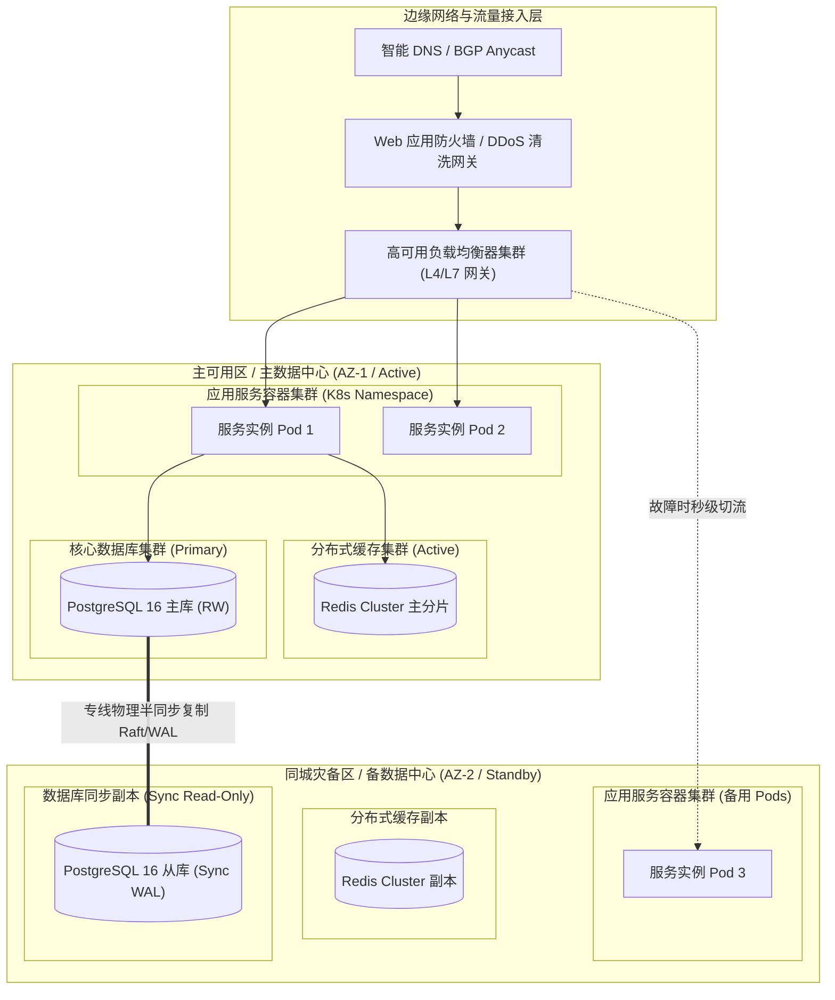

# 物理部署架构设计规约 (Deployment Architecture)

> 架构层次：Layer 3 - 物理与工程权衡 (How & Resilience)  
> 状态：APPROVED (签署入基线)  
> 目标系统：[系统全称]  
> 责任架构师：[架构师姓名/代号]

---

## 1. 部署拓扑全景 (Physical Deployment Topology)

### 1.1 物理网络与多可用区 (Multi-AZ) 架构拓扑

---

## 2. 计算资源规格与容器规划清单 (Compute & Resource Capacity)

| 核心组件 | 容器/虚拟机规格 (CPU/内存) | 副本数 (Min - Max) | 自动弹性伸缩策略 (HPA) | 网络隔离区划 / 子网 |
| :--- | :--- | :--- | :--- | :--- |
| **接入网关 (Ingress Gateway)** | 4 Core / 8 GB | 3 - 10 | CPU > 70% 或 并发连接 > 5,000 | DMZ 外部访问区 |
| **核心业务计算引擎 (Core Engine)** | 8 Core / 16 GB | 4 - 16 | 队列积压 > 500 或 P99 > 150ms | 生产核心受保护网段 |
| **异步消息/作业工作单元 (Worker)** | 4 Core / 8 GB | 2 - 8 | 消费者 Lag > 1,000 | 生产核心专用网段 |
| **沙箱隔离验证环境 (Sandbox)** | 2 Core / 4 GB (严格配额) | 4 - 12 | 待检任务数 > 10 | 无公网出站限制网段 |

---

## 3. 网络拓扑、隔离区划与安全边界 (Network & Security Zones)

### 3.1 网络隔离区划划分
1. **DMZ 接入区**：部署入口 API 网关、WAF 与公网负载均衡，仅暴露经过认证的 HTTPS / mTLS 端口。
2. **应用计算区**：无公网直接路由，仅允许通过内部服务网格 (Service Mesh) 或内部 gRPC 通信。
3. **数据持久化区**：核心数据库与缓存分片部署于物理隔离的私有子网，仅接受特定应用节点白名单 IP 访问。
4. **控制与管理区**：Bastion 跳板机、CI/CD 构建代理与 Prometheus 监控集群，必须通过双因素 (2FA) VPN 访问。

### 3.2 节点间通信加密与证书体系
- 服务间通信全面启用 mTLS (Mutual TLS 1.3)，由内部私有 CA 自动签发和轮转证书。
- 敏感配置（数据库密码、API Key）通过密钥管理系统 (Vault / KMS) 注入环境变量，严禁硬编码。

---

## 4. 多可用区容灾与故障切换 (Disaster Recovery & Failover)

### 4.1 容灾指标等级 (RPO / RTO)
- **恢复点目标 (RPO)**：核心交易数据 RPO = 0（零数据丢失，同步复制）。
- **恢复时间目标 (RTO)**：同城双活切流 RTO < 30 秒，跨地域灾备 RTO < 5 分钟。

### 4.2 故障检测与自动切换演练
- **健康检查机制**：接入网关配置 L7 应用层 `/healthz` 深度心跳检测（含数据库可达性探针）。
- **防脑裂保护**：采用 Raft / Paxos 多数派选主协议，当网络分区发生时，失联的少数派节点自动进入只读保护状态，拒绝外部写请求。
