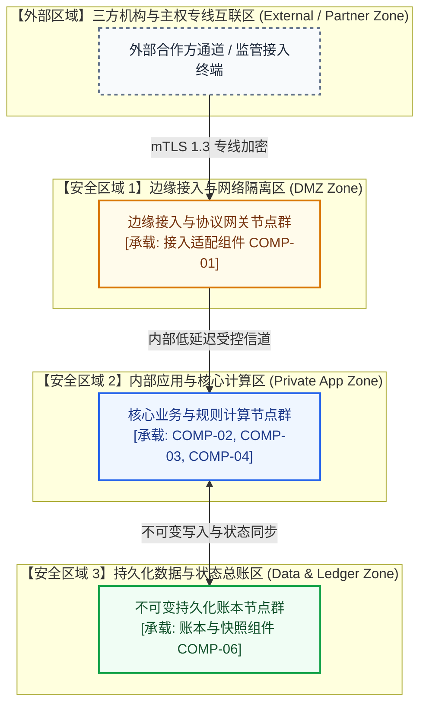
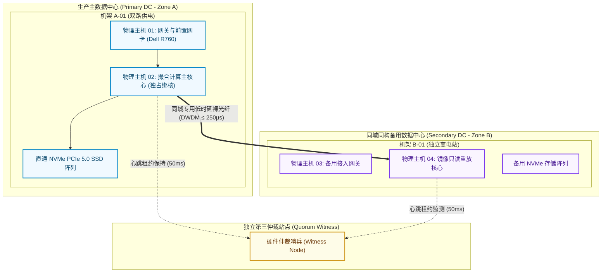

# 运行模型说明书 (Operational Model - OM Template)

> 本文档遵循 IBM Team Solution Design 与 Architecture Thinking 规范，作为承接非功能性需求（NFRs）与 CM 物理组件的运行基础设施架构工件。

---

## 1. 逻辑运行模型 (Logical Operational Model - Logical OM)

---

## 2. 物理运行模型 (Physical Operational Model - Physical OM)

---

## 3. 核心节点规范卡片集 (Node Specifications)

### 3.1 NODE-01: 核心计算节点 (Core Compute Node)
| 规范要素 | 架构内容说明 |
| :--- | :--- |
| **节点标识** | `NODE-CORE-01: 主撮合与定序核心主机` |
| **承载组件 (CM 映射)** | `matching-core.so`, `sequencer-hub` (物理 CM) |
| **网络区域归属** | 私有核心计算区 (Zone 0 - Private Isolated VLAN) |
| **硬件/实例规格** | Dell PowerEdge R760, 2x AMD EPYC 9654, 64GB 1GB 巨页内存, NUMA Node 0 锁定 |
| **可用性设计** | 主备热倒换 (Active-Standby)，跨独立供电机架与同城双机房配置 |
| **网络与交互策略** | 仅接收网关 SPSC 环推流，输出仅允许直连组播交换机与 WAL 存储 |
| **存储与持久化** | 本地直通 PCIe 5.0 NVMe SSD，开启 O_DIRECT 异步无锁追加写 |

---

## 4. CM 构件部署映射与隔离规则矩阵 (Deployment Allocation Matrix)

| 物理 CM 构件名称 | 目标运行物理节点 | 部署形态 (Process/Container) | 共存与隔离规则 (Colocation/Isolation) |
| :--- | :--- | :--- | :--- |
| `ingress-gateway` | `NODE-GW-01` (Core 0) | 用户态独占进程 | 必须与网卡物理端口直连，禁止跨 CPU Socket |
| `matching-core` | `NODE-CORE-01` (Core 2) | 单线程独占动态库 | 必须独占 CPU 物理核，完全禁止其他线程抢占 |
| `market-broadcaster`| `NODE-CORE-01` (Core 3) | 组播推流独立进程 | 共享同一 NUMA 节点的共享内存以达成微秒级事件获取 |
| `wal-daemon` | `NODE-CORE-01` (Core 4) | 异步写盘守护进程 | 独立绑核，隔离磁盘 I/O 中断对撮合核心的干扰 |

---

## 5. 容量规划与伸缩策略 (Capacity Sizing & Scalability)

- **吞吐与容量基线**: 测算基于单标的峰值 1,500,000 TPS 计算，每秒产生约 144MB 二进制事件流。
- **存储年化规划**: 8小时高频交易日产生约 4.1TB 日志，经异步压缩归档后需要 1.2TB/天冷存储容量。
- **伸缩边界**: 核心交易对采用静态独占物理分区（Static Core Sharding）；边缘接入层支持基于会话数的动态横向扩展。

---

## 6. OM 压力实战测试验证记录 (Stress & Failure Walkthrough)

- [ ] **拔电源测试 (Chaos / Failure Scenario Test)**:
  - 模拟主机掉电演练：主节点心跳中断超 250ms，独立第三机房仲裁哨兵自动收回租约，备机在 350ms 内平滑接管，达成 **RPO=0, RTO < 500ms**。(合格)
- [ ] **容量与成本测试 (Cost & Sizing Walkthrough)**:
  - 基于本 OM 清单拉取机房机柜、裸光纤租赁与物理机采购清单，SRE 与财务团队能够据此直接核算出年度 CAPEX/OPEX 基础设施预算。(合格)
- [ ] **运维与可观测测试 (Operational Readiness)**:
  - PTP 硬件时钟对齐探针、Prometheus Metrics 导出器与网络交换机镜像监控端口均在 OM 中唯一定位，SRE 无需额外猜测部署位置。(合格)
