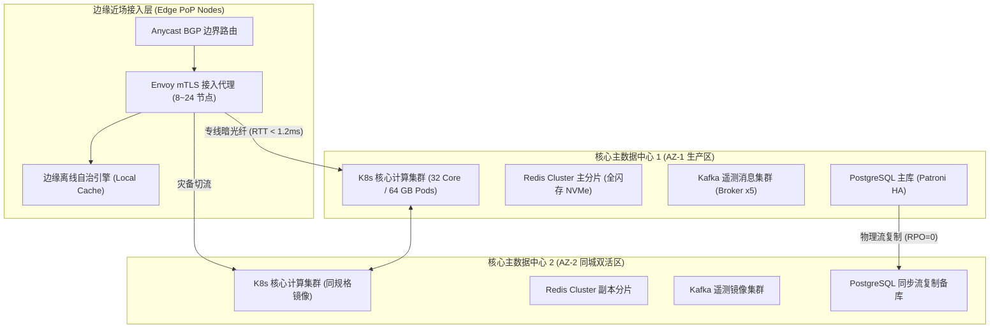

# 运行部署与基础设施拓扑模型 (Operational Model, OM)

> 架构视角：基础设施与拓扑 (Physical / Operational View)  
> 核心作用：描述组件如何部署。包含网络分区、数据中心分布、服务器/容器节点拓扑、容灾备份与中间件配置。

---

## 1. 基础设施拓扑与多数据中心分布 (Data Center & Node Topology)

## 2. 网络安全分区规划 (Network Zones)
| 安全分区 | 网络隔离级别 | 准入策略与安全策略 | 容纳组件 |
| :--- | :--- | :--- | :--- |
| **外部接入 DMZ 区** | 互联网直连，边界硬防火墙防护 | 仅允许 TCP 443 (mTLS) 与 UDP 8443 (QUIC)，严禁端口穿透 | 外部负载均衡器、Anycast 边界路由、Envoy 边缘代理 |
| **应用计算安全区** | 私有 VPC，通过 Cilium eBPF 隔离 | 仅允许来自 DMZ 代理的已鉴权流量，服务间开启双向认证 | K8s Pods (FSM 调度引擎、解冲突引擎、API 网关) |
| **核心数据存储区** | 极高安全级别，物理网段隔离 | 仅允许计算区 Pod 经专用白名单连接，禁用任何公网外联 | Redis Cluster、PostgreSQL HA、ClickHouse、Kafka |
| **管理与可观测区** | 专享运维专线接入 | 需通过双因子堡垒机 (2FA) 认证，所有操作录像审计 | Prometheus、Grafana、OpenTelemetry Collector |

## 3. 容灾备份与中间件高可用配置 (DR & Middleware HA)
- **数据中心倒换 (Failover)**: 依托 BGP Anycast 与 DNS 健康探针，AZ-1 故障时 1.5 秒内自动将入站流量漂移至 AZ-2。
- **数据库高可用**: PostgreSQL 采用 Patroni + etcd 架构，故障时主备倒换时间 < 3 秒，保持零数据丢失 (RPO=0)。
- **缓存集群容灾**: Redis Cluster 跨机房交叉部署主从节点，单机房断电自动触发多数派选举提升。
