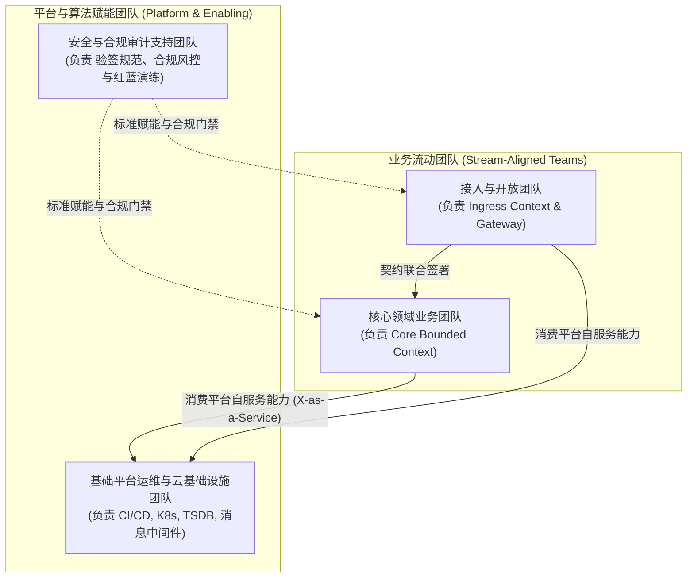

# 组织架构与康威定律应用设计规约 (Organization Structure & Conway's Law)

> 架构层次：Layer 4 - 组织与交付实施 (Who & Rhythm)  
> 状态：APPROVED (签署入基线)  
> 目标系统：[系统全称]  
> 责任架构师：[架构师姓名/代号]

---

## 1. 康威定律与团队拓扑映射 (Team Topologies & Conway's Law)

### 1.1 团队与限界上下文映射全景

### 1.2 团队职责划分与代码所有权矩阵 (Code Ownership)
| 团队名称 | 团队类型 | 负责限界上下文 / 代码仓库目录 | 核心交付物与 SLA 目标 |
| :--- | :--- | :--- | :--- |
| **接入流团队** | Stream-Aligned | `services/ingress/`, `04-contracts/` | 外部对接 API、网关鉴权插件、协议防腐层 |
| **领域核心团队** | Stream-Aligned | `services/core/`, `src/domain/` | 核心聚合根、不变量规则引擎、状态机主控 |
| **基础平台团队** | Platform | `infra/k8s/`, `monitoring/` | 容器编排清单、分布式追踪与监控告警看板 |
| **安全合规团队** | Enabling | `security/`, `audit/` | 自动化合规测试、代码审计门禁脚本 |

---

## 2. 跨团队协作协议与接口契约治理 (Cross-Team Collaboration)

### 2.1 契约先行原则 (Contract-First Governance)
- 跨团队接口必须首先在契约仓中签署定义（通过 OpenAPI 或 Protobuf PR），经双方架构代表评审后合并，方可启动编码。
- 契约一旦合并即视为只读防护网，消费方不可随意提出破坏性破坏变更。

### 2.2 演进与反向逆康威调整 (Reverse Conway Maneuver)
若未来系统业务发生拆分或合并，团队组织边界必须同步调整，严禁“一个子系统由两个互不沟通的异地团队共同维护核心业务逻辑”的反模式。
