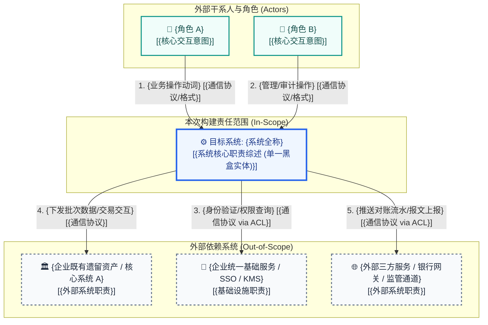

# 系统上下文与边界规约 (System Context & Boundary Specification)

> **架构视角**: 架构第 0 层 (Level 0) - 生态位与绝对边界 (System Context & The Black-box Rule)  
> **核心使命**: 确立系统的绝对范围边界，明确“我们在建什么（In-Scope）”与“我们依赖谁（Out-of-Scope）”。中心系统被严格视作单一黑盒实体，严禁暴露任何内部微服务或数据库细节。

---

## 1. Level 0 系统上下文图 (System Context Diagram)

---

## 2. 上下文实体交互矩阵 (Context Interaction Matrix)

| 实体分类 | 实体名称 (Entity) | 职责与系统关系描述 (Description & Interaction) | 数据流向与核心契约 (Data Flow & Contract) | 边界责任归属 (Ownership) |
| :--- | :--- | :--- | :--- | :--- |
| **中心系统** | **{目标系统全称}** | **[核心黑盒 / 本次构建范围]** 提供核心业务全生命周期闭环服务。 | 不适用 (中心黑盒) | **本团队研发与 SLA 责任区 (In-Scope)** |
| **外部角色** | {角色 A} | {明确角色边界，执行主要业务操作与输入} | `{角色 A}` $\to$ {核心操作指令} [{协议}] $\to$ `系统` | 外部用户 / 业务方 |
| **外部角色** | {角色 B} | {明确运维/管理/审计角色边界} | `{角色 B}` $\to$ {管控与审批指令} [{协议}] $\to$ `系统` | 外部运维 / 审计机构 |
| **外部系统** | {企业既有系统 A} | {企业既有遗留系统，提供核心底账或主数据支撑} | `系统` $\to$ {业务交互数据} [{协议 via ACL}] $\to$ `{系统 A}` | 内部兄弟团队 / 遗留资产团队 (Out-of-Scope) |
| **外部系统** | {基础设施服务 B} | {企业级统一基础设施，提供单点登录与密钥托管} | `系统` $\to$ {校验凭证/获取密钥} [{协议}] $\to$ `{服务 B}` | 企业基础架构平台团队 (Out-of-Scope) |
| **外部系统** | {第三方服务 C} | {外部云服务或国家监管网关，提供外部核验通道} | `系统` $\to$ {外部核验/报文同步} [{协议 via ACL}] $\to$ `{服务 C}` | 外部供应商 / 监管机构 (Out-of-Scope) |

---

## 3. 三道安检门检验结论 (The 3 Gatekeeper Tests)

- [x] **“X 射线”违规测试 (The X-Ray Test)**:
  - 经严格自查，图中目标系统仅体现为单一黑盒节点，没有任何数据库、内部微服务、缓存或底层代码框架细节流出。
- [x] **责任切割测试 (The "Who owns this?" Test)**:
  - 明确划分了本团队系统（In-Scope）与外部协作方系统（Out-of-Scope）的边界，后续接口对接均需签署专属 SLA 契约。
- [x] **“孤岛”与“无源之水”排查 (Orphan & Magic Flow Check)**:
  - 确认系统具备清晰的外部业务触发源（输入流），同时对外产生明确的业务交付价值与下游输出流，形成端到端业务闭环。

---

## 4. 从上下文图到 AOD 的关键过渡 (Zooming In)
> **“当前系统上下文图处于万米高空视角，着重界定‘系统大楼外观及外部交通马路’（纯黑盒）。当下一步无人机降落穿过大楼屋顶时，将正式进入 AOD（架构概览图），展开大楼内部的‘接待大厅（网关层）’、‘业务核心区（子系统划分）’与‘底层金库（数据持久层）’的白盒全景结构。”**

---

## 5. 责任边界签署 (Boundary Sign-off)
- **主导架构师**: APPROVED (确认系统绝对边界与黑盒法则)
- **外部系统协调代表**: APPROVED (确认外部系统交互契约与 SLA 划分)
- **签署生效日期**: {YYYY-MM-DD}
